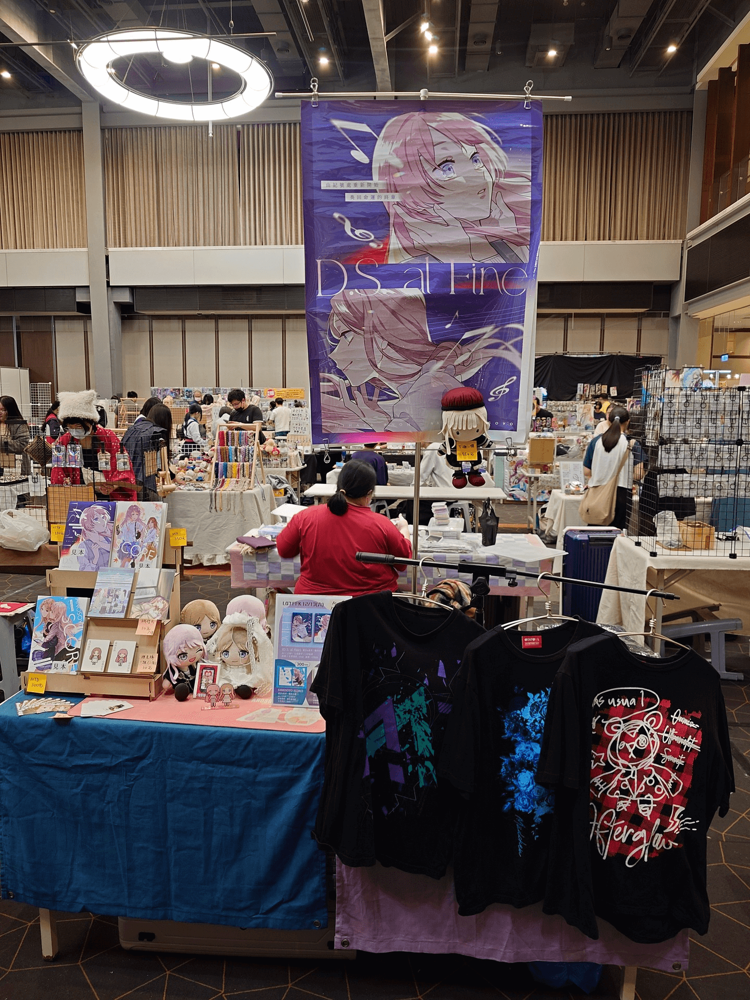

　　做任何事情，有時候會遇到兩種極端。

　　一是做之前很開心，做完卻有些後悔。例如很餓的時候點了一堆餐點，結果到最後吃不完撐在那邊懷疑人生，不懂為什麼要把自己搞成這樣。而另一種剛好相反——做之前覺得麻煩，做完卻慶幸自己有做。例如健身或跑步或打羽球，一想到那全身痠痛的感覺，就會在心底問自己「今天真的要去嗎」，但每次做完走出健身房，又會覺得有來真是太好了。

　　參加同人場次，對我來說永遠是後者。

　　前一天整理行李的時候在心中埋怨「整理行李好麻煩」，早上鬧鐘響的時候覺得「為什麼周末不能睡到自然醒」，下午顧攤顧到一半發現好想睡覺但沒辦法睡，更慘的是攤位正對面剛好是賣床的，看著那幾張床散發著無形的魔力，睏意瞬間加倍，整個過程沒有一刻不覺得麻煩。

　　但每次結束拖著行李準備離場時，心裡總會浮現同一個念頭：

　　「有來真是太好了。」

　　這次報攤前我曾經想過，目前三本小說都已在網路通販，想買的人多半也都下單了，千里迢迢開一小時的車去現場擺攤的意義在哪。

　　但每當有人走到攤位前跟我說「網路上有在追我的連載」，當我把故事介紹給一個完全沒聽過的讀者，當我又認識了左鄰右舍新的創作者……

　　「啊，這就是此時此刻人生的意義了。」

　　謝謝今天來場的每一位朋友，新刊已經默默規劃了一個月，已經到了「[後設寫作法](/writing/post-writing/)」的中盤階段，屆時會在 [pixiv](https://www.pixiv.net/users/355810) 與這裡同步連載，還請大家多多指教。

　　就算拖著超累又快感冒的身體回到家，洗完澡呆在電腦前，腦海裡還是想著：

　　「我還是會繼續下去。」（By 千早愛音）

　　打著打著忽然覺得好餓啊，看來又要點一堆吃不完的餐點了 XD（學不乖）