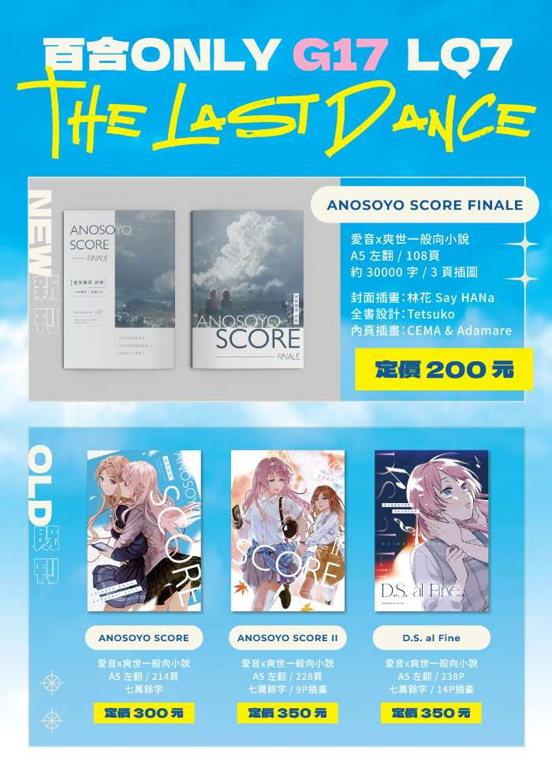

　　本活動場次全名為「いつか一緒に輝いて－百合向ONLY」，是 Comic Horizon 漫創地平線（CH）系列中以百合向作品為主題的活動，內容為限百合向（女性角色）主題同人社團參加。

　　（時間：2026.10.09（星期五）｜地點：新北市三重區綜合體育館一樓）

　　這次的百合 Only 同人場，我會在攤位編號 G17 之處推廣（名義上最後一本）愛音ｘ爽世同人小說新刊《ANOSOYO SCORE FINALE》。以下節錄自本書〈序〉：

> 這本書是《ANOSOYO SCORE》最後的系列作，裡面共收錄了三篇小說，分別是去年為了慶祝長崎爽世與千早愛音的生日而創作的〈未完成的延長記號〉及〈休止符間的隱形記號〉，有別當初的完稿，本書收錄的文本也是一年後大幅潤飾的版本。而最後收錄，則是未公開於網路，參與「天下第一邦兩周年合本」所創作的〈低音譜上的便箋〉，這也是我所創作的最後一篇愛音爽世同人作品。
> 

　　除了將以上三篇遺留在外的故事收錄進紙本外，本書從第 62 頁開始就是「後記」，佔了本書將近一半的篇幅，拿同人本的篇幅寫~~廢文~~心得感想我看也是沒誰了。

　　本書的封面插畫或許眼尖朋友有認出來（嗎），沒錯，就是傳說中的國寶級繪師　[林花 Say HANa 大大](https://www.pixiv.net/users/1443093)（這邊也要挪抬）。至於一秒幾十萬上下的林花老師為什麼願意幫不才小弟畫封面插圖，請見本書的鳴謝部分，當然白話一言以蔽之就是靠情勒，這世界上沒有一次情緒勒索辦不到的事，如果有，就勒兩次（朋友們請千萬不要學）。

　　因此，這次新刊的特典也是將這精美的封面做成了明信片，空前絕後，非常好看，不出意外也是林花老師第一次也最後一次畫愛爽惹，買新刊即送一張特典明信片，建議各位朋友收藏。

　　這場活動結束後，短期應該不會出現在同人場次的攤位內了。我知道有些讀者是因為小說認識我，最後跟著來到這 Blog 和我一起閒聊，也在此謝謝各位一直以來的支持。

　　有緣的話，我們星期五見。