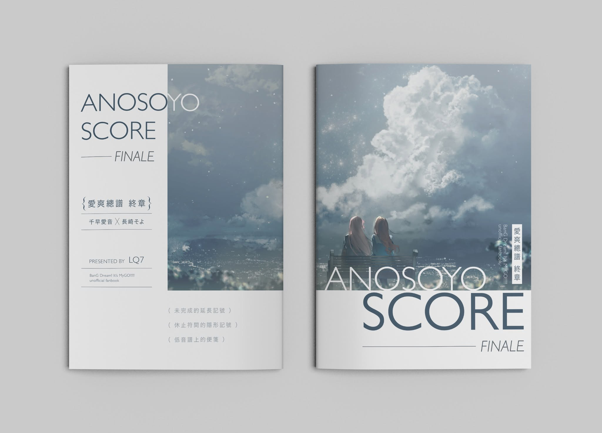
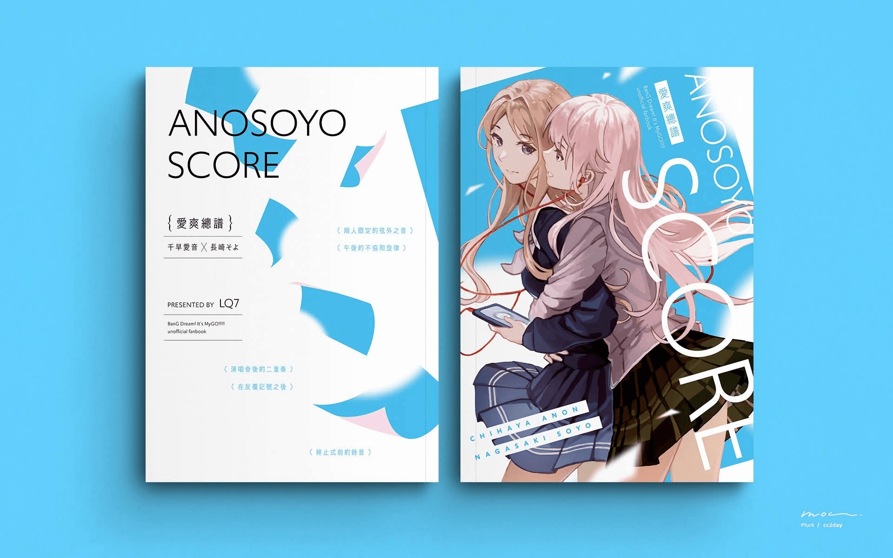

　　我寫了四本共 24 萬字的千早愛音ｘ長崎爽世同人小說。如果不知道她們是誰，請先進入[「傳送門１」](https://www.youtube.com/watch?v=WOrYBIYIwyk&list=PL12UaAf_xzfqYGkaq7fR0DpB6osiuNlYu)和[「傳送門２」](https://www.youtube.com/watch?v=dxmmSFQxWzM&list=PL12UaAf_xzfo6TAmxIM7rEvrJAB0rzAAO)後再閱讀為佳。除了紙本收錄的限定章節外，其餘內容於 Pixiv 皆可免費閱讀，之後會逐步整理並移轉至本站（編按：講了快一年只移了兩篇，真是抱歉）。

　　如果喜歡我的故事，也可至底下通販連結購買實體書籍支持。

　　[Pixiv 作品頁](https://www.pixiv.net/users/355810)

　　[實體書籍通販連結 (賣貨便)](https://myship.7-11.com.tw/general/detail/GM2506029061346)

---

## 作品一覽（依時間倒序排列）

《ANOSOYO SCORE FINALE》愛爽總譜——「終章」

千早愛音x長崎爽世一般向同人小說｜A5｜108頁｜三萬餘字｜3頁插畫｜2026 年 10 月 初版

作者：LQ7｜封面繪師：林花 Say HANa｜全書設計：Tetsuko｜內頁插畫：CEMA & Adamare

收錄作品：〈未完成的延長記號〉｜〈休止符間的隱形記號〉｜〈低音譜上的便箋〉｜〈作品回顧〉

《D.S. al Fine》——由記號處重新開始奏回命運的終章

千早愛音x長崎爽世一般向同人小說｜A5｜238頁｜七萬餘字｜14頁插畫｜2025 年 10 月 初版

作者：LQ7｜封面繪師 & 全書設計：moc｜內頁插畫：CEMA

收錄作品：《D.S. al Fine》（全書為同一個故事）

《ANOSOYO SCORE II》愛爽總譜第二集

千早愛音x長崎爽世一般向同人小說｜A5｜228頁｜七萬餘字｜9頁插畫｜2025 年 8 月 初版

作者：LQ7｜封面繪師：橘外葡萄餡｜全書設計：moc｜內頁插畫：CEMA

收錄作品：〈即興曲的距離〉｜〈遺失的秘密樂章〉｜《五分之二的協奏曲〉

《ANOSOYO SCORE》愛爽總譜第一集

千早愛音x長崎爽世一般向同人小說｜A5｜214頁｜七萬餘字｜2025 年 5 月 初版

作者：LQ7｜封面繪師：橘外葡萄餡｜全書設計：moc

收錄作品：〈兩人限定的弦外之音〉｜〈午後的不協和旋律〉｜〈演唱會後的二重奏〉｜〈在反覆記號之後〉｜〈終止式前的餘音〉

---

### 以下為已從 Pixiv 轉移至本站的故事

---