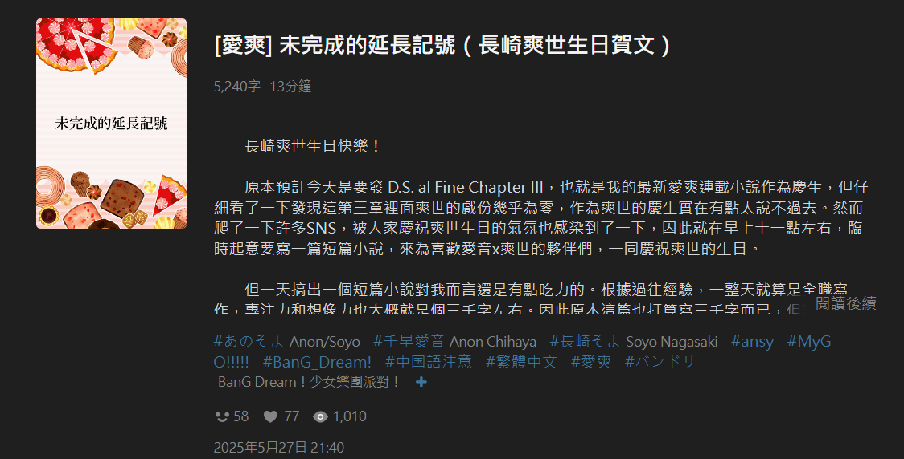

## 前言

　　長崎爽世生日快樂！（again）

　　這是去年的今天為了慶祝爽世生日所寫的愛音ｘ爽世二創短篇小說。當時寫得略為潦草，所以一年後的今天決定以現在功力（啥）精修後重新發表，故事設定為兩人已交往後發生的小故事，希望大家會喜歡。

## Blog 序

　　怕有 Blog 專門讀者搞不懂這是啥然後傻傻的讀了下去所以還是得註明一下，這是基於 MyGO!!!!! 動會內角色描寫兩個女生相親相愛的溫馨小品（白話一點就是GL小說），其中也有兩人的親密互動的描寫，如果有宗教信仰[^1]或其他因素無法閱讀的朋友請略過本篇文章，實在非常抱歉 <(_ _)>

　

## 《未完成的延長記號》（2026 年精修版）

　　長崎爽世拖著疲憊的身體推開家門，整個人累得倒在沙發上。

　　星期五早上吹奏部沒有晨練。原本打算上完今天的課後悠哉迎接周末的爽世，睡前卻收到部長「明天早上臨時加練」的緊急訊息，只好一大早匆匆趕到學校，在沒睡醒的情況下拉了快一小時的低音提琴。

　　好不容易撐到午休時間準備補個眠，又被班級導師在走廊叫住：

　　「不好意思，上次收齊的學生資料出了點問題，長崎同學能幫忙整理一下嗎？」

　　爽世理所當然露出了那招牌的完美笑容，結果一忙就忙到下午，錯過了寶貴的休息時間。但最離譜的還是下午的體育課，體育老師居然為了之後的校慶馬拉松，臨時決定改為長跑練習。原本就不擅長運動的爽世，拖著疲憊的身軀在操場上不停地跑著，讓她感到心力交瘁。

　　「像是過了三天這麼久呢……」

　　爽世躺在沙發上，回想起今天學校發生的所有事情。週五晚上媽媽依舊出差不在家，但這種時候，爽世反而慶幸能獨自一人享受這份寧靜。她不用照顧任何人，不用維持完美的儀態，也不用應付某個粉色頭髮的女孩——那個說話時會露出可愛小虎牙，總是精力過剩的千早愛音。

　　一想到千早愛音，爽世也想起那天兩人開始交往後，發生的種種事情。

　　平常的爽世心底會承認，愛音為她單調的生活增添了許多色彩。母親長期出差時原本令人發悶的夜晚，有了愛音的笑聲後也不再那麼無聊。

　　但今天不一樣。今天的她，只想要安靜，只想要休息，只想要——

　　叮咚！

　　「不會吧。」

　　爽世懷著極度不好的預感走向視訊對講機。果然一按下按鈕，那抹再熟悉不過的粉色頭髮直接映入眼簾。

　　「Soyorin 晚安！」愛音露出燦爛的笑容，手裡還提著塑膠袋：「妳一定還沒吃晚餐對吧？我買了學校附近超——好吃的起司蔬菜通心粉套餐，一起吃吧！」

　　「不是說了多少次，要來之前至少傳個訊息講一下，唉……」

　　爽世嘆了口氣的同時，手指還是按下了開門鈕。她總以為自己適應了這種突如其來的拜訪，但今天真的不一樣，全身的疲憊使她沒什麼耐心，愛音這種不請自來的行為，現在只讓她煩躁。

　　她走向玄關，算準電梯的時間打開家門，才發現站在門口的愛音居然還背著吉他。

　　「妳背著吉他幹嘛？」

　　「原本想說吃完飯可以順便練個琴嘛，」愛音立刻發現爽世臉上的不耐，笑容也收斂了些：「不過 Soyorin 妳的臉色好差喔，沒事吧？」

　　「……真不知道愛音這麼喜歡練琴，總之先進來吧。」

　　爽世避開了愛音的目光，轉身往廚房走去。她伸手打開櫥櫃，結果差點沒將盤子拿好。她搖搖頭，深吸一口氣，像是用盡最後的力氣般，將所有的餐具分次拿到餐桌。

　　此時，爽世突然感受到周遭異常安靜。平常的愛音應該會在旁邊吵吵鬧鬧講著今天學校發生的事，但現在除了空調的聲音外，什麼都聽不到。

　　「愛音？」

　　爽世回頭看向客廳，卻發現桌上只有餐盒，沒有其他蹤影。就在疑惑時，遠處傳來了水聲。爽世皺起眉頭正想走過去看，此時粉色頭髮的少女剛好從浴室探出頭來。

　　「愛音，妳又跑去幹嘛了……」爽世還沒說完，才發現愛音手上拿著毛巾，朝她快步走來。沒等爽世反應，愛音已經拿著毛巾輕輕幫她擦拭臉頰，毛巾的溫熱與舒適，讓爽世閉上了眼睛。

　　「Soyorin 今天一定很累吧？不要亂動喔，脖子這邊也很僵硬耶！」

　　愛音一邊擦拭著爽世脖子上的汗水，一邊隔著毛巾輕輕按摩。

　　「……謝謝。」爽世低聲喃喃自語。

　　「怎麼這麼見外？好了，先回去餐桌吧，我放好毛巾馬上回來！」

　　看著消失在走廊的身影，爽世突然有些內疚。

　　她內心明白，愛音一直以來的貼心舉動，在交往後已成為了內心的養分。但她總習慣用「吵吵鬧鬧」去預設對方的行為，甚至想要拒絕愛音進入家門。

　　「讓妳久等了，」愛音跑著回到了餐桌：「我開動了！」

　　爽世將通心粉送進嘴裡，濃郁的蔬菜香味在口中散開。這才又想起，蔬菜通心粉是她最喜歡的料理。剛才在門口甚至沒有好好聽愛音說明，她到底買了什麼晚餐。

　　「所以 Soyorin 今天怎麼搞得這麼累？」愛音吃著通心粉，臉上擺著一直以來的溫暖笑容：「可以跟我說說看嗎？」

　　原本還在盤算如何道歉的爽世，聽到愛音的這番話後沒有過多猶豫，滔滔不絕將所有事情說了出來：

　　「唉，愛音妳聽我說……今天原本可以睡比較晚的，結果吹奏部突然說要加練……」

　　從早上的緊急晨練，中午被抓去整理資料，到下午那場要命的體育課，愛音笑著聽爽世講述今天的遭遇，偶爾還會發出驚訝的感嘆。當聽到爽世整整跑了一節課的操場時，終於忍不住大笑：

　　「天啊！跑一整節課也太慘了吧！」

　　看著愛音笑得如此開心，爽世的心情也漸漸變得輕鬆。雖然以往都是愛音和她分享學校的事，但現在的她發現，能將自己的心事分享出來，也沒有想像中的彆扭。

　　晚餐後，當爽世正準備起身收拾餐具時，愛音搶先一步站了起來：

　　「Soyorin 已經很累了吧？這些我來收拾就好，先去沖個澡會比較舒服喔！」

　　「沒關係，我來收——」

　　「快去快去！」

　　爽世半推半就進了浴室。她打開蓮蓬頭，腦中冒出了許多關於愛音的想法。平常在團員面前，愛音總是顯得有些孩子氣，甚至會因為一些無關緊要的小事惹立希生氣。但只要是「關於爽世」的事，愛音就像換了個人似的，變得無比細心體貼。

　　「這大概就是愛音的魅力吧。」

　　換上居家服，爽世走出浴室，發現愛音正窩在客廳的沙發上看電視。

　　「不是要練琴？」稍微恢復精神的爽世好奇地問。

　　「啊……」愛音搔了搔頭：「剛好轉到一部想看的電影，Soyorin 一起來看？」

　　她拍了拍身旁的位置，爽世就順勢坐在愛音旁邊。但電影才撥沒多久，爽世就發現不太對勁。電視上陰暗的畫面加上詭異的配樂，完全不像愛音會看的類型。印象中的愛音平常都是看些輕鬆的綜藝節目，記憶中完全沒有看懸疑驚悚片的印象。

　　不過劇情確實曲折離奇，愛音偶爾會緊張地抓著她的手，遇到恐怖畫面時還會用枕頭遮住眼睛，嘴裡碎念著一些發語詞。就連平常冷靜的爽世，也漸漸被劇情吸引，看得入神。

　　「哇……真是太好看了。」隨著電影結束，愛音長嘆了一口氣。爽世覺得有些好笑，就順口一問：「怎麼會突然想要看這種電影？」

　　「總、總要嘗試一點不同的口味嘛！」愛音的笑容變得有些僵硬：「好啦，該來練一下琴了，Soyorin 如果累的話……可以在旁邊看就好。」

　　「練琴？這時間？」爽世看了一眼牆上的時鐘，已過晚上十一點。雖然她一開始就知道愛音今天想要找個藉口住下來，但沒想到都快半夜了居然還想練琴，實在出乎意料之外。

　　「愛音妳先去洗澡吧，這麼晚我要先去睡了，琴明天再練也不遲。」

　　愛音見狀，連忙將吉他拿出來：「咦？不行啦！每天都要練琴的，等我練完再去洗澡……」

　　如此不尋常的反應，讓爽世慣有的敏銳直覺開始運作。她仔細回想著今晚愛音的種種舉動，試圖找出那股揮之不去的不協調來源。她心想，愛音藉機想要留宿這件事本身並不奇怪，但是最想不透的，還是明明知道今天很累，卻還希望她陪著一起練琴這件事。

　　「啊！」

　　如閃電般清晰的念頭，在爽世的腦海閃過。她終於明白，愛音在打什麼主意了。

　　「愛音，妳要練琴沒關係……」爽世迅速撇過頭，避開愛音的視線：「但我今天真的很累，要先去睡了。妳練完後洗完澡再自己來房間吧。」

　　說完，爽世立刻快步往臥室走去。

　　「咦？等等，Soyorin！」

　　愛音顯然沒料到爽世會突然這樣。她慌忙放下吉他，追在爽世身後，但爽世的動作太快，已早先一步進了房間。

　　「So……Soyorin……」

　　愛音輕輕推開半掩的房門，聲音帶著一絲失落：「再、再陪我一下嘛……」

　　房間裡一片漆黑。愛音探頭仔細張望，卻沒看到爽世的身影。就在她疑惑的瞬間，身後的門被關上，一抹熟悉的身影突然出現，輕輕將她抱住。

　　「生日不一定要在十二點過後才能祝賀喔，笨蛋愛音。」

　　這人毫無疑問，就是爽世。那耳邊極其溫柔的語調，讓愛音感到一陣酥麻，甚至忘了呼吸。

　　「咦？啊……」愛音愣了好幾秒，才理解現在的情況。

　　「我從剛剛就覺得奇怪，」爽世將愛音抱得更緊了些：「明明一進門就發現我的疲憊卻如此體貼的愛音，吃完飯後卻一直不讓我休息……這實在太反常了。」

　　她微微一笑：「所以仔細想了想，一起看恐怖片是想讓我保持清醒，可是電影結束後時間還是差了一點，所以愛音只好另外找個理由，說要練琴……」

　　「這一切都是為了拖到十二點，想要準時第一個跟我說生日快樂吧？」

　　愛音耳根漸漸發紅，不敢回頭看爽世的表情。

　　「這種可愛又幼稚的小心思，果然很有愛音的風格呢。」

　　「Soyorin 好沒情調喔，」短暫沉默後，愛音終於低聲抗議：「既然都發現了，應該要裝作不知道，配合一下嘛。」

　　「要不是累到都快忘記自己的生日，差點就要被愛音得逞了呢。」爽世的雙手依舊摟著愛音的腰：「誰叫愛音一直要我更坦率一點？」

　　「既然這樣……」

　　愛音突然轉過身，反手扣上了爽世的腰，順勢將她推倒在床上。

　　「生日禮物也不一定要在十二點過後才能送嘛？」愛音對著自己身體下的爽世，微微一笑：「笨蛋 Soyorin。」

　　「等、等等……」

　　話還沒說完，爽世的唇間便已感受到一陣柔軟的觸感。伴隨著熟悉的口紅香氣，愛音已將所有的話語，傾注在這個瞬間。

　　不知過了多久，兩人躺在床上微微喘著氣，而地上零散的衣物，還殘留著剛才親密的餘溫。就在此時，床邊愛音的手機鬧鐘，突然響了起來。

　　「Soyorin，生日快樂。」

　　愛音側頭看向臉頰帶著些許紅暈的爽世，溫柔地笑著。

　　「所以愛音的生日禮物，」爽世直視著天花板，淡淡地開口：「就是不洗澡跑來弄髒我的床？」

　　「不對喔，Soyorin 的生日禮物是……」愛音將爽世的手抱在懷裡：「剛剛只有 Soyorin 才看得到的表情。」

　　「愛音，就是個笨蛋。」

　　月光灑進房間，照在兩人的身影上。

　　長崎爽世牽著愛音的手，帶著微笑進入了夢鄉。

## 後記

　　愛音沒洗澡就跟睡在爽世床上，好孩子不要學喔。

[^1]: 場次交流發生的真人真事：我送對方（同為創作者）小說印製的明信片特典（上面印的是愛音爽世接吻的圖），對方猶豫了一陣子後表示家裡宗教信仰所以不能收。此後讓我理解的確有些人有這層顧慮，因此類似的文章往後也多少會提醒一下。