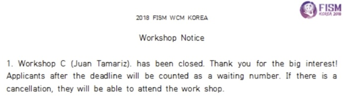
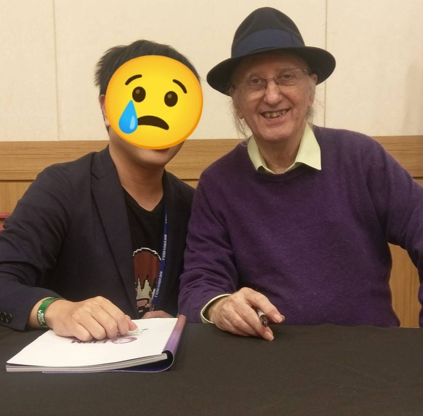

　　Juan Tamariz 過世了。

　　一般人或許不熟他的名字，但在魔術圈中，如果有人跳出來說 Juan Tamariz 是本世紀最偉大的魔術師，我想大概沒人會反對。

　　2018 年在韓國舉辦的 FISM，其實一度猶豫要不要去，畢竟[先前提過](/mood/thursday-badminton-10/)我「沒那麼愛出國」外，很多會在韓國 FISM 出現的魔術師，在台灣 TMA 大會也相對容易遇到。但壓死駱駝的最後一根稻草，就是 Juan Tamariz 也會去。

　　Juan Tamariz 長年居住在西班牙，當時年事已高，大家都在猜這或許是他最後一次來亞洲的魔術大會了。報名這次 FISM，其實就是為了見偶像一面。結果報名成功沒多久，就收到 Tamariz 居然打算在其中一天開 Workshop 的消息，僅限 30 個名額。當時我連價格都沒看，二話不說就填了報名表，結果沒過多久就立刻額滿，真是好險沒有半點猶豫。

　　知名魔術師在魔術大會開的「工作坊」，多半一次都三至四個小時，內容通常都是該魔術師的獨家心法以及絕學。但真要說 Juan Tamariz 有教了什麼只有在 Workshop 裡面才能學到的東西，其實沒有。Juan Tamariz 從不藏私，那些心法和絕學早已通通變成了教學影片和書，這場 Workshop，更像是完成了心中那原本遙不可及的夢想，也就是現場看著 Tamariz 重現那些原本只會出現在教學片中的經典效果。

　　最後 Workshop 結束，他一一為來上課的朋友簽名並閒話家常。世界上最厲害的魔術大師之一，卻從不拒絕觀眾的任何要求，要簽多少個名，要拍多少張合照都可以，等到大家滿意了，他才收拾東西，和助理最後一同離開房間。

　　「Tamariz doesn't act.」

　　當初忘了從哪聽到這句話時，我是半信半疑。真要說，哪有一個魔術師不「Act」？這樣要怎麼「演」？

　　但親身經歷過 Workshop 後我才知道，世界上真有人的魔術可以如此真誠，如此發自內心，就和他在書上提到過的所有心法一樣。他認為魔術一直都不該是「我想騙過你」或「魔術師很厲害」，而必須開始於「心」，也就是魔術師內心深處對「奇蹟」與「童趣」的真實渴望。

　　小時候我們想像人類或許能在天上飛，或許有任意門，或許能穿越時空，那些才是「魔術」這門藝術的真正起點。而真正發生「魔術」的，是魔術師透過身心完全的投入，並感染現場的每一位觀眾。最後，好的魔術表演結束時，不該留在觀眾的大腦，而要留在「內心」，必須讓手法被遺忘，過程被模糊，唯有當時受到的感動與不可思議，會永遠停留在觀眾的心底。

　　Juan Tamariz 教會我的，或許不只是魔術也說不定。

　　如果世界上真的有天堂，那他現在應該正和 Dai Vernon 開心地討論著魔術吧。謝謝 Juan Tamariz，帶給我們這群魔術師們無數的歡笑與快樂，並提醒著我們魔術的本質，讓我們不會走上歪路。

　　在我心中，他就是最偉大的魔術師。

（攝於 FISM 2018 Tamariz Workshop）

### 後記

　　僅以此文，紀念 Juan Tamariz。如果想看他的表演，以下放個簡短的片段，雖然一般人大概不會覺得這魔術多厲害，但我的想法就和那些留言差不多（皆已翻譯成中文）：

　　「如果你沒完全學會他的一舉一動，那不可能有人被你騙到，他完全是個天才」

　　「沒看過比他更棒的表演，以這個程序來說」

　　「這影片的每一秒鐘都有無數個值得學習的地方」



### 後記 1.5（8/20 00:40 更）

　　或許是宇宙大電波，在得知 Tamariz 過世的幾個小時前，剛好看到一篇文章[^1]，提到了最近格友間流行的荒島問題：

　　訪談中，Juan Tamariz 被問到：「如果有一天，你漂流到荒島去了，而你只能帶一樣東西，你會帶什麼？」

　　大家或許都在猜他可能會回答撲克牌或是其他的魔術道具。但 Juan Tamariz 這樣說：

　　「我會帶一個觀眾。因為魔術必須要有觀眾才可以存在，只有一個人是沒辦法變魔術的。」

> 不只是魔術，許多人類文明如果沒有第二個人，我想也無法成立。 By LQ7

### 後記 2

　　沒錯，這是我的「 [8 月 BlogBlog 同樂會](https://blogblog.club/party/)」的投稿文章，本月主題是「[一期一會](https://blog.ikukaroom.com/ichigo-ichie/)」，由 [ikuka](https://blog.ikukaroom.com/) 主持。先前的投票，想說講個在澳洲打工遇到日本大叔或高中翹家的事，最後還是跳票了，非常抱歉。最近發生了些事情加上今天被 Juan Tamariz 的新聞洗版，讓我很快下了決定，用「與 Tamariz 的一期一會」投稿了八月文章。

　　廣義而言，無論相遇的時間多長，這世界上發生的任何事情真的都是一期一會。因此，想做的事情就去做，想見的人就去見，或許才不枉人生的一期一會也說不定。

　　各位平安健康。

[^1]: 原本想 reference 原文但發現是私密社團，只好由我轉述後 reference 作者，原文出自[非洲魔術醫生 - 黃大胖](https://www.facebook.com/FattyMagic)之筆。