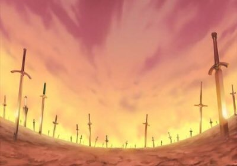

### 古董

　　講個劉墉書裡印象非常深刻的故事。[^1]

　　一位年輕人偶然買到了一只精美的古董瓷瓶，被其展現的工藝與神韻深深震撼，從此開啟了收集並鑽研骨董的興趣。數十年過去，他擁有了一間業界有名的古董店，也變成了首屈一指的古董鑑定大師。而那只瓷瓶對他而言就是鎮店之寶，每當遇到客人，他都會講述與這只瓷瓶相遇的故事，客人也深深感動。

　　因此，當他準備將那只瓷瓶拍賣掉的時候，所有人都震驚了。

　　最後得標的人非常高興，表示會一輩子珍惜這麼有意義的寶物，捧著瓷瓶離開了現場。但那位大師的太太表示鎮店之寶怎能隨便亂賣？氣得三天不跟她丈夫說話。

　　那天晚上睡在床上太太再度撇過頭，不跟他說話。那位大師只好靠了過去：

　　「有天關店後，我在店裡看著那個瓷瓶，想說好久沒有好好鑑賞它了，於是就把它拿了下來……」

　　「在拿的時候我就覺得不對，仔細一看後發現這只瓷瓶，是假的。」

### 畫

　　會想到上面的故事，是因為幾年前看到徐小虎老師的許多訪談[^2]和這段讓我深受震撼的說法：

> 「如果看到畫覺得『我好喜歡』，又買得起，那麼我覺得買假畫也沒關係。因為這樣你就和畫發生了真的關係，這一點都不傷害別人。」 
> 

　　「形式的連結遠比真偽重要」，我完全感同身受。單純因為一幅畫的線條與意境而感動，這幅畫就與內心產生了真正的連結，是真是假已不是問題。許小虎認為許多假畫其實畫得精美絕倫，只是它們「生在了另一個時代」。

　　比起這些，她也提到藝術更大的問題，那就是現代人不是因為「愛」而買畫，而是因為「貪」。畫裡面畫了什麼沒人在乎，只看名氣、印章、落款和價格。我認為不僅是骨董收藏界，放眼望去所有的藝術都通用的道理——內心的真實感受，遠比那顆「印章」重要，而所謂的「印章」，在各類藝術都會以不同形式出現。

　　但後面這部分離題了，有空再另闢文章細說。

### 鴿子

　　在 GQ Taiwan 的「[專業賞鳥人親自回答賞鳥問題](https://www.youtube.com/watch?v=g-U-vJlvPPs&t=481s)」中，Christian Cooper 被問到「對於鴿子的看法」（在台灣其實路上的那些幾乎是斑鳩[^3]）時，表示原本也是「老天啊為什麼要造出這種鳥」，後來才認為，牠們是給那些「困在都會區生活」無法隨時來到優美大自然人們的「鳥類大使」，也是連結大自然的那道窗。

　　聽到這說法後有時候會想，身為都市小孩的我會喜歡鳥或許也是鴿子（斑鳩）的原因也說不定？

### 後記

　　興趣的連結讓我想到許多事情，包括有時候不見得非得是什麼大師的作品才能引人入坑，可能只是「帕海貝爾Ｄ大調卡農」，但就如同這篇文章一樣，我認為都沒有關係。

　　題外話，一開始劉墉的寓言如果是我大概會換個結局方式，雖然讓主角賣瓷瓶是最戲劇的結局，但如果主角逢人就介紹那鎮店之寶其實是假的，大概是更芙莉蓮式的結尾吧。

### 後記２

　　關於真品和贗品，很難不想到這個[^4]：

　　「這些本來就是贗品，所有的劍都是模仿而來，對你來說只是不值得一提的存在。但是，並沒有什麼贗品就勝不過真品的道理……」

　　「英雄王，你的寶具存量，足夠嗎？」

　　🗡️⚔️🗡️⚔️🗡️ 有空再說（again）🗡️⚔️🗡️⚔️🗡️ 

[^1]: 稍微搜尋了一下沒搜到原文，所以憑久遠印象和大家分享，內容鋪陳可能與原文有出入還請見諒 🙏

[^2]: [揭故宮假畫被封殺40年！91歲藝術史學者隱居深山活出最純粹靈魂](https://www.hk01.com/article/60293286)，[徐小虎：台北故宫50多幅吴镇只有3幅半是真迹](https://www.chinanews.com/cul/2014/02-25/5877168.shtml)，兩篇都是非常好看的訪談，推薦閱讀。

[^3]: [鴿子和斑鳩的分辨法](https://taiwanking68.pixnet.net/blog/posts/9556902943)，教大家一個最簡單分辨法，就是都市路上看到的 99% 都是斑鳩所以先喊斑鳩準沒錯 🫠。另外有個豆知識就是魔術師常變出來的那隻也不是鴿子，是「白斑鳩」（我大概也是因為這樣才知道鴿子與斑鳩的差異）。

[^4]: [Fate/Stay Night: Unlimited Blade Works](https://zh.wikipedia.org/zh-tw/Fate/stay_night_Unlimited_Blade_Works_(%E7%94%B5%E8%A7%86%E5%8A%A8%E7%94%BB))，最喜歡 UBW 的設定和世界觀，但無論是劇場版還動畫我還是更喜歡最初的遊戲（電子小說）版本。