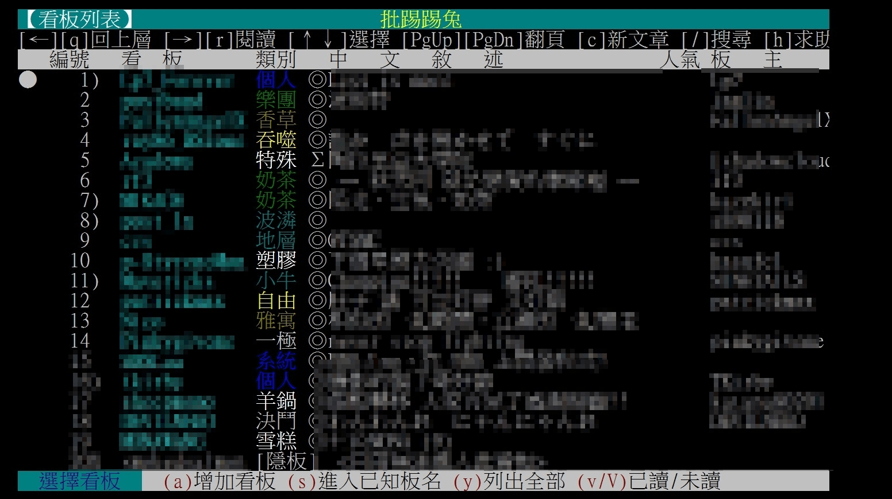

　　聊完[跟風](/mood/join-the-hype/)立刻來跟風，如果想看其他格友的答案，可以來[這裡](https://trashposts.com/blog/blog-questions-challenge/)看看。

　

### 為什麼開始寫部落格？

　　想要有個安靜思考和寫作的地方。詳細請見[為什麼回來寫 Blog](/thinking/why-back-to-blog/)。這也是寫 Blog 的好處之一，遇到問題如果有已經寫好的文章，直接貼個連結就搞定了 XD

　　題外話，其實三月初我就重新開始使用社群軟體，包括 FB、Threads、IG、X、Plurk。或許之後也會寫篇「為什麼回去用社群軟體」，有空再細說。

　　

### 使用什麼平台來管理部落格？為什麼選擇它？

　　我用的是 Hugo 這套靜態網站產生器 搭配 PaperMod 主題，網站檔案則部署在 GitHub Pages 上，網域在 Cloudmax 購買與管理，另外像 [q@lq7.tw](mailto:q@lq7.tw) 的自訂網域信箱則透過 Zoho Mail 代管郵件服務。

　　至於為什麼選擇 Hugo，因為 [Blogblog 同樂會資源](https://blogblog.club/resources)內的介紹，其中有一行字「以速度快聞名」，天啊，誰能拒絕速度快的產生器？結果就用到現在。

　　題外話，自訂網域信箱有個問題，是容易被 gmail 之類的郵件收發系統判定為垃圾信。我發現寄出的信如果對方沒有回覆，多半是因為被丟到垃圾信去了。所以某天自己也檢查了一下 gmail 的垃圾信夾（因為我習慣用 gmail 整合所有的 mail），也發現裡面有 ikuka 的留言板回信訊息，雖然是 gmail 的鍋，但有使用自訂網域 mail 的朋友還是得注意寄給那些大公司網域的 mail 被判定為垃圾信的問題。

　　就在剛剛我決定認真解決這個問題，發現似乎要去 https://postmaster.google.com/ 驗證 domain 應該就能一勞永逸，之後再觀察看看是否有改善。

　

### 有在其他平台上寫過部落格文章嗎？

　　拜我爸也是資訊本科之賜，得以在撥接年代就架過個人網站。但當時的個人網站多半都比較有……目的性？這邊的目的性不是指商業活動，而是類似像[史萊姆的第一個家](http://www.slime.com.tw/)（剛點進去才發現原來還有在更新好扯喔XD），多半做一些有目的性的分享交流，印象中非常少「個人心情記事」的網站。當時我第一個網站是分享蒐集的 GIF 動圖（然後被我爸說這網站設計不良，因為一堆 GIF 動圖流量太大別人根本點不開，沒錯，那時候的網路速度是 56Kb/s），第二個網站則是介紹金庸（當時沉迷金庸小說），在網站上討論喜歡和討厭那些角色，想想有點意味不明（說好的目的性呢）。

　　對我而言比較像是「部落格」的創作方式前身，應該是 BBS 個人看板，當時[批踢踢兔](https://term.ptt2.cc/)或校內 BBS 都能申請個板發廢文，直到 FB 興起後 BBS 就漸漸沒落了，因此當時有轉移陣地至 Google Blogspot 一陣，出社會後也在 Medium 寫了點東西，Blogspot 文章因太過青春羞恥目前已設不公開，所以搜尋不到了嘿嘿。

　　其實個人還是最喜歡 BBS 個人看版那樣的方式，簡單快速又方便交流~~，美好的過去為什麼會漸行漸遠呢.jpg~~。

（PTT2 那些~~美好的過去~~個版們）

　

### 如何撰寫文章？

　　文章會在 Notion 先寫好，然後匯出 Markdown 檔後再去 Notepad++ 自己加上 Tag

　　（先在 Notion 寫好後匯出 .md 檔）

　　（然後把檔案用 notepad++ 開啟加上 Hugo 可辨認的 Tag）

　　然後再丟到資料夾，開啟 PowerShell 先用 hugo server 從網頁上看一下顯示上有沒有問題（順便校稿），最後 git add .，git commit -m “blabla”，git push，文章就發布完成了。

　　原本打算~~優化~~[最佳化](https://wiwi.blog/blog/optimize/)這個流程（例如寫個程式連動 Notion 上面的文章之類的）但後來覺得好像也沒有必要，這略為繁瑣的流程反而可以讓我更謹慎對待每篇文章~~減少廢文的產生~~。

　

### 什麼時候最有寫作靈感？

　　~~上班的時候。~~

　

### 部落格文章是寫完後立即發布，還是會先存成草稿醞釀一下？

　　寫完會立刻發布，但會控制每篇文章寫完的時間點。例如寫到這段的現時點是 2026/5/5 21:15，由於這篇是 5/6 要發的文章，所以我會自行配速配在 00:00 後寫完再校稿。這大概是「既然文章寫好就趕快讓大家看到」和「想要保持文章發佈時間平均」的一個最佳平衡點了。

　

### 部落格上最喜歡的文章是哪一篇？

　　當初成立這個 Blog 原本文筆想要裝得很「作家」，結果一下就破功了。要寫成像小說和長文那樣精煉的文字（有精煉嗎）很累的R！潤稿要潤好幾遍R！現在日更的文筆比較像是一般的我，贅字多愛用括號不優雅（間諜家家酒亨利老師.jpg），但好處是文章打比較快也比較輕鬆。

　　呃，離題了。如果是其他格友，我比較喜歡看~~廢文~~心情記事類的文章，但自己的 Blog 最常重看的系列則是[思考分頁](/thinking/)裡面的文。如果硬要選一篇，我會選[〈我的ＡＩ使用守則〉](/thinking/my-ai-principles/)。原本這只是系列文的第一篇，但寫這種文章太累了，導致第二篇遲遲不見蹤影。人生嘛，計畫總是趕不上變化（？）

　

### 對部落格有什麼未來計畫嗎？例如重新設計、搬到另一個平台，或是加入新功能？

　　~~用得好好的幹嘛改？~~（PS 手把派）[^1]

　　啊，真要說的話因為最近在[碩人](https://shuojen.com/guestbook)那邊用文章底下留言用得很開心，覺得那樣真的很方便，所以如果要加入新功能的話應該就是這個了~~但我連去叫ＡＩ幫我用好的力氣都不想花，如果一覺醒來發現部落格多了這個功能那就再好不過~~。

[^1]: 相較於任天堂每換一次主機手把都要大改，PS手把從一代就是長那樣，傳聞 Sony 表示：「用得好好的幹嘛改？」