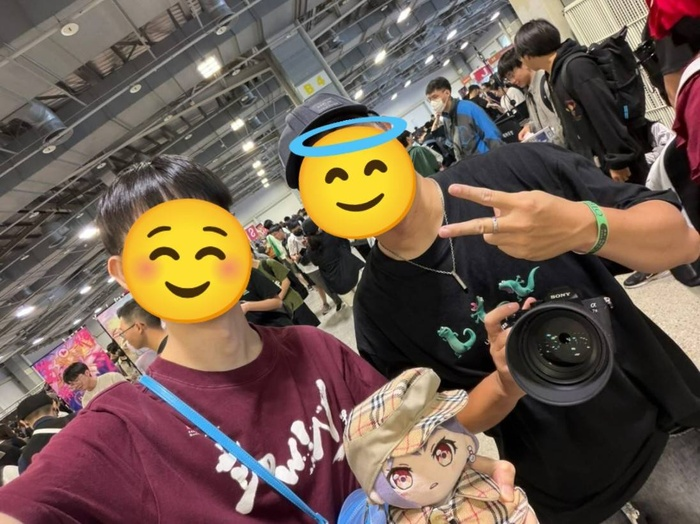
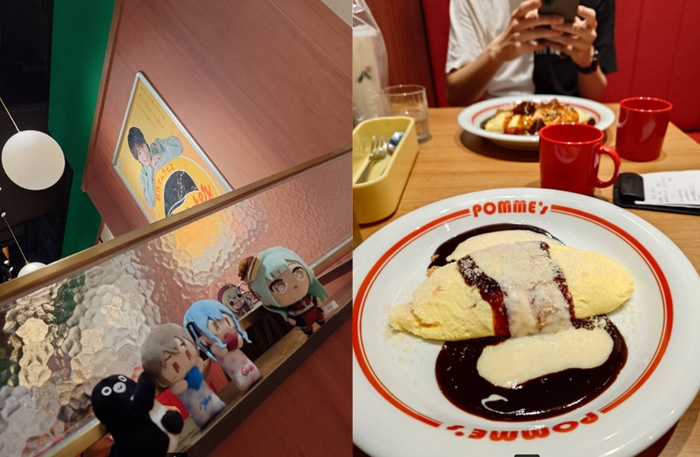
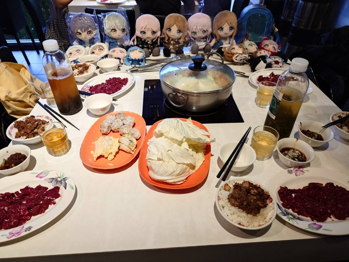
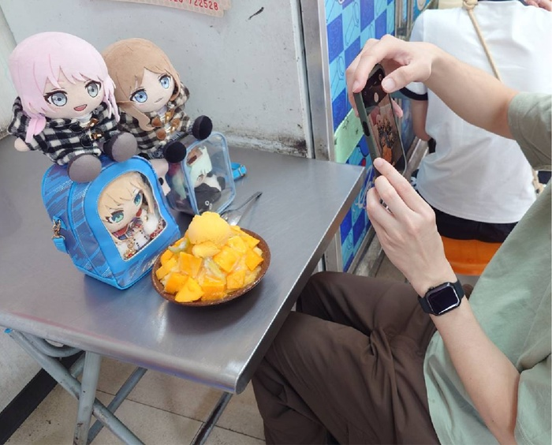
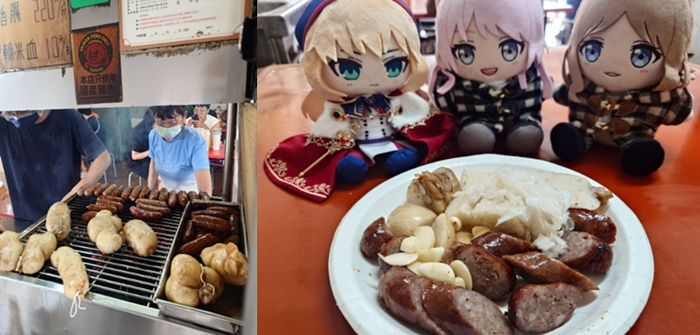
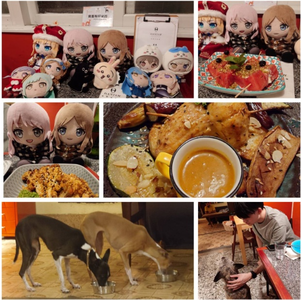
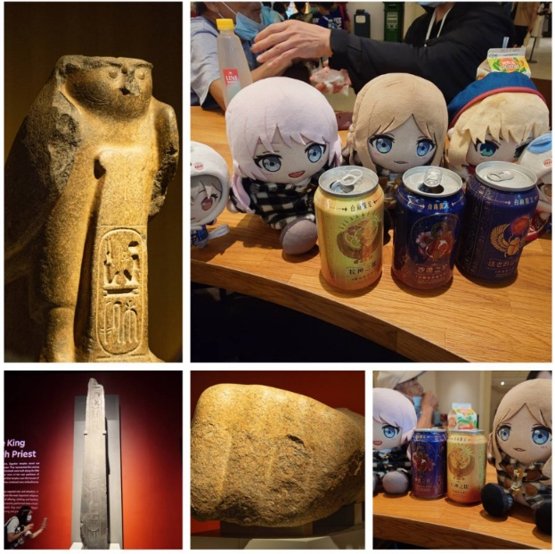
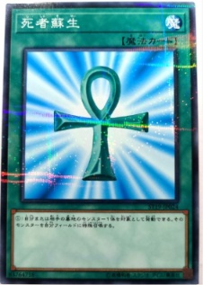
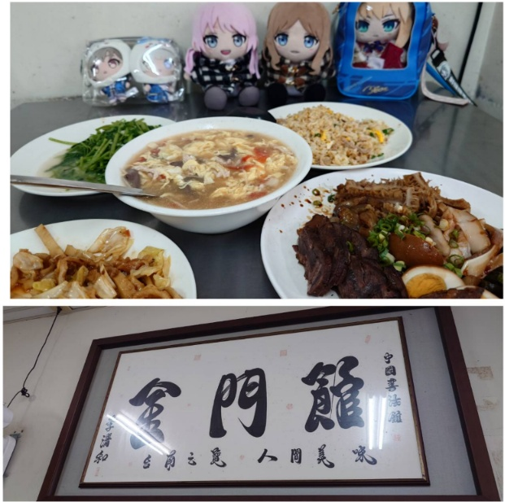

　　事情要回到五月底參加台北創集繪同人場說起。

　　不對，應該要回到[大佳河濱公園的邦邦演唱會](/music/ppp-roselia-live/)後，看到了[這篇 Blog 文章](https://blog.wei-lee.me/posts/random-thoughts/2026/04/tomorin-goes-to-presidential-office/)，發現格友李唯居然同時也是邦友，經過進一步稽查後（？）發現早在[二月時就潛入了 FF 同人場次](https://travlog.wei-lee.me/posts/review/2026/02/ff-46/)拿過我的名片。由於興趣如此相近（相反？[^1]），從那之後就在對方的 Blog 留言板偶爾留個言保持聯繫。直到五月中，在李唯的留言板和他介紹了五月底在花博的創集繪同人場，表示裡面有許多~~女同~~有趣的攤位可以來逛逛……

　　宅宅果然很好上鉤（？），李唯雖然~~一秒幾十萬上下~~工作繁忙，但還是抽空前來創集繪，於是就是如此突如其來，完成了首次的格友見面會。

（李唯大大表示他的照片網路上到處都是所以不用碼，但總覺得只碼自己有點太杯壁（？）最後還是都碼了🫠）

　　事實證明（到底是什麼事實）宅宅都是好人，我們逛了展聊了天，就這樣度過美好的一天，之後也交換了聯絡方式（怎麼有種[既視感](/mood/super-mission/)）。之後我也提到如果有空下來南部可以一起出門晃晃之類的，李唯也表示有機會的話一定。

　　如果是日本人，事情大概就這樣落幕不會有任何後續[^2]，但很可惜我和李唯都不是，就在上周六，李唯真的就這樣跑來台南了！

　　兩天的周末行程規劃，明明是個Ｊ人的李唯卻說「怎樣都好」，殊不知這樣的說法對一個Ｐ人（我）實屬大忌，除了已預訂好的週六晚餐外，其餘行程就算到高鐵站接準備接人時依舊空白。太太在我出發前也出了老套的主意，說帶台北人體驗丹丹漢堡應該是絕佳選擇，結果接到本人後，才發現李唯大大在這裡念了好幾年的書，根本對這裡瞭若指掌。這樣下來，丹丹漢堡那些什麼甜到有問題的玉米濃湯，根本不算什麼特殊體驗。

　　完蛋啦！！！這下真不知道要幹嘛了！

　　沒關係，山不轉路轉，路不轉車轉，高鐵對面就是個 outlet，在車道瞄了一下發現停車場排隊的車不多，果斷轉進去，午餐就在 outlet 裡面解決，真是太棒了。但是，這也只解決了一半，因為接下來的難題就變成了要在眾多的餐廳中趕快找一家有在地特色的店，不然如果只是吃些什麼全台都有的連鎖餐廳，成何體統…..

　　啊！

　　「欸你知道蘋果樹蛋包飯嗎」

　　「不知道欸」

　　「就……[這間蛋包飯](/mood/join-the-hype/)」

　　「好像可以喔，去看看」

　　沒錯，我們立刻前往了另一位格友推薦的蘋果樹蛋包飯，看一下人潮如何再決定要不要吃。沒想到假日中午居然不用排隊就能直接進，看來台灣人的跟風熱潮已過，真是太幸運惹。

　　我們兩人被安排到有岡大貴（這次終於沒打錯）海報的隔壁位置，我也立刻和李唯介紹了這間蛋包飯的由來（直接[貼 Blog 文](https://blog.ikukaroom.com/pomunoki-tainan/)）。這次我點的是番茄口味的飯，我覺得雖然依舊偏鹹，但真的是很好吃，李唯則是點了上次我覺得不錯的 PRENIUM 醬系列，他也覺得好吃，真是太好了。

　　「這間我看以後就叫做 ikuka 蛋包飯了」[^3]

　　「很有道理」

　　（不要造成別人困擾Ｒ）

　　吃飽後，真的不知道要幹嘛了，只好先回家。宅宅的行程就是這麼樸實無華，明明從台北遠道而來，待在家裡也是非常舒適，就這樣聊天鬼混到晚餐時段後，出發前往本次聚會唯一既定的牛肉火鍋行程。

　　這次牛肉火鍋除了李唯之外，還找了另外一位同樣在南部的邦友——先前在創集會合本認識的 LACC 老師一起共襄盛舉。結果莫名三人都讀過同間學校加上類似職業，聊起來還真格外親切（其實聊邦邦的部分更為親切），果然牛肉火鍋作為台南的定番行程，絕對不會有任何問題。

　　原本打算邀請 LACC 老師吃完飯後一起回家繼續嗨，但老師表示來餐廳時車子爆胎了😱（到底怎麼抵達餐廳真是太強），等等要去修車不然今天可能回不了家，實屬可惜（最後成功找到店家修好，可喜可賀）。於是，回家後和李唯一起將最新的邦邦動畫《[夢限大みゅーたいぷ](https://www.youtube.com/watch?v=aWyEn31kBIY)》補到最新進度第五集（李唯其實已經看過，所以基本只是陪我複習一次）。看完後感想還是只有這樣：

　　理性上能理解這樣的編劇就是有流量和話題（就如同八點檔的角色設定，壞女人就是扁平的壞，才能讓大家有共感而一起討厭），但感性上認為都 2026 年了，應該至少有 100 種能達到同樣效果但角色刻劃更立體的方式去推進劇情吧？🤔

　　離題了，但我想瘋狂星期四[^4]還是會繼續下去，但我個人是已經沒這麼期待劇情本身，比較像是「看你還能變出什麼把戲」的湊熱鬧模式。

　　看完邦邦，本日重頭戲終於來了，那就是和李唯一起討論出明天到底要幹嘛 🫠

　　原本的計畫是看來都是有在運動的戶外宅宅們，找座附近的山健行似乎是不錯的選擇，但這兩天天氣永遠是早上開始下雨下到中午，雖然說是喜愛運動，但也沒愛到下雨還硬要爬山，短暫盤算後決定放棄這計畫。

　　然後，就沒有然後了，那到底要幹嘛 🤣

　　最後決定，看來睡到中午也是個不錯選擇，再看要不要去個玉井吃個芒果冰之類的。

　　「好欸～」

　　李唯大大真是我遇過最Ｐ的Ｊ人了（啥）。於是，隔天我們就照著計劃執行，早上先去吃了虱目魚皮湯後就回家繼續睡到中午，再出發前往玉井吃芒果冰。

　　這間玉井每次都大排長龍的芒果冰，由於每次來的時候都人潮眾多，我是一次都沒有進去過，但沒想到這次明明也是假日，居然完全沒有排隊就直接入座，難道李唯就是傳說中受到「不用排隊之神」眷顧的子民？！

　　雖然耳聞玉井最好的芒果都是外銷，自己留下來切的算是「沒那麼好的芒果」，感情上也知道就算在台南市區吃到的芒果 99% 也是從玉井山上運下來的，但每次在產季來玉井吃芒果冰總覺得還是特別好吃，我想這就是產地的儀式感作祟吧（而且的確比較便宜）。

　　吃完芒果冰，和李唯晃了一下玉井老街，沒其他事幹就準備回家（真是特地來吃芒果冰的），結果在路上看到一間香氣四溢的烤香腸攤，而且一堆人排隊，兩人的台灣人排隊魂[^5]立刻被喚醒，反正來都來了，就排一下看是不是真的好吃。

　　結果還真好吃！果然排隊是有原因的！比起市區夜市普遍吃到的「黑豬肉香腸」再好上一點，糯米腸也是正統大腸灌出來後烤過非常香，推薦。

　　最後，吃完這攤我們就真的回家了。再度殺了許多時間後，又到了歡樂的晚餐時光。這次李唯大大直接推薦了一間我沒吃過的丹麥美食，這種推薦行程實在是太棒惹！二話不說立刻驅車前往：

　　很不錯的餐廳，吃了許多平常鮮少吃到但風味十足的異國料理，店裡面的狗狗也很可愛，會跑來討摸（怕狗人士須留意）。

　　吃飽喝足後依舊回到我家，由於禮拜一大家都要上班，於是李唯從禮拜一開始就沒有住在我家，而是自己找了個旅館，旅程就這樣畫上了句點……。

　　當然還沒結束！李唯表示星期二他打算前往奇美博物館看埃及展，這種好康怎能錯過，剛好我和太太都還沒看過埃及展，於是不僅我請了假，也順便慫恿太太請了假，三人在星期二一同前往奇美博物館：

　　（三人不約而同被「台南限定」博物館氣泡飲騙錢）

　　由於各大藝術創作或多或少都有借鏡埃及文化，因此埃及展的文物有種熟悉又陌生的感覺，例如看到熟悉的標誌就會立刻想到遊戲王的卡牌，也是沒辦法的事：

　　埃及展結束後，原本臨時找了間附近評價還不錯的義大利餐廳，但打去發現怎都沒人接，一查才知道果然又是臨時店休（台南店家 google 營業時間完全不可信），最後靈機一動，想到一間有點久沒吃的眷村美食「金門館」：

　　這間店某種層面和我以前的生活有著某種淵源，最後能帶李唯來吃這間店真是太棒惹。吃完最後送李唯回旅館（下午還要工作真辛苦），就真正結束了這次美好的旅程。

### 後記

　　由於不寫下來的東西都會被遺忘（again），這篇在星期二時就努力先把流水帳盡量寫下來了，還好有寫，不然許多事情發生的時間順序已經開始搞混，人類的記憶真是不可盡信，也請大家期待李唯大大的遊記，相信會比這篇流水帳有趣許多🫠（施加寫作壓力）。

　　然而，這周末回想起來的確挺不可思議，因為寫 Blog 而認識新朋友，還能在現實當中一起出遊，我想人與人的連結就是這麼魔幻。回想這幾天的行程，或許又讓傳說中「理想的日常」資料庫再度更新了也說不定。

　　雖然不覺得自己是個Ｅ人，但接下來還是不免俗講些很Ｅ的宣言，如果有其他格友來南部玩，歡迎來信聯繫，不嫌棄的話可以一起吃吃飯聊聊天講講其他格友的八卦[^6]，想必同樣會非常有趣！

　　希望之後還能寫出「格友見面會（續）」的文章，嗯，不對，或許是「格友見面會（二）」也說不定？🫠

[^1]: 參閱李唯大大的[構成我的九部動畫](https://blog.wei-lee.me/posts/random-thoughts/2026/05/nine-anime-that-builds-me/)，唯一重疊的是 MyGO!!!!! 之外居然還推不同 CP，某種層面而言大部分的影視喜好都是光譜兩端（？）

[^2]: 日本人如果說「有機會的話就去」，白話翻譯就是「我不會去」🫴

[^3]: 現在重看文章才發現裡面寫了「蛋包飯裡面就應該要是番茄炒飯」，而上次吃奶油炒飯這次吃番茄炒飯的我，也覺得番茄炒飯好吃很多😊

[^4]: 邦邦上部《Ave Mujica》新番也是在星期四播，由於劇情同樣曲折離奇非常誇張，被邦友們稱為「瘋狂星期四」，這次的新番我想也是同樣狀態。

[^5]: 其實我沒那麼喜歡排隊，但看起來不會排太久，所以就，來都來了（？）

[^6]: 雖然實際上沒任何八卦成分，但姑且還是有聊到其他格友並聊了些好笑的事，由於不知道講出來會不會有失禮的嫌疑因此暫且略過 🫠