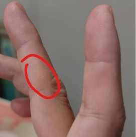
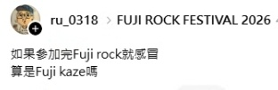
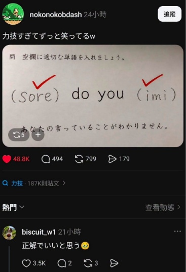
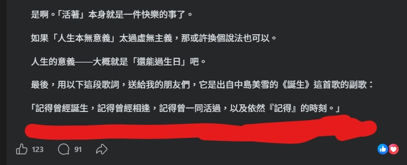

　　總覺得今天開篇「雜談」的文章是不是跟羽球系列重複，但說實話重複也算不上什麼問題，因為有很多完全不相干的事情想一次紀錄，於是，好吧，就這樣 XD

## 東野圭吾

　　星期一上班上到一半突然被訊息洗版，沒錯，東野圭吾老師因為大腸癌過世，享年 68 歲。就算沒打籃球，或許也會聽過 Michael Jordan，就算沒玩 LOL，或許也會聽過 Faker，就算對推理小說不那麼熟悉，或許，也早已看過東野圭吾老師作品改編過的日劇或其他影視作品。

　　據查東野圭吾老師共有 106 部作品，是個非常高產的作家[^1]，但自己看過的「原作」應該不超過五部，或許是因為近年總刻意找「沒有死人」的推理作品去看，因此排除了大部分的本格作品。如要只能推薦一本東野圭吾老師的作品，那毫無疑問就是《解憂雜貨店》了。我喜歡這故事的全部，推薦大家也能去看看。

　　謝謝東野圭吾老師，在文學上帶給我如此多的啟發與靈感，希望老師在另一個世界也能繼續快樂創作。

## 繭

　　我的手最早的繭，應該就是筆繭了。在中指第一指節的左側，學生時期大量用筆的關係導致。然而邁入資訊時代後，鍵盤越打越多，筆繭漸漸消失時，卻又因為當兵時非常認真寫大兵日記之係又長了回來一陣，時至今日，雖然已沒有繭，但還是留了個痕跡在上面。

　　再來是有在健身的朋友最常出現的手掌繭。就算現在已超少做力量訓練，但食指和中指的掌心還是有個繭，這繭對有些朋友的確會困擾，因為握手會讓別人覺得手非常粗，而且這部位的繭只要回去拿個兩下啞鈴，不出兩天又會直接長回來，是個非常難纏的繭。

　　若要徹底根絕，唯一辦法就是戴重訓手套，但我本身沒特別在意就是。

　　然後，我的左手大拇指指節左側，也有一個「羽球繭」。長時間握棒狀物基本上都會有這個繭，由於彈吉他時左手一直靠在琴頸上，這個繭也是共用的。說到吉他，大家第一時間想到的還是左手指尖因為按弦而長出的繭，但很可惜現在左手的繭已經消失，這或許也證明我已經不算是個吉他手了，真是可憐。

　　最後的最後，就是這段落的起因，是上禮拜發現的新繭。發現的時候我還愣了一下，因為我完全沒有意識到為什麼會有這個繭，它長在右手中指第二指節的左側。

　　思考了 10 秒鐘後，沒錯，這是相機繭。長期單手拿著相機一整天，不得不讓我的中指長出了繭來對付它。綜合以上，雖然現在的我不是吉他手，卻可以更大方地說我是個攝影師了？

## 幽默感

　　雖然「為什麼回去使用社群媒體」這篇文章還沒生出來，但我想先談談「幽默感」這件事，比如說看到以下兩篇，就讓我想要分享給日文老師 ikuka 以及那些人均 N1 的格友看：

　　許多富有想像力的短文，在社群媒體上遠較 Blog 容易看到。長文跟短文各有優劣，雖然我喜歡有思考性質的長文，但我同樣喜歡有趣的短文，就跟一首兩小時的古典樂和一首兩分鐘的音樂遊戲短曲一樣。

　　如果真要分出個高下，比如說這世界上只容許人類保留一種情緒，那我或許會承認「幽默感」遠比「會思考」來得重要[^2]，如果全世界的人都能有相當程度的幽默感，這世界早就大同了也說不定呢。

## **門外青山**

　　（前情提要：[門外青山 by 碩人](https://shuojen.com/blog/2026/07/21/article)）

　　看完後如果有人問我這是個好故事嗎，我或許會說，嗯，不錯，故事結構完整，非常深刻，發人深省。但事實上看完整篇後第一時間在心裡罵了句「幹這什麼垃圾故事」。原因說穿大概跟[不寫悲劇](/writing/not-writing-tragedy/)異曲同工。這也讓我想到某位攝影師說了「世界上所有擺拍的照片都是垃圾」這句話，雖然我也擺拍，但意外能懂攝影師說出這句話的心情，就跟我想偏激地說「世界上所有悲劇故事都是垃圾」一樣吧。

　　當然，這真的就只是偏激而已，而且光就「悲劇故事」這名詞，每人心中定義或許也不同，就算要討論也很難有個基準點。

　　門外青山終究，終究，是個好故事。那麼問題就變成了，好故事難道就不能是垃圾嗎？誰知道呢。

## 抵達月球的方法

　　（前情提要：[抵達月球的方法 by Shuyu](https://shuyulin1127.com/pixel-gif-outerspace/)）

　　雖有前情提要，但和原文沒什麼關係就是了。而是當看到這標題時，就立刻讓我想到[《To The Moon》](https://store.steampowered.com/app/206440/To_the_Moon/?l=tchinese)這款遊戲。

　　故事背景設定是有間特殊的公司，專門提供「幫臨終病人修改記憶」的服務。技術人員會進入病人記憶深處植入想法，讓病人沒有遺憾地離開人世。兩位主角接到一位叫 Johnny 老爺爺的委託，而他唯一的願望是「想去月球」，至於「為什麼想去」則完全記不起原因。因此，主角群的目標就是幫 Johnny 找出想去月球的真正原因，這樣才能正確修改記憶，完成任務。

　　當初朋友不知為何突然在實況玩這款遊戲，一群其他朋友就看著他從開頭玩到結局。原本只是以為是個 RPG 遊戲製作大師弄出來的普通作品（遊戲性的確超級普），大家一開始也是抱著看好戲的心情看著朋友實況，結果「越看越不對勁」，也不約而同在劇情高潮以及結局出來後深受感動。

　　為了寫這段查了資料後，才發現原來這作品得了 2011 年 GameSpot 最佳劇本獎，實在毫不意外。真要說這故事就「不是悲劇」嗎？也不盡然，但在結尾字幕搭配主題歌曲打在畫面上時，我也在心裡罵了句「幹這個故事也太棒了吧」。找了些 YT，聳動的字眼表示「遊戲史上的頂級佳作！讓無數主播『猛男落淚』的遊戲 」，第一次覺得這種聳動釣魚標題只是在陳述事實，講得一分不差，現在想起劇情還是令人印象深刻。

　　如果有閒，強力推薦這雖有遊戲性質但實質為電子小說的作品，我想不會讓人失望。

## 跟 LQ7 一起一拳打死羊黑

　　聽說這是[這系列文](https://travlog.wei-lee.me/posts/travel/2026/07/pomunoki-tainan/)的標題，讓我想到周處除三害的故事，此時的李唯或許不知道，最後要和 LQ7 一起一拳打死 LQ7……

（突然想找張打死羊黑的照片但發現原來版本這麼多只好直接截圖搜尋結果🫠）

　　好吧，雖然偶爾還是會和其他朋友討論小羊的唱功，但我終究算理性務實（？）的邦友，應該不能歸類在羊黑的範疇吧（啥）

## 跨時空價值

　　（前情提要：[怎樣可以有「跨時空價值」by Wiwi](https://wiwi.blog/blog/timeless-value/#%E6%80%8E%E6%A8%A3%E5%8F%AF%E4%BB%A5%E6%9C%89%E8%B7%A8%E6%99%82%E7%A9%BA%E5%83%B9%E5%80%BC)）

　　原本這篇文章已經要關門了，但突然看到 Wiwi 熱騰騰的最新文章，只好多了這段趁這機會講講自己的想法。而我只能說，文章（或者劇本）會不會是垃圾，終究還是取決於寫文章或劇本的人，以及文章產生的方式，「寫在哪」反而是最無關緊要的部分。

　　更白話一點，一篇文章就算只寫在記事本，沒有發在任何社群媒體或 Blog，同樣不影響文章的價值。當然，如果硬要舉個例，[《人生》](/thinking/2025birthday/)這篇文章就是從我的 FB 搬來的。

　　不知道大家覺得這篇文章如何？不管讀者怎麼想，或許是近年中自己最喜歡的文章之一了，和《我的 AI 使用守則》不相上下。至於其他想法，就留到「為什麼我回去用社群媒體」再說。

## 一期一會

　　（前情提要：[BlogBlog同樂會：一期一會 by ikuka](https://blog.ikukaroom.com/ichigo-ichie/)）

　　結果文章超難關門，因為講到 FB 文，又讓我想到八月同樂會的文章原本上禮拜二就打算寫出來，但因為最後有兩件事入選，還在猶豫到底要寫哪件事因此遲遲沒有產出。

　　然而，為什麼「講到 FB 文，就讓我想到八月同樂會」呢？原因也很簡單，因為兩件事都是在 FB 寫過的長文，有一篇甚至長到有點誇張，或許比我 Blog 內最長的文還長。

　　不如在此問問讀者和格友們的意見好了。大家比較想看澳洲打工旅遊時和日本大叔的一期一會，還是高中翹家時的一期一會？

　　未看先猜後者應該壓倒性的多數，光故事標題就非常引人遐想，但寫這個又牽扯到更多個人資訊，讓我猶豫再三，澳洲打工旅遊其實也滿有趣，實在非常難拿定主意。

　　好吧，希望下星期文章能如期產出，也期待各位格友一期一會的文章！

　　

[^1]: 在不知天高地厚前，我以為去年一年三本，一本七萬字很高產。雖然以同人文而言確實不算低產，但和真正高產的職業作家真是不值一提。106 部作品意思是，一年三部也要寫 30 年才有辦法達成，想想真是非常離譜。

[^2]: 但事實上「幽默」的本質其實就是「不計較」，因此富有幽默感的人多半有著超越一般人層次的智慧，或許才是真正「會思考」的人類呢。