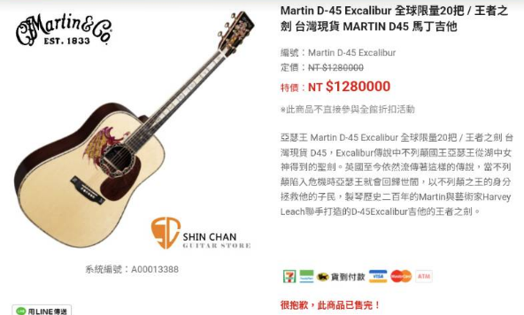

　　「ただの雑談」。

### 洗冷氣

　　宇宙大電波這次成功[打到了碩人](https://shuojen.com/blog/2026/08/24/ac)，因為不久前我也才洗了冷氣，而且這件事情說來話長，原本也打算打篇文章記錄，但後來發懶就不了了之，於是趁這機會剛好跟風一下。

　　家裡共有三台冷氣，其中兩台客廳與主臥的冷氣較常使用。然而，主臥冷氣每一兩年就會因為排水管堵住而漏水，於是會定期請原廠來通一下管路。好景不常，某年開始原廠來一次的價格翻倍，這次再度漏水時想說這樣下去不是辦法，於是就上網自學「如何通冷氣的排水管」，加上先前看著師傅施作的模糊記憶——「我記得他拿了個水桶，將管子拔出來，用粗吸管對著裡面吹氣，嗯……」

　　最後，將排水管吹通了後，把排水管塞回去，冷氣殼裝回去，天啊，真的被我搞定了，原來我有這麼厲害？（鼻子翹到天上去）

　　家裡主臥的冷氣自此終於恢復往日寧靜，但，故事還沒結束。

　　幾年前主臥冷氣堵塞時，有請師傅來洗過一次冷氣。但當時師傅遲到[^1]，原本打算一次洗兩台，但因為時間不夠，只洗了主臥那台。由於客廳那台冷氣從來沒有漏水過，功能也完全正常，原本想說就這樣算了，結果該來的躲不掉，不久前居然也開始漏水了！

　　沒關係，我現在已經是「冷氣排水管小王子[^3]」，不過就拆個冷氣通個排水口，有什麼難的？

　　結果不拆還好，一拆發現，這台冷氣的「內」觀實在有點超乎想像，除了一堆水垢殘骸外，生鏽的機構也越看越不對勁，最後決定，還是請了師傅來家裡洗個冷氣，一勞永逸。

　　洗冷氣的當天我不在家，但聽說冷氣師傅表示這是他們近年來遇到的大魔王，看了照片，洗出來的水跟沼澤沒兩樣，原本想放個圖紀念但看起來真是過於噁心，最後還是作罷。一回到家，天啊，冷氣變得比較小聲之外同樣的遙控器溫度也比較冷了，洗冷氣真棒！

　　在此推薦各位，家裡冷氣還是得定期清洗，除了比較省電外，吹出來的風也比較乾淨喔！🫠

### 金錢價值觀

　　周末在台北和朋友吃飯聊起最近的興趣愛好，當朋友得知我目前在攝影所花的費用後：

　　「天啊，這樣都可以買一把 Martin D45 欸！」

　　聽到這句話後不知怎地，我腦中快速盤算了許多事情，不自覺這樣回了這樣的一句話：

　　「忽然覺得 Martin D45 好貴喔。」

　　「……剛剛那句應該錄下來。」朋友也笑了，我猜他心裡想的是「他Ｏ的 LQ7 怎麼成了這個樣子.jpg[^4]」。

　　後記：回家後好奇查了下現在 D45 要多少錢，結果意外發現全球限量 20 把的「EX咖哩棒」D45：

　　只好推薦給[曾經 Cos 過傻八](https://travlog.wei-lee.me/posts/review/2022/12/first-time-cosplay/)的李唯大大惹。李唯身為一個烏克莉莉經驗人士，我想這把琴非常適合他，推薦購買（？）

[^1]: 說老實話，那些搬家師傅、冷氣師傅、ＸＸ師傅系列，這輩子請了不下十幾次還沒看過準時的，有時候甚至是以小時在計算遲到時間。如果有遇過準時[^2]的請務必告訴我，讓我開開眼界。

[^2]: 退一萬步，我能接受因為上一個客戶拖延所以下個客戶 Delay 這件事，畢竟案場狀況也容易計畫趕不上變化，但如果是這樣，我認為約時間的方式可以改成「我可能會兩點至四點間到」，或者確定拖延前也來電告知，我想是更好的做法，可惜這輩子同樣沒遇到過這樣的師傅，永遠是到了約定時間後無消無息，最後打過去才發現師傅會晚半小時來。

[^3]: 某陣子朋友間流行過的黑話：「ＸＸ小王子」。例如「吉他小王子」、「譬喻小王子」、「全糖飲料小王子」。原以為已經是死語了但查了下發現今年群組還有用過的痕跡，看來還沒死透（？）

[^4]: 如沒看過原圖的朋友，大概在[〈格友見面會〉](/mood/blogger-journey/)這篇文章的中段。