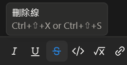

---
title: "Ctrl + ⇧ + X"
date: 2026-01-05T10:03:00+08:00
tags: ["心情"]
--- 

　　因為重回 Blog 的懷抱後解放了所有演算法平台無法使用的 markdown 語法，最近終於開始認真學習 Notion 上的快速鍵按法。最常用的就是這個用久會上癮的~~刪除線~~了，據我觀察越年輕的朋友越愛用（~~這大概也是老人裝年輕的一種辦法~~）。只是看了快捷鍵說明後，我完全不懂Ctrl + ⇧ + X 的「⇧」到底要怎按，試了幾次後都變成「剪下」，最後也就放棄了。結果就在剛剛靈光一閃——

　　該不會那個「⇧」是指「Shift」吧？！

　　立刻按了一下，Bingo，還真的是。天啊 Notion 大大，Shift 就不能好好打 Shift 嗎？真是謝了！

### 後記

　　上次遇到這種事大概是 Line 突然找不到分享鍵，結果最後發現是這個符號，天啊這個符號到底哪裡像分享按鈕啦！就算是現在我還是覺得它是「匯出」之類的意思，難道這一生興趣都與年輕人為伍的我（？）也要遇到世代之間的代溝了嗎？我不能接受！！！QQ

