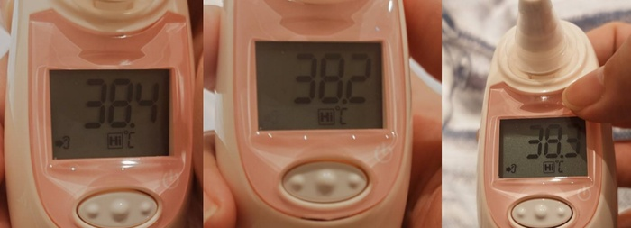
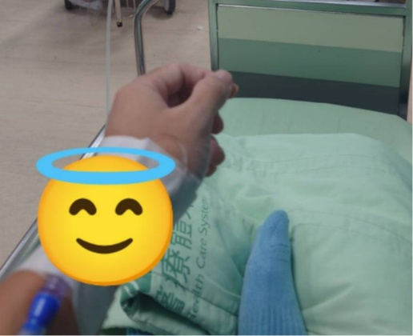

　　星期二下班吃完晚餐後覺得有些疲倦，大概八點左右就先跑去躺床了。身為一個夜型人[^1]，兩段式睡眠[^2]對我而言已經是家常便飯，然而，今天卻有些不太一樣。

　　睡了一個多小時之後，我夢到全身發冷，於是立刻翻身醒了過來……不對！就算醒來還是全身發冷！嘴裡喃喃念著「耳溫槍」，太太立刻就幫我送到床邊，一量下去不得了，38.5 度！我不信邪，又多量了幾次，但數字總在 38.2 至 38.4 之間徘徊。

　　沒錯，這怎麼看都是發燒了。但非常奇怪，為什麼一個喉嚨完全不痛，上廁所也正常，沒有任何病徵的人會發燒？這似乎非同小可，在家裡喝水待了兩小時到 12 點，發現燒一點都沒有要退的跡象後，立刻起身前往急診。

　　掛號之後，量了血壓和體溫，血壓有點高，然而體溫從在家裡量的 38.5 變成了 39.5！

　　「有什麼症狀嗎？喉嚨痛？上廁所會痛？腹瀉？」

　　「都沒有」

　　「……好吧，那先驗血驗尿照 X 光看看」

　　急診室的內科醫師如此說。於是，我就一邊打著生理食鹽水，一邊等待檢驗結果。

　　大概一個多小時後，醫生過來了：

　　「所有數值都正常欸，也不是流感，白血球也沒飆高，Ｘ光也正常沒有肺炎。」

　　「？！」

　　「但燒到 39.5，可能只是早期症狀還不明顯，先回去吃個抗生素和退燒觀察一下，如果繼續燒再去掛感染科門診。」

　　於是，我就繼續在急診的觀察床上待到生理食鹽水滴完，搞到兩點多時，覺得水袋內的食鹽水都沒有減少的跡象，問一下護士，這是一定要滴完才能回家嗎？因為「明天要上班」[^3]，想說早點回家休息。護士拿了耳溫槍來量了一下：「38.6，還沒退燒欸！還是把它滴完好了，我幫你滴快一點？」

　　什麼，原來可以調整速度，不早說，拜託幫我開到全速[^3.5]。

　　又過了 40 分鐘，終於滴完了，我拎著滴完的食鹽水袋跑去找護士拆針領藥批價，回到家後時間已經過了凌晨三點。睡回床上，立刻遭受到以前的自己攻擊——房間 24 度，就算躲在厚被裡面，還是冷到一個不行。但如果現在將冷氣溫度調高，早已熟睡的太太可能又會因為溫差搞到不好睡，嗯，好吧，當機立斷，在客廳鋪床[^4]，先熬過這回合。

　　躺在客廳的床上，周圍不時傳來天竺鼠的噗嚕噗嚕聲[^5]，這樣的體驗倒是有些特別。雖然朋友來家裡玩時，在客廳打過幾次地舖，自己倒是第一次睡在客廳的地板上。又過了一小時，身體漸漸開始出汗，量了下體溫，應該是藥效發揮，降回了 38 度左右，也沒那麼發冷了。洗個熱水澡後，突然有點精神，開啟了電腦，看到李唯因為在地球的另一端出差傳來的關心訊息，突然想到，天啊，這就是最棒的 9 月同樂會「晚上不睡覺」的主題了，於是，立刻開了篇草稿開始寫作，最後，在文章打完開頭時，已是早上六點，外面的白頭翁已經開始吱吱地叫，一陣睡意襲來，關掉電腦，將棉被和枕頭鋪回房間，終於可以好好睡一覺了。

　　晚上不睡覺在幹嘛？

　　在發燒 🫠

### 後記

　　雖然明天（今天）要去掛門診 double check，但目前燒已經退得差不多，感謝各方大大關心。這同時也是我的「[BlogBlog 同樂會 - 2026 年 9 月](https://blogblog.club/party/)」的投稿文章，本月主題是「[晚上不睡覺](https://jasonjlai.net/zh/3pwriting/stay-up.html)」，由 [Jason Lai](https://jasonjlai.net/) 主持。歡迎各位一起來參加！

[^1]: 夜型人：出自[《為什麼要睡覺》](https://shuaixin.cc/Why-We-Sleep/index.html)（連結為劉昕大大的學習筆記）。先前我就發現，看過此書的格友們比想像中得多，所以當九月主題一出，就想到是否該開賭盤看有多少篇投稿文章會提到這本書。

[^2]: 如果晚上有重要的事情要做，我多半一下班會另外睡一段1小時左右的「晚休」，因此算下來我一天睡了三次，午休、「晚休」、以及正常睡覺時間。

[^3]: 其實早已請病假，但這就是使用魔術技巧溝通的藝術（並不是）。

[^3.5]: 此為內心戲，實際上並沒有這樣說出口。

[^4]: 其實家裡是有次臥，但不經過簡單的整理，是無法睡人的。

[^5]: 半夜也在搶地盤，真是精力旺盛。