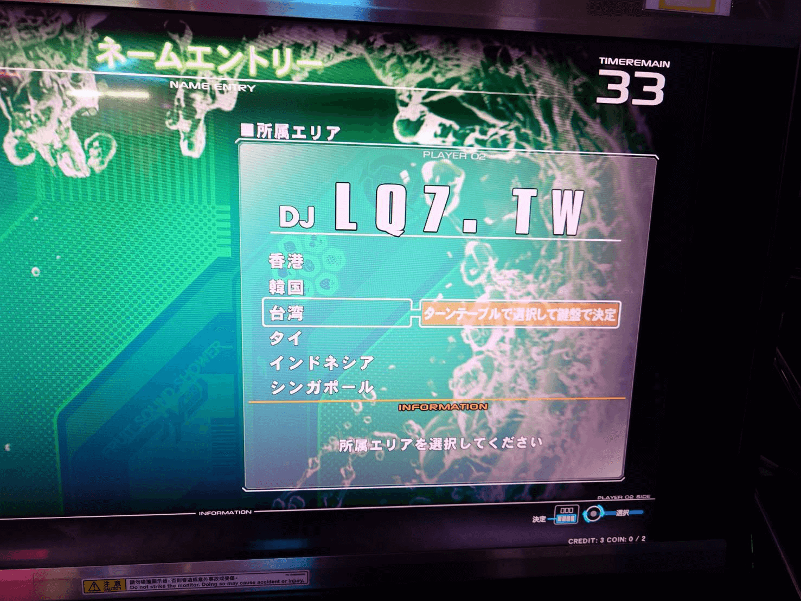

---
title: "溺水行舟"
date: 2026-01-24T22:30:00+08:00
tags: ["心情"]
cover:
  image: "/mood/if-you-stop-you-sink/image.png"
  hidden: true
--- 

　　今天下午和玩音樂遊戲的朋友聊到年紀和學習能力的事，我和他說一個月沒玩遊戲就變得超級陌生，結果朋友說他只要一星期不玩，下個禮拜就變得像是在復健一樣。

　　

（音樂遊戲 beatmaniaIIDX 33代今天總算開卡）
　　

　　回家後我暗自思索了一番後得到的結論是：如果現在還想要進步，一個禮拜四天，一天兩小時以上大概才能穩定進步。我一星期打兩次羽球，不包括其他運動，一次至少兩小時，有一天甚至是三小時，但感覺只能「不退步」而已，甚至體力還是漸漸下滑的狀態。如果加上其他健身或者有氧，大概才能勉強慢慢進步一點。

　　唱歌就更不用說了，如果一個禮拜沒有唱個兩三天，音域和穩定性就是慢慢地往下掉，我甚至不敢想像一年沒有認真練琴的我現在拿起吉他會長什麼樣子。

　　說真的，一個禮拜四天一天兩小時這樣一星期八小時，一年也才四百多小時。根據[一萬小時理論](https://www.books.com.tw/products/0010715281)（雖有人不認同，但與我某些技藝上的經驗相符），需要 20 年時間才能達到 8000 小時，實在是微不足道。

　　如果加上年紀，這大概已經不是逆水行舟了，是「溺水」行舟，當你沒有在船上時就是在溺水的狀態，先想辦法浮起來找回那條船再說吧。