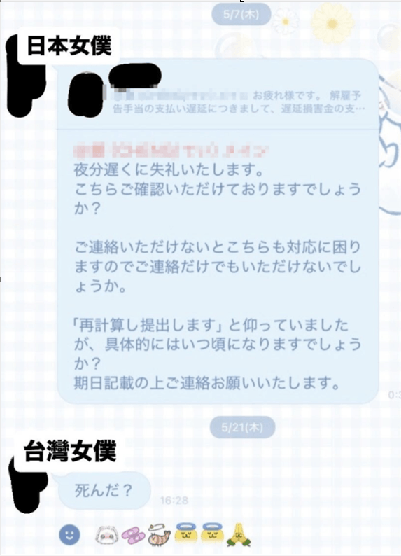

## １＋１＝？（續）

　　（前情提要：[１＋１＝？](/mood/one-plus-one/)）

　　台灣人在日本開的女僕咖啡廳結束營業，因為老闆延遲給付資遣費，所以員工們依法向老闆要求延遲金。

　　老闆表示會重新計算後，一直沒有下文。日本員工在群組裡面打了一長串訊息：

　　「抱歉在深夜打擾您。請問您有確認到之前發送的訊息了嗎？如果無法取得您的回覆，我們這邊也會很困擾而無法處理，能否請您至少先給個回信呢？」

　　「雖然您先前表示『會重新計算後提出』，但具體來說大約會是什麼時候呢？還請您註明預計的期限並與我聯絡。」

　　結果兩個禮拜沒有回覆後，台灣員工：

　　「死了嗎？」

　　……。

　　最後老闆付了延遲金，事情平安（？）落幕。

　

## 接龍

> 龍心大悅→悅耳→耳朵
> 

　　[Noa](https://noa.bearblog.dev/) 在[這篇文章](https://noa.bearblog.dev/word-chain/)嘗試中文接龍後，表示只接了三個字就接不下去。看到時就立刻想到如果是我一定會刻意閃掉「朵」這個難接的字：

> 龍心大悅→悅耳→耳洞→洞見→見面→面倒→倒地→地瓜……
> 

　　看吧，母語人士的文字接龍，就是這麼簡單。

　　嗯，面倒？🤔

　　圖文無關。（有關？）