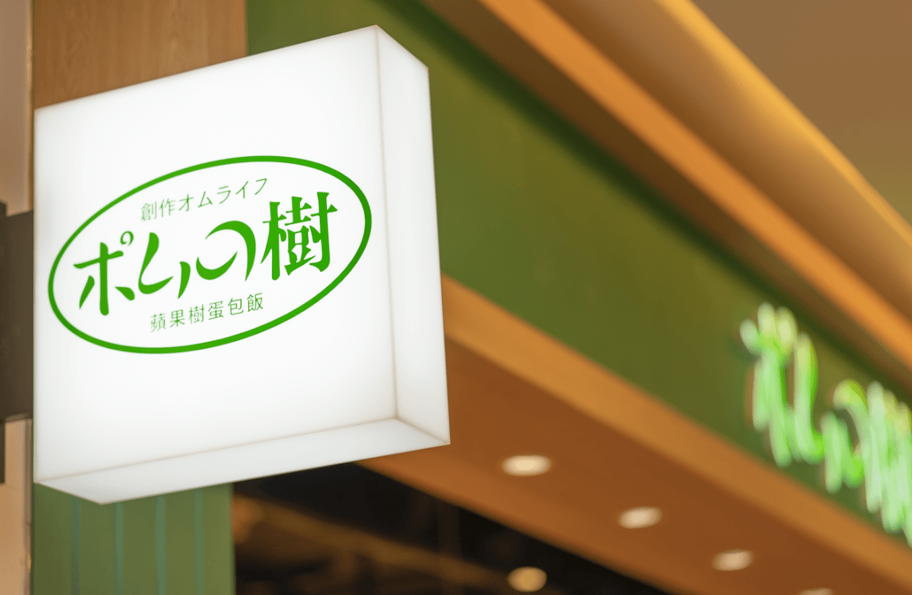

　　（前情提要：皮皮的[出門吹風曬太陽](https://trashposts.com/blog/sunlight-bike-ride/)）

　　這陣子有時候會思考到自己到底算不算是個「喜歡跟風」的人，包括到底要不要跟風[投稿「近況」頁面](https://wiwi.blog/blog/nownownow-world-champion)（一直覺得我的「近況」只有短短幾行所以和「關於」放一起就好），就在剛剛似乎得出了結論——「[It depends](https://blog.kalan.dev/random/it-depends/)」~~短短幾行立刻跟風了三個 Blog 話題~~。回顧四月的文章九成都在「跟風」，就連這篇跟風的文章也是跟風，真是太可怕了。

　　使用 Blog 文章跟風自古以來有種魔力，BlogBlog同樂會的[資源](https://blogblog.club/resources)裡面有一欄在告訴那些不知道 Blog 該寫些什麼的人[要寫什麼](https://blogblog.club/resources#-%E8%A6%81%E5%AF%AB%E4%BB%80%E9%BA%BC)，但我只能說，光是跟風格友們的文章就寫不完了。例如 YangBear 最近的文章們都讓我聯想到許多可寫的題材，包括[〈自己責任〉](https://yangbear.bearblog.dev/8992/)讓我想到魔術理論「觀眾會找碴是魔術師的問題」，[〈愛嬌〉](https://yangbear.bearblog.dev/2196/)讓我想到「講話難聽的人最要求禮貌」這一直想寫卻還沒開始寫的文章。前陣子發現的 Blog[《那些沒人在乎的事》](https://travlog.wei-lee.me/)才驚覺居然是邦友大神[^1]，害我認真考慮已完結的「[我的部落卷](https://lq7.tw/mood/my-blogroll/)」系列要不要加開一篇 OVA 諸如此類。如果一天有 48 小時，或許有辦法把這些文章全部寫下來，但可惜的是就算已經盡量利用閒暇時間~~當薪水小偷~~寫作，一天一篇文章已經非常極限了（更別說之後還有那還沒開始動筆的小說）。

　　但如果在其他地方就完全不是這麼回事。例如[《構成我的九部動畫》](/mood/nine-anime-that-made-me/)這跟風在社群早就流傳已久，當時也完全沒有想填寫的慾望。之前路過發現的人氣日本餐廳，只要有排隊人潮我也寧可換其他間，下次再來。

　　但因為某些原因，我決定今天（文章發布時間點已是昨天）晚餐就要來吃[蘋果樹蛋包飯](https://blog.ikukaroom.com/pomunoki-tainan/)！

　　（朝聖「歐姆生活」オムライフ，之前都沒發現 XD）

　　上次就算平日來還是排了一列，果斷放棄跑去吃別間，結果這次就很空~~果然跟風期過了~~，直接走進來真開心。然後座位居然很巧地在「有岡貴大四人座」旁邊。

　　（人少到「有岡貴大四人座」是空的，可以直接拍娃）

　　點的是燉牛肉，整體而言很好吃，但價位的確偏高（上面照片內 Ｍ Size 599 +10趴 = 660），雖然算是非常喜歡吃蛋包飯的人，但同樣價格會更想吃鰻魚飯或炸牛排之類的，日式蛋包飯忍到去日本的時候再吃選擇更多，或許也更便宜。

　　（兩個月前去池袋吃的たまごけん，和蘋果樹比就是各方面都更勝一籌的版本）

### 結論

　　~~沒什麼結論。~~

　　回到最初的「[出門吹風曬太陽](https://trashposts.com/blog/sunlight-bike-ride/)」，雖然 Wiwi 宇宙間多半認為「不要被資訊或演算法影響」較佳，但個人認為這件事本質上沒那麼重要——問題不在「有沒有被影響」，而在如何去定義「選擇」，如同[五月同樂會投稿文章](/thinking/we-suffer-more-often-in-imagination-than-in-reality/)提到「痛苦不在於事物本身，而在於你對它的看法。而這個看法，隨時可以改變」，照樣造句就是「選擇不在於跟風與否，在於你對選擇的看法」。或許我們自以為的「選擇」其實不見得都出於我們的「意志」（也許之後聊《楚門的世界》就能談到關於自由意志的哲學話題），更廣義而言，我們做出的「選擇」也全是跟風也說不定。

　　所以，多數時候保持正面心態，理解「被影響的選擇也是選擇」，我想跟不跟風都沒什麼大不了。不跟風很好，跟風也很好，造成心境的變化永遠不是因為「跟不跟風」，而是事情本身，所以就算和我一樣看到蘋果樹蛋包飯文章就立刻決定去吃，當然也很好，因為吃完還拍到一張好笑的嚕咪照片，很讚 >_<b

　　（嚕咪 is watching you.）

### 後記

　　最近 JN 做了個[海巡工具](https://blog.giveanornot.com/now/20260503/)，超級好用。好用的點在除了可以稽查自己的網站外，還能稽查別人的！因此就可以知道自己常看的那幾個 Blog 有沒有相同的粉絲，~~等於是我稽查你的稽查~~。於是突然想到是否可以寫篇完美的主題文章 Link 到所有的格友然後就當成部落卷之類的（本篇文章打完後才發現有這樣的味道，但這計劃似乎比想像中的麻煩因此作罷）。

[^1]: [帶著高松燈去接見總統](https://blog.wei-lee.me/posts/random-thoughts/2026/04/tomorin-goes-to-presidential-office/)的大神，然後也[有去 FF46](https://travlog.wei-lee.me/posts/review/2026/02/ff-46/) 還同樣拿了幸運星的 DM 以及我的名片，之前一直沒有發現是因為本格友都用另一個 Blog 參加 Blogblog 同樂會~~真是心機~~。