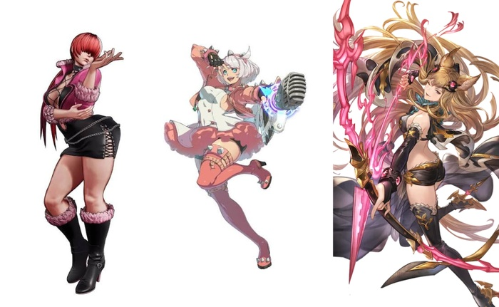

　　嗯，不是[那首歌](https://www.youtube.com/watch?v=9MjAJSoaoSo)，但閱讀文章時或許可以當 BGM 放，就跟我現在寫這篇文章時的 BGM 一樣。

　　下午前往某間即將結束營業的百貨公司，發現一攤可以試聞超多專櫃品牌的香水櫃位，雖然平常用的常用款是男香，但逛了老半天都搞到嗅覺疲勞最後買了六款隨身瓶，全是女香。

　　該怎說，男香九成在某個前中後幾乎都有木質調，有點無趣，聞起來很大男人（刻板印象 again）？我認為有平常用的那款就夠了，其他類似要嘛太重要嘛太臭，我和太太都不喜歡。

　　但女香無論是花香調還是水果調，都甜甜的很好吃！讓自己變得好吃（？）不是很好嗎？

　　忽然想到難道這跟打格鬥遊戲喜歡選女角是同個道理？誰要選屁顛屁顛的八神草薙京紅丸Ｋ，我的 KOFXV Main 角可是 Shermie[^1]，GGST 則是 Elphelt Valentine，GBVS 也是 Metera 呢。

（左：KOF Shermie，中：GGST Elphelt Valentine，右：GBVS Metera）

　　但眼尖讀者或許有發現，[快打六](https://lq7.tw/mood/sf6-menard-vs-daigo-ft10/)我的 Main 角並不是香香妹子，而是[塔爾錫](https://www.streetfighter.com/6/zh-hant/character/dhalsim)。

　　唉沒辦法，這角色太好笑了，角色設定又很合我個性（？），所以必須是我的 Main 角，實在沒得選[^2]。

　　不知道各位朋友比較喜歡男香還女香呢（硬要拉回話題），我認為男生使用女香的不在少數，但女生會去使用男香的似乎不多，如果有的話可以偷偷告訴我是哪款，非常好奇🫠

[^1]: KOF 其實由於是三隻一起上場，所以除了 Shermie 另外幾隻常用的是 Isla、B.Janet、Blue Mary、Whip 等。

[^2]: 可惜不知火舞出的時候我已經沒在玩了，不然 KOF 玩家說什麼 Main 角必須得是 KOF 角色吧（啥）