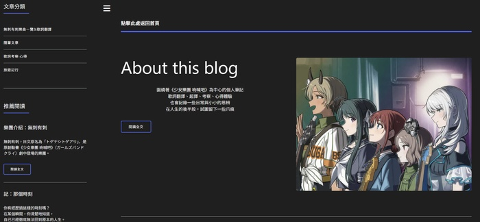

　　（前情提要：[我的部落卷（一）](https://lq7.tw/mood/my-blogroll/)、[我的部落卷（二）](https://lq7.tw/mood/my-blogroll-2/)）

　　（前情提要二：應該不是 OVA（Original Video Animation），但懂意思就好）

### 前言

　　理論上「我的部落卷」系列連載已結束。但因為一些原因，還是得寫這篇 OVA。冰雪聰明的讀者可能會猜，或許是最近在 Blog 中很常提到的[李唯](https://wei-lee.me/)或者[劉昕大大](https://shuaixin.cc/)，但其實都不是，因為這兩位大大的 Blog 導覽非常詳盡，先前在各文章中也 Link 了不下百次，實在不需要我另外畫蛇添足。

　　那麼，這篇 OVA 到底要寫什麼呢？

### [點擊此處返回首頁](https://togetoge.cc/)

　　這個 Blog 的名稱就叫「點擊此處返回首頁」，據本人說是因為想不到好的名稱，我完全可以理解。總之，這是我的好友兼後輩[^1] SYM 開設的個人 Blog，也是目前格友當中唯一現實生活本來就認識的人，也或許是真正意義上不處在 Wiwi 宇宙[^2]的人。

　　時間回到五月初，好友 SYM 突然丟訊息表示想和我一樣架 Blog 寫文章，只是擔心沒有程式底子到底能不能成。唉，2026 年的今天，連我都快被 AI 取代了，架 Blog 寫文這件事情只要有 AI 的幫助，對 SYM 這樣的高知識份子而言簡直比 IIDX 皆傳[^3]簡單百倍。丟了幾篇參考文獻給他後，不出所料，沒過多久網站就出現了。一開始他是架在 github 上，我想想這樣怎行，架都架了當然是要有個漂亮的網域名稱，於是就慫恿他趁還沒出名前（？）趕快買一個不然出名之後（？）要換就麻煩了。果然，「togetoge.cc」比什麼「巴拉巴拉.github.io」順眼多了，我相信這幾塊美金應該花得很值得。

### SYM

> 
> 
> 
> 大部分人叫我SYM，一個隨處可見的平凡人，獸醫師・商人・專任講師，音樂遊戲玩家・刺刺粉絲，丈夫・次男・旅人，不同的場景，使用不同的面具，演不同的戲，取悅不同的觀眾
> 

　　這是好友 SYM 首頁自己打的介紹，如果各位要從這個面向去認識他，我認為也無妨。但既然是在這裡我的 Blog 上，還是得從我的角度介紹一下他。

　　我和 SYM 因為音樂遊戲認識，在此 Blog 其實或多或少提過他，比如說在[《DP 十段》](https://lq7.tw/music/iidx-dp-10-dan/)文章中提到「日本工作的音樂遊戲好友難得回國」的「音樂遊戲好友」，或者在[《人生》](https://lq7.tw/thinking/2025birthday/)文章中提到「上次朋友來我家聊天聊到這些朋友」的「來我家聊天的朋友」，其實都是在指 SYM。

　　不知道是因為唸過同所高中（但我們在校的時間完全不同）還是因為怎樣，我認為我們的確有點像。

　　這邊的「像」，或許和一般人想像得不太一樣，不是我們喜歡吃同樣的東西或者興趣相同（都有在玩音樂遊戲）的像，而是「看事情的觀點」和「思考人生的方式」很像。

　　比如說，無論是[《記：那個時刻》](https://togetoge.cc/na-ge-shi-ke/)，還是[《[樂曲心得]  理想的パラドクスとは》](https://togetoge.cc/le-qu-xin-de-suo-wei-li-xiang-de-bei-lun/)這兩篇文章，雖然裡面的經歷完全不是我，但這些文章如果當作是「內心的某個我」寫出來的，似乎也不奇怪。如同 SYM 一開始的自介所提到的「不同的場景，使用不同的面具，演不同的戲，取悅不同的觀眾」，現實生活中，或許我們也能和其他人聊車聊房子聊股票聊工作，但在某個內心深處，我們問自己「人究竟應該相信什麼？又該對什麼感到悲觀？」的次數，或許也比一般人多上百倍。

　　更簡單地說，我們就是怪人。正常人好好過生活就好了，想這些有的沒的，幹嘛呢。

　　但這樣的怪人，高中時期還真遇過不少[^4]。上了大學出了社會後，我發現這樣的人原來才是少數，不如說，大部分的人關心的議題，都比想像中來得更日常實際，這種虛無縹緲、「就算想了也沒用」的問題，我這輩子還沒有在任何普通聚會參與過這樣的話題。

　　舉個例子，一群朋友吃飯聚會，會突然開始討論「身為人類究竟該相信什麼」嗎？

　　結果每次跟 SYM 聊天，反而意外都會聊到類似的事情，之後都會覺得「啊，好久沒有跟其他人討論到這樣的話題」的感覺。

　　所以，或許我們真的都很適合寫 Blog。很多自我腦內的想像，打在 Blog 比起一般擁有現友的社群軟體上，更無憂無慮，也更自在也說不定。如果各位喜歡我的 Blog，那麼我相信看他的 Blog 應該也能看得很開心，就連[歌詞的翻譯](https://togetoge.cc/ge-ci-kao-cha-xi-xi-rang-rangwo-men-de-cheng-shi/)，我也覺得非常好看，SYM 在今年因為迷上了刺刺而開始成為跟著團體飛遍世界各地的有為青年這件事，不知道為何也有點為他感到開心。

　　這篇文章突然就不知道該怎麼結束，總之就是向各位推薦 [SYM 大大的 Blog](https://togetoge.cc/)。雖然上面幾篇或許可能比較嚴肅的文章，文筆看起來有點陰キャ[^5]，但如果能看到他的[演唱會紀行](https://togetoge.cc/2026ci-ci-dong-nan-ya-xun-hui-yan-chang-hui-ji-xing-tai-guo-pian/)，應該也能發現他其實也有搞笑的一面，剩下的就請各位大大自行在 Blog 中發覺惹。

　　祝 SYM 大大 Blog 寫作順利。

[^1]: 格主在[關於我](https://togetoge.cc/about-this-blog/)頁面打的「受到好友兼前輩的LQ老師 aka 愛爽大將軍影響……（略）」，在此作為呼應。

[^2]: 就說要弄個全域註腳……不過算了。總之，我相信 SYM 應該也是目前所有格友中唯一「沒聽過Wiwi」的人。

[^3]: 其實也完全沒說錯，關於 IIDX 他是 SP DP 雙皆傳，而且還是現役玩家，和我這十段新手（現已退回九段）完全不同。

[^4]: 真要說全校都是怪人也完全合理。

[^5]:「陰気キャラクター」的簡寫，意旨個性陰沉、內向、寡言、不善社交或氣場陰暗的人。其實他應該完全沒這感覺，但不知道為何常思考人生大事的人都會給人這樣的感覺？