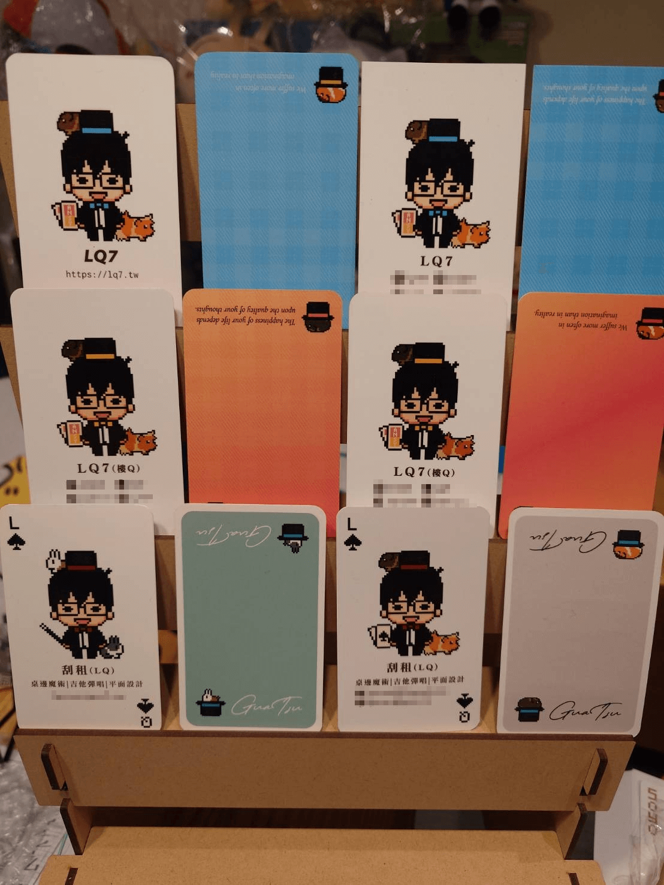

最近因為社群使用習慣的改變，所以又印了新名片。這樣算來個人名片已經改版了六次：

（以前的聯絡方式已不使用，所以碼掉了）

　　幾年前我比較常出現在魔術與音樂表演的場合，於是請人將名片設計得像是撲克牌，當時用的小名也不一樣，是遊戲圈比較常叫我的「刮租」（和我的彈唱團體撞名，這又是一個複雜的故事，有空再說）。

　　名片一開始更動了一次，將太太家以前養過的兔子換成現在養的四隻天竺鼠。後來開始寫作決定用 LQ7 這筆名後，除了更新社群聯繫方式外，也一併增加了名片背面的兩句英文：

> We suffer more often in imagination than in reality.（我們在想像受的苦多於現實中）
>
> The happiness of your life depends upon the quality of your thoughts.（你人生的快樂取決於你思想的品質）

　　這兩句話與其說是座右銘，不如說是在提醒自己人生中最重要的價值觀，也順便分享給拿到名片的朋友們。有機會的話，再詳細介紹這名片上的兩行字和斯多葛哲學思想，但最近看 Blog 已有朋友粗略提到過[《善用悲觀的力量》](https://www.eslite.com/product/1001180772654732)這本書，等不及的可以先看看 [chihyang 的文章](https://chihyang.cc/posts/guide_to_good_life/)，或[子非魚的心得](https://vocus.cc/article/66988103fd89780001eaf0b1)。

　　最新這一版名片我把所有社群的聯繫方式都拿掉，只留下本站的網址。有短暫考慮過要不要留下 Plurk 這唯一還有在用的社群，但想想也沒必要，因為現在的網站內容已經是最好的名片了。

　　看著這些名片突然想到能全部蒐集到的朋友應該非常少，畢竟除了要認識我很久之外，某種程度還得跨圈。或許該辦個活動：只要同時擁有這六張名片，就可以兌換精美小禮物之類的？但其實這輩子沒有遇過會把每張拿到的名片好好收著的朋友（就連我也都在亂丟） XD

（最新名片——乾淨、簡潔、俐落！）（老王賣瓜）

　　最後，名片都是請[小春（Tetsuko86）](https://linkgoods.com/tetsuko86)幫我設計的，如果喜歡這樣的風格，可以來[這裡](https://www.cake.me/me/tetsuko-wang/portfolios)逛逛。