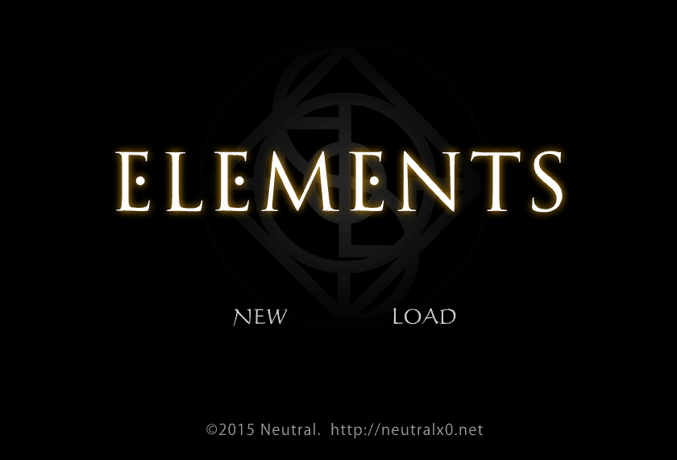

（前情提要：[Neutral Room Escape Games](/mood/neutral-room-escape-games/)）

　　自從得知 Neutral 已下架的曠世巨作 [ELEMENTS 還有得玩](/mood/privacy-and-mementos/#後記20260526-1915-更)的時候，我就決定找個機會回味一下。

　　壞消息是，結果除了房間大抵上還有點印象外，謎題全忘了。

　　好消息是因為這樣，所有謎題又能重新體驗一次，超級開心！就在剛剛，終於逃出了密室！

　　畫面雖然在 2026 年的今天解析度已經有些落伍，但剛好印證並彰顯一款好遊戲內容和劇情對我來說果然遠大於畫面表現，真是太棒了。

　　但還是必須收回先前的話：

> 「Level」這作品雖然標註三顆星，個人體感比起已下架的最高難度作品「ELEMENTS 」（以前標註四顆星！）差不多。
> 

　　全錯。這就是 Neutral 最難的作品，沒有之一，難度四顆星當之無愧。同樣不看任何提示，「LEVEL」花了兩天共三小時逃出密室，這款「ELEMENTS 」可是斷斷續續花了我四天，一天至少兩小時，也就是總遊戲時長至少八小時！

　　我實在非常佩服 Neutral 可以設計將謎題設計得如此合乎邏輯，卻又能表現得靈活隱諱，許多機關之間也彼此關聯，最後依舊來個前後呼應。

　　突然也好想做個解謎遊戲喔！現在有 AI 的幫助，就算寫 Unity 應該也會快很多，了嗎？

　　真不知道 Neutral 做 ELEMENTS 到底花了多少時間，完成度真是太可怕了。

　　如果玩完 Neutral 官網上的「LEVEL」和「SIGN」之後還意猶未盡，那麼「ELEMENTS 」絕對值得各位挑戰。但我敢保證，這可就不是留假日的一個下午這麼簡單的事情，或許會花掉各位不只一天的時間，但我想非常值得 XD。

### 無雷提示

　　這是給有玩過「LEVEL」或「SIGN」朋友的無雷提示：

- 由於解析度比較低，我通常全螢幕在玩，比較好找東西（遊戲右鍵可以將模擬器全螢幕）。
- 相較於「LEVEL」或「SIGN」，「ELEMENTS 」找東西顯得更困難一點，雖然絕對不會硬要藏在沒人知道的地方，也都有邏輯可循，但還請務必注意每個畫面上的可能物品。
- 撿到的物品不能旋轉，但同樣可以檢視。
- 謎題真的不簡單！層層保護之外又有厲害的錯誤引導，難道 Neutral 也是個魔術師？！該被騙的都被騙過一次了，超暢快，最後的謎題也起了雞皮疙瘩！
- 這次真的是在禮拜五發了，周末祝大家遊玩愉快 XD

