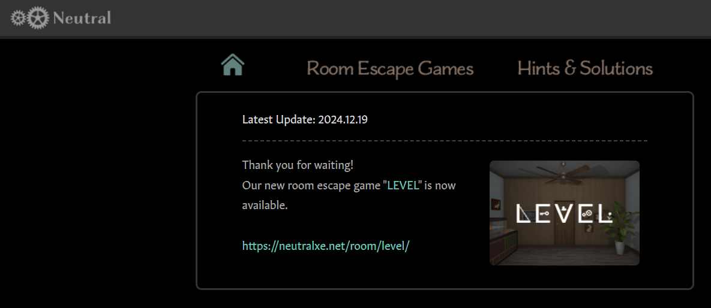

　　在此為大家介紹這輩子到目前為止最喜歡的密室逃脫網頁遊戲團隊——「[Neutral](https://neutralxe.net/room/)」。

　　真人密室逃脫還沒開始流行的年代，網路上有許多密室逃脫類型的 Flash 小遊戲。玩家在畫面上找尋線索，點擊擺設，解開謎題後，最終得以離開房間。一直非常喜歡益智遊戲（包括密室逃脫系列）的我當時幾乎把所有類似的遊戲玩遍後，立刻發現某幾個作品品質遠超越了其他人，而且都具有相同的特色——謎題形式豐富、邏輯線索具巧思、逃脫方式也非常有創意。

　　仔細一查，果然都出自於同一個作者，也就是上面提到的「Neutral」。

　　從那之後我三不五時就關注著他的作品，只要一出新作就立刻去玩。早期的作品包括「RPG」、「Vision」，巔峰時期還有遊戲內容龐大到令人震驚的「Elements」，製作的精巧程度拿到 2026 年的今天依舊超越了許多商業作品，但作者就只是免費放在網頁上給大家玩，非常佛心。

　　但好景不長，Flash 因為安全漏洞問題式微，漸漸被 Html5 取代。2020 年 Adobe 正式終止 Flash 支援，Neutral 也把當時那些用 Flash 製作的作品撤下網頁，現在已經完全看不到了。從那之後作者似乎也因個人因素休息停耕，沒有繼續推出新的作品。

　　那時正是真人密室逃脫連同「桌遊」開始流行的時代。但不管玩了多少場真人密室逃脫或電子類的商業作品，心中總會這樣想：

　　「啊，這真的不錯，但還是差了 Neutral 一點。」

　　這就是 Neutral 在我心中無可取代的地位。對我來說，他就是密室逃脫遊戲界當中的「聖杯」，就算在 Steam 上和朋友一起玩密室逃脫模擬器[^1]時，儘管那些作品真的不差，我總會想要和 Neutral 比較，然後在心裡偷嘆口氣。

　　就在前天，腦袋忽然被雷打到，想著事隔這麼多年，「Neutral」還過得好嗎？

　　沒幾秒找到了這網頁後，發現他不僅很好，在 2022 年和 2024 年都發了新作！！！

　　我立刻顧不得當時到底在幹嘛（其實大概也沒在幹嘛），立刻點開了「Level」。

　　玩了幾分鐘還來不及感動，卻整個陷入作者精心設計的謎題中。自詡為密室逃脫大師（？）的我，玩了兩個小時後居然還卡了關，只好存檔明天再來。最後總共花了三個多小時，才成功逃脫了密室。

　　十幾年過去，Neutral 依舊是那個 Neutral。放眼望去，現代有更多的類密室逃脫概念的遊戲，畫面設計得更精美，讓玩家更身歷其境。但 Neutral 的作品卻在引導與抽象邏輯上空前絕後，我想如果拿「古典推理」[^2]而言，這大概就是「古典密室逃脫遊戲」的最佳典範了。

　　這篇文章特地挑在禮拜五發，如果對密室逃脫「小品」有興趣的朋友，強烈建議周末將一小段時間留給 Neutral。雖說是小品，我認為至少會花大概三小時以上（如果完全不看提示的話），「Level」這作品雖然標註三顆星，個人體感比起已下架的最高難度作品「Elements」（以前標註四顆星！）差不多，想要遊玩的朋友可能需要有心理準備。如果沒有心理準備的朋友，可以玩玩另外一個兩顆星難度的「Sign」，雖然我還沒開始玩，但以我信任 Neutral 的程度，想體驗應該是相同的。

　　（點選[這裡進入網站](https://neutralxe.net/room/level/)遊玩）

　　「…ようこそ。~~Ave Mujica~~ Neutral の世界へ。」

### 後記１

　　如果完全沒接觸過這類作品而想嘗試的朋友，這邊有幾個不暴雷的技巧與提示，可以幫助各位更快上手這類的遊戲：

- 遊戲多半分成三個部分：蒐集、觀察、解謎。
    - 蒐集——到處找東西蒐集線索，覺得奇怪或想細查的部分都可以點，或許有意外的發現（例如沙發底下或桌子底下）
    - 觀察——那些不能點的裝飾，或許都有其意義。
    - 解謎——有些謎題是很直觀的「密碼」，但有些可能更為抽象，尤其是物品之間的交互邏輯，需要各位玩家的想像力。
- 撿起來的東西可以檢視，也可以和其他物品交互作用。
- 卡關時比起亂點，想想物品之間的關聯性，以及還有哪些忽略掉的細節，更有機會解決。
- 祝大家遊玩愉快！

### 後記２

　　昨晚破關了之後跑去 X 找到了 Neutral 的帳號，回了一串粉絲濾鏡心得（原本想寫 email 但找不到）。

　　得知 Neutral 還有在更新，真的是本周最讓人開心的事情了。

[^1]: [密室逃脫模擬器](https://store.steampowered.com/app/1435790/_/)，其實還不錯玩，官方的作品也有一定的水準。最近[出了二代](https://store.steampowered.com/app/2879840/2/)，一直想找朋友玩但太忙了（？）就遲遲沒有購買。

[^2]: 以前的[兩篇文章](/reading/)有提過「古典推理」，有興趣可以來[這裡](/reading/in-spectre/)和[這裡](/reading/the-poisoned-chocolates-case/)看看。