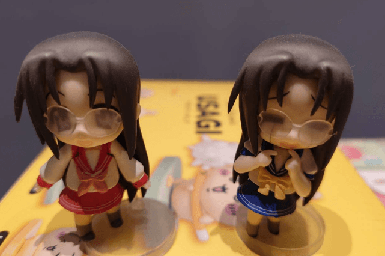

### 前言

　　（前情提要：[構成我的九部動畫](/mood/nine-anime-that-made-me/)）

　　某次聚會上，所有人的視線同時望向了 LQ7。

　　「你有辦法證明，這些動畫真的構成了『你』嗎？」一位宅宅緩緩開口。

　　唉，宅宅最喜歡要別人證明（或者向別人證明）自己的「愛」了。既然你們這麼愛看證據，那就來吧（裝作不情願的樣子但內心竊喜）。

### 幸運星

　　我的兩隻田村日和公仔（居然還找得出來也是意外）。雖然貴為配角畫面沒有主角群多，但是個宅女而且個性很討喜，在已不可考的年代台北地下街格子鋪一隻５０元購買的。喜歡冷門角色就有這種好處，別人不要的就是我的寶藏~~不像千早愛音的周邊永遠最快完售然後二手永遠最貴真是夠了~~。

　　順帶一提主角群裡我最喜歡的是卡嘎米，也多虧了她讓我會念「柊」這個字，無論是日文還是中文發音都謝謝她。在已不可考年代的某次地下街店內聽到前台 KEY IN 資料時碎碎念「那個雙馬尾小妹妹的名字到底怎麼打啊」時，立刻尾巴翹得老高後湊上前去：「柊，ㄓㄨㄥ柊」。（雙馬尾小妹妹全名柊鏡，但其實她是姐姐，有另一個妹妹叫柊司。另「柊」的日文發音為：ひいらぎ hiiragi）

　　（柊鏡本人）

### ARIA 水星領航員

　　啊，雖然有全套~~已發霉的~~漫畫但放在其他地方拍不了，怎麼辦呢？

（英雄聯盟 ID，創帳號以來從未改過，呃，加好友請隨意？）

　　我這從未改過的 LOL ID 取自我最喜歡的水星領航員角色アリス·キャロル（Alice Carroll）。題外話，水星領航員裡面有一個無用豆知識，就是所有的角色名稱通通都是「Ａ」開頭，例如三位主角分別是「燈里（Akari）」、「藍華（Aika）」、「愛理須（艾莉絲？）（Alice）」，而她們的師傅分別是「艾莉西亞（Alicia）」、「晃（Akira）」、「雅典娜（Athena）」。

（愛理須卡洛爾本人）

### CLANNAD

　　完了，證據不足（滿頭大汗）。我確信我有買過角色吊飾，但應該是找不出來了。不過好險找到這張在不可考年代用幾十萬畫素手機拍的照片：

（這是 Konami 大型機台遊戲 GuitarFreaks 的ＩＤ）（還真難解釋）

　　圖中 Tomoyo.S 指的就是坂上智代，現在想想直男還真好懂，當時喜歡什麼角色遊戲ＩＤ就會取什麼真是千古不變定律。

（坂上智代本人）

### 冰菓

　　老實說京阿尼動畫系列真的超級不愛出周邊，但還是在官方商城買了壓克力立牌作為紀念與支持。

（只買了女主角千反田卻沒有買男主角折木奉太郎真是抱歉~~畢竟那根本不是我~~[^1]）

### 上低音號

　　同樣買了壓克力牌，總共六人~~分為三組ＣＰ~~，就放在千反田立牌的附近。

　　然而這畢竟是我人生目前為止最喜歡的動畫，所以非常罕見地買了原畫集，翻閱的次數也是非常罕見（只有某陣子學畫畫時較常翻）。

### 辣妹與恐龍

　　為了打這篇文章才發現恐龍的周邊意外多（誰能拒絕可愛的恐龍？），衣服杯墊壓克力牌之外，連 Line 貼圖都買了好幾組，但真要說最喜歡的周邊我想是這個：

　　明明只在動畫最後出場了一下子卻非常喜歡的黃色恐龍！！！夾娃娃機限定景品，謝謝那年太太不知道哪來神力搞來當生日禮物送我 <(_ _)>

### MyGO!!!!!

　　在此還是得必須老實承認在 MyGO!!!!! 前我從來沒買過同人本，直到開始理解ＣＰ到底在喜歡什麼，二創到底在幹什麼，開始寫小說~~變成同人男~~之後。

　　感謝各位老師們的創作能量，能身處其中並一同提供糧食深感榮幸。

（人生第一次的同人場次擺攤與品書，報名攤位時甚至還沒決定筆名所以不是用 LQ7 這名字。）

（我的本本們，雖沒仔細算但應該接近百本？全台有出過的愛音 x 爽世作品99%都在裡面了，佔了全部本子數量的八成）

### 小市民 / 葬送的芙莉蓮

　　０。

　　天啊！現在才發現我沒有半點小市民和芙莉蓮的周邊，也想不到任何關聯。會唱 [意解けない](https://www.youtube.com/watch?v=v0rm5rrgJYg)（小市民S1 ED）和 [Anytime Anywhere](https://www.youtube.com/watch?v=lv5R6C3hz54)（芙莉蓮S1 ED）算嗎？

　　（LQ7 已逃離戰鬥）（ＲＰＧ音效）

### 後記

　　寫了回顧後才發現 ARIA 的最新（四年前）整波劇場版都還沒看，還有發現上低音號最近劇場版要上了（可惜台灣好像沒同步上），然後居然有出新的景品娃！

　　……可惜目前還卡在到底怎樣才能不被代購貢盤子 QQ

### 附錄圖片

[^1]: （附錄圖片）冰菓裡面的男主角因為行動瀟灑腦袋又好，成為了部分觀看男性投射對象後，這張迷因就開始廣為流傳（關鍵字：「折木奉太郎 這我」）

