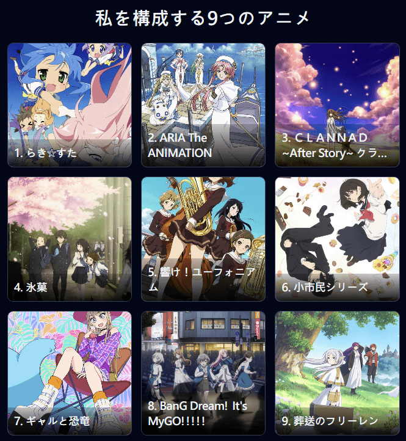

　　就在格友們輪番完成[部落格挑戰](https://trashposts.com/blog/blog-questions-challenge/)以及[電影評分頁面](https://blogg.ttheng.com/movie/)的同時，我決定先搞定這個放了將近一個月的跟風 XD

　　| 1. 幸運星 | 2. 水星領航員 | 3. Clannad After Story |

　　| 4. 冰菓 | 5. 吹響吧！上低音號 | 6. 小市民系列 |

　　| 7. 辣妹與恐龍 | 8. BangDream it’s MyGO!!!!! | 9. 葬送的芙莉蓮 |

### 吹響吧！上低音號（全）

　　擺在九宮格的正中間的是截至目前人生中最喜歡的動畫作品，沒有之一。故事為吹奏上低音號的久美子，上了高中後與管樂部發生的種種故事。它某種程度喚起了我高中時期合唱團的回憶，有歡笑有爭吵有淚水有情感糾葛，也有對音樂的執著。

　　這部動畫無論在角色刻劃、劇情編排、動畫製作、聲優表現、甚至樂曲錄音上都符合我心中「完美」的定義。也再次印證並彰顯好的故事不需要過度地誇張角色的個性與刻意製造扁平化的衝突，有時候「真實」才是最引人入勝的敘事方式。我認為任何喜歡音樂又不排斥動畫這樣藝術呈現的朋友，都該看看這部本世紀最棒的動畫作品。

### 冰菓 / 小市民系列

　　在九宮格中央旁邊的兩格，則是米澤穗信老師的原作——冰菓與小市民系列，冰菓動畫是我初次認識米澤穗信老師的契機，也是讓我理解推理劇情不一定得死人或找出兇手，就算是平淡的日常，也能創造出精彩的推理故事。小市民則是表現手法與冰菓相近的近期作品。

　　兩部都是我先看了動畫才回頭看小說，也是構成日常推理喜好的原點，也影響了我小說的寫作方式。在上低音號出來之前，「截至目前人生中最喜歡的動畫作品，沒有之一」的稱號是在冰菓上面的，但真要說這兩部的劇本對我而言都是無懈可擊，現在會偏心上低音號一點或許是因為音樂要素終究是我最喜歡的題材，勝過了日常推理。

### CLANNAD ～AFTER STORY～

　　世界上動畫大概能分成兩類，一類是「沒那麼宅」的人或許也會看的動畫如《航海王》、《進擊的巨人》、《多拉Ａ夢》等，另一類則是只有圈子內才會聽說的動畫，如 KEY 社三部曲《AIR》、《Kanon》、《CLANNAD》。朋友的九部動畫構成裡面擺了《AIR》，他表示這部動畫是他「體感變宅的那部動畫」。回想起來，或許我「體感變成宅宅」也是因為《AIR》，但現在回想起來《CLANNAD》尤其是 After Story 帶給我的震撼，實在大過於《AIR》，最後還是選擇了《CLANNAD》。

　　《CLANNAD \~After Story\~》是《CLANNAD》的續作，描述的是男女主角在一起後組成家庭過程中發生的種種故事。故事主軸貫穿了「家族」的話題，現在回想起來，還是無法忘懷當初看完後大受震撼的心情。以現在的眼光而言，我不會主動推薦這部動畫，但它確實是構成我的要素之一。

### ARIA 水星領航員三部曲

　　朋友看到我的構成裡面有這部動畫後，表示他其實也有看漫畫，但動畫他每次都看到睡著，最後就放棄了。這也讓我想到看完 ARIA 的人心得只會有「非常喜歡」這一種，因為不這樣覺得的人通通都睡著了。

　　這部共三季（第二季是半年番，所以總共大概是5x集）的動畫描述的是主角立志想要成為領航員的故事。雖然聽起來很像《航海王》之類的劇情發展，但故事圍繞著主角平淡的日常，與她生活的都市漸漸展開。回想起這部動畫，總能感受到作者想表達出的生活細節，以及透過主角觀察事物的方式，讓人感受到生活上的美好。

　　2026年的今天，現代人或許看不了這麼平淡而節奏緩慢的動畫（和西洋電影《荒野大鏢客》系列有異曲同工之妙），但我依舊誠心推薦這部~~睡眠~~治癒系作品。

### 幸運星

　　同樣是「平淡日常系」動畫，《幸運星》的節奏比起 ARIA 就輕快許多。這部動畫描述一群女高中生無所事事討論著極為生活輕鬆的話題，在當年蔚為風潮（原作為四格漫畫，看完動畫後因為太喜歡所以跑去買了原作漫畫支持，但真要說我喜歡動畫非常多）。

　　但總歸這部動畫也是宅宅向動畫。如果「體感變成真宅宅」是因為《AIR》，那麼如此喜歡《幸運星》大概就是意識到「就算不想承認，自己終究是個宅宅」的時刻。

　　題外話，直到 2026 年的今天，在台灣同人場攤位上遇到了推廣幸運星聖地巡禮的日本人，有興趣可以看看[這篇文章](https://home.gamer.com.tw/artwork.php?sn=1917419)，而這文章內居然已經是 2013 年的事情，而在今年場次上拿到了同樣類似的地圖，十幾年間能如此熱愛一部動畫還特地飛來台灣擺攤推廣，真的非常厲害！

### 辣妹與恐龍

　　這部泡麵番[^1]描述某天辣妹回家後，遇到了一隻恐龍的故事。對作品劇本合理性非常要求的我，反而認為這部刻意沒有強調劇情邏輯性的動畫，才正是它的精隨。我非常喜歡動畫當中無論是「辣妹」還是「恐龍」看待這世界的方式，至於這部動畫「構成」了我什麼，大概是某一陣子我拿恐龍的頭像闖蕩了一陣，導致某圈的朋友現在還會叫我「恐龍」吧。

### 葬送的芙莉蓮

　　在這個勇者小隊闖蕩世界劇情爛大街的今天，居然能有著乍看是一樣的皮，骨子卻如此不一樣的動畫，真是非常幸福。然後，拖到現在才發文的好處是關於芙莉蓮，可以看看[這篇文章](/mood/my-blogroll-2/)，裡面有我所有對這部動畫的想法，在此就不多贅述。

### BanG Dream! It's MyGO!!!!!

　　最後的最後，終究還是得聊一下這部動畫。

　　雖然我為了這部動畫裡面的角色寫了[三本同人小說](/fanfic/)，但或許有人會發現，如果在其他社群介紹看到我的動漫喜好，《冰菓》、《青春之箱》、《小市民》、《上低音號》（甚至外傳利茲與青鳥）都榜上有名，唯獨 MyGO!!!!! 不在其列。

　　或許這代表著我不願意讓陌生人第一眼就發現「啊，這個人喜歡 MyGO!!!!! 系列動畫」。說到 MyGO!!!!!，我大概會猶豫再三，最後變成「啊……基於如果要看懂我的小說我建議可以看完 MyGO!!!!! 和 Ave Mujica，但動畫本身看完後如果沒到喜歡，我認為也是正常……」的感覺。

　　這大概就是每次出現想看我的小說卻沒看 MyGO!!!!! 和 Ave Mujica 的朋友，我總會發生的內心戲。

　　單就 MyGO!!!!! 動畫本身而言，角色鮮明有魅力，故事結構完整，有別於一般青春校園樂團動畫，更著重刻劃角色的「人性」與「現實」，但到了第二季 Ave Mujica 時，動畫內容總有「商業服務」的氣息，也就是必須推廣真人聲優與樂團的商業考量而設計出的劇情非常明顯。然而，其中的尷尬點就在於我的小說偏偏是依據 Ave Mujica 衍生，單單看完 MyGO!!!!! 還不行。所以我實在無法說出「Ave Mujica」是一部值得推薦的動畫，與其跑來看 Ave Mujica 我認為把時間花在「冰菓」或「上低音號」更值得一些。

　　嗯，大概就是這樣了，雖然這兩部系列作品構成了「我」很大的一部分，但今年的那本同人小說，就是想和 Ave Mujica 這實在不能接受的爛劇本做一個了結。

　　希望六月能如期開始動筆。還是老話一句，如果把經營部落格的時間拿來寫這本小說……（略）

### 後記

　　前幾天（編按：至發文時間點大概過了一個月）朋友貼了[這個連結](https://tlpt-telepath.github.io/9-animes/)說想看看大家的構成，於是選出了這九部動畫。Blog 版本和最初貼在 Threads 上以及貼給朋友的版本略有差異，原因是寫這篇文章時，嚴格執行了「不是從動畫入坑的動畫」都不能算在內，因此忍痛拿掉了我最喜歡的安達充作品《[四葉遊戲](https://zh.wikipedia.org/zh-tw/%E5%9B%9B%E8%91%89%E9%81%8A%E6%88%B2)》。

　　如果沒看過以上動畫而想看的朋友，我個人的喜好順序是《上低音號》→《冰菓》→《小市民》→《芙莉蓮》→《ARIA》→ 其他，如果有看過以上動畫的朋友，也歡迎和我分享心得喔！

[^1]: 「泡麵番」是指單集時長極短（通常為3至10分鐘）的連載動畫，意指「泡好一碗泡麵的時間剛好看完」的迷你劇集。（AI 摘要）