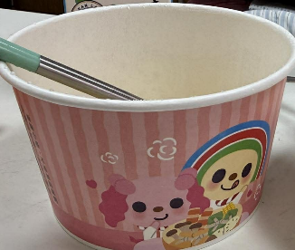

　　使用 Blog 到現在，一直有個困擾。

　　有時想回頭找某篇文章，明明還記得內容，卻完全想不起標題和作者。感覺就像一些舊型登入網站，只能找回帳號或密碼其中一個，但有時偏偏兩個一起忘了，就完全沒救（多半也沒有什麼 email 找回帳密的功能）。

　　不過就在剛剛，我終於找到[〈綠色是渣男的顏色〉](https://kevinowo.com/green-is-for-cheater/)這篇文章了！（作者為 [KevinOwO](https://kevinowo.com/)）

　　當時因為這篇文章才得知open醬換過（？）女友，也在某次聚會和朋友大討論了這個話題。然而就在上周末朋友傳了這張照片，說在吃關東煮的時候居然拿到了 open 醬和小桃的碗！

　　唉，果然是渣男 🫠