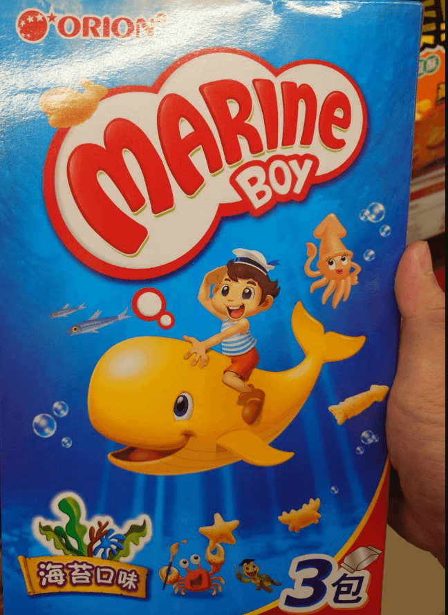

　　（前情提要：[獵戶座清晰免費](/mood/orion-clearfree/)）

　　「欸欸欸是獵戶座欸！」

　　在全聯發現了這個名叫「好多魚」的零食，震驚之餘立刻拿起手機查了一下，才發現不是沖繩的那個 Orion，而是韓國的零食品牌 Orion（同樣也是獵戶座，商標也是一堆星星）。

　　結果因為很懷念小時候常買的阿囉哈水族形狀餅乾（有人知道我在說啥嗎而且到底是誰~~盜版~~參考誰？），結果莫名其妙就買了（這算被演算法推銷嗎 XD）。

　　吃的時候想要找出到底有幾種形狀，一找不得了，超多種！我怎麼記得以前阿囉哈的只有五六種？！

　　為了找齊全部圖鑑還把它全部倒出來看有沒有漏的，從左上開始是蝦子、水母、透抽、有鰭的魚、沒鰭的魚（河豚？）、海狗（一開始擺錯形狀以為是海豚）、烏龜、回到左下螃蟹、星星、海馬、企鵝、神秘的魚、太陽？！（那三種魚經專業設計師鑑定擔保一定是不一樣的品種）

　　都快吃完才想到，那個太陽應該是海膽之類的吧？ 🤔