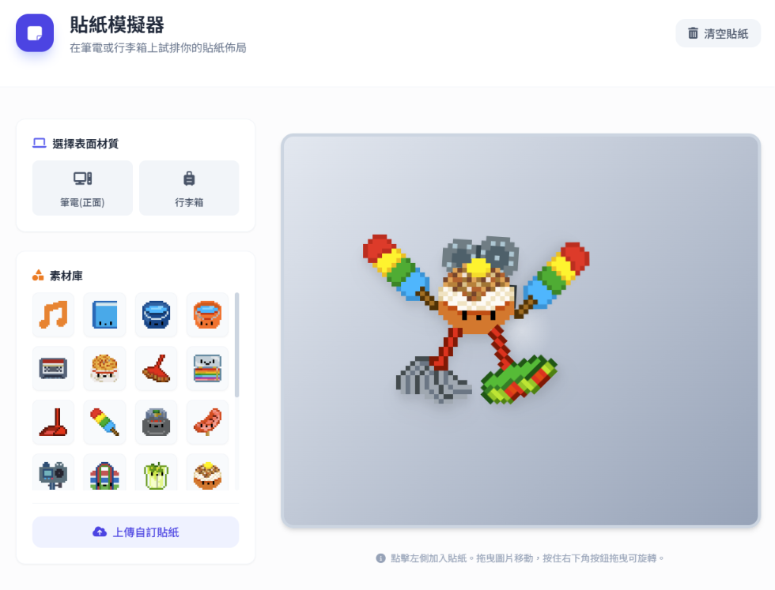

　　（前情提要：[Pixel Art](/mood/pixel-art/)）

　　最近流行（？）的[像素圖圖庫](https://icons.shuyuart.com/)以及其衍生的[貼紙模擬器](https://shuojen.com/sticker)，我立刻心有靈犀和[皮皮一樣](https://trashposts.com/blog/sticker-simulator/)弄了個類似的：

　　（根本就是在惡搞但我覺得一開始弄還沒加手腳的時候很像貓頭鷹？！？！）

　　原本只想在皮皮的留言板回覆但這種圖完全無法用 [.jpg 大法](/mood/slang/#jpg)，只好特地發篇文章 XD

　　.jpg 大法看來也有吃鱉的時候（啥）