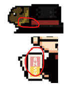

　　最近像素圖大師（？）越來越多，然而眾所周知，我的形象照就是一張像素圖，據繪師本人表示我差不多就是長這樣，呃，有點 Q 版（風評被害）。

　　但這不是本文的重點（那你還講），而是這張像素圖有個不為人知的秘密。在此放個大張的讓大家仔細看一下，看能不能發現什麼端倪。

｜

｜

看

一

下

分

格

線

｜

｜

　　有看出什麼端倪嗎？

　　沒錯，這其實不是一張「真正」的像素圖！！！

　　較明顯的地方除了躲在帽子後面那隻天竺鼠（牠的名字叫汪八）是不同張圖疊上去之外，撲克牌也因為字太難畫而將像素縮小作畫了。

　　因此，就跟果汁一樣[^1]，這其實是一張「像素風」的圖，而不是「像素圖」，因為我認為「Pixel Art」的基本教義就是每個 Pixel 都得一樣大才是。

　　LQ7 的部落格豆知識，我們下次見（？）

[^1]: 市售果汁標示依原汁含量區分：10%以上可直接稱「果汁」並標示含量；未達10%須註明「果汁含量未達10%」；若無原汁則品名標示「風味」或「口味」，並需註明「無果蔬汁」。（AI摘要）[^2]

[^2]: 等等，照這定義這張圖應該也算像素汁（？）沒錯🫠