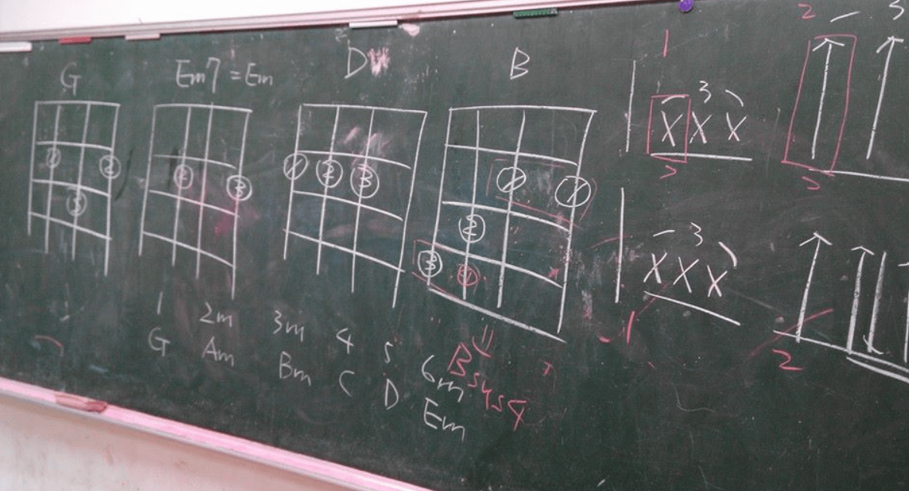

　　（攝於某年某學校某間教室的某黑板（整句話基本是廢話）。）

　　畢業當完兵後，第一份工作是在音樂教室教木吉他。剛開始沒什麼學生，所以也沒什麼收入。另一位朋友也就是我當時的同事[^1]好心地說可以暫住他那邊，在完全沒收我房租的前提下就一起住在一間超老舊不到十坪的公寓內，裡面甚至只有一張雙人床，我們就睡在同一張床上[^2]。

　　重點是，這間公寓有個超酷的地方，那就是大門門鎖其實是壞的。

　　什麼意思呢？就是看起來是正常的門鎖，但「任何一把鑰匙」都能將它打開。朋友已先住了一陣子覺得沒差一直沒找房東修，我也覺得還好，後來發現甚至連十元硬幣都能開，好像更方便了（？）。

　　忘記當時有沒有討論過「萬一遭小偷怎辦」的問題。但或許我們想得差不多——小偷進到屋內應該會可憐這兩個學音樂不會變壞但快變成乞丐的人，然後放點錢再走。雖然整屋子最值錢的物品大概是朋友幾萬塊的吉他，但那把吉他並不是名牌，要能懂它的價值大概也得是識貨的音樂人小偷，真的被偷了，大概也只能算他識貨。

　　直到朋友決定去外縣市發展後搬離，我還是繼續住在這裡，最後退租前都沒什麼大事發生[^3]。不知道下一個房客有沒有叫房東修那個鎖？但如果不用其他鑰匙試，老實說也不會發現那個鎖是假的。

　　咦，這樣說來室友一開始是怎麼發現這件事的？🤔

　　但其實，研究所期間我住的地方還真遭過小偷。

　　當時租的是一棟透天，一樓是公用空間，二三樓分別租給其他學生和上班族，我則是住在四樓頂加。因為是頂加所以房間特大，隔壁也不會吵到人，除了熱了點（開冷氣就沒事）住得也算開心。

　　我猜小偷有偷偷觀察過，知道這透天整棟出租也沒有監視器，所以挑過年大家返鄉的時候下手。當時還沒回來時，就被二樓最先回租屋處的房客告知家裡遭小偷了。

　　沒多久我也回到住處盤點損失——

　　嗯，完全沒有損失。

　　粗略檢查只有兩個抽屜有被拉開的痕跡，其他東西完全沒被翻過。放眼望去屋內最值錢的東西大概是一台（跟朋友借的）電鋼琴，或許因為太重，又或許小偷可憐玩音樂的窮學生（again）所以沒有將它搬走。當時損失最大的，就是被偷了個名牌包的二樓房客。對我來說除了那台電鋼琴，房間內沒有任何值錢的物品可以偷，真是~~有夠可憐~~令人安心。

　　撇開實際生活，就算資訊本科的我，從以前就對網路安全超級不在意。

　　我就是「防毒軟體是最大的病毒」的~~邪教~~基本教義派。防毒軟體除了拖慢電腦速度外（以前老實說真的是這樣），因為軟體漏洞而導致被駭，大概也幫不了什麼。就跟地震一樣，「小的不用躲，大的躲不掉」，我一直認為保持良好的電腦使用習慣，才是降低電腦被駭機率最佳方式。學生時期為了玩區域連線遊戲搞了許多奇葩的連線方式，為求方便甚至預設防火牆也是關的。和一開始故事提到的門鎖差不多，我電腦裡沒什麼重要資訊，中了勒索病毒，我可以一秒內毫不猶豫重灌，就算信用卡卡號被盜了，我想二階段認證也沒那麼容易盜刷，就算真的被盜刷，也不至於完全不能處理。

　　可能是我一直以來保持著人與人的信任感動了上天[^4]，又或是單純運氣好，這輩子電腦沒中過毒（或者中了也沒發現），各大帳號也沒真的被盜過。

　　綜觀以上，我應該算沒那麼在意隱私的人。

　　「萬一被盜了」、「萬一被偷了」、「萬一被拿去幹嘛了」，我多半不特別在意，而最大原因就是「[本來無一物](/thinking/there-is-nothing-at-all/)」這篇文章提過的生活哲學。

　　文章裡面 Ray 的故事我非常感同身受，因為以前的我也不是這麼豁達，也是想要將任何值得紀念事情留下的人。例如在校期間第一場正式羽球賽獲勝的那顆「羽球」我特地將它撿了回來，全校越野賽跑 30 名的成績貼紙，這些有形的紀念物我都認真收著，甚至買了個透明鋁製紀念盒好好保存。

　　但隨著人生歷練越來越豐富，價值觀也漸漸改變。某天發現留著這些紀念品，只是可以拿出來和別人說「你看這顆就是我人生第一場正式羽球賽獲勝的羽球」，或者「你看這是我當時越野賽跑全校 30 名的成績貼紙」。

　　但就算沒有這些，我同樣也可以和別人分享這些事情，就像現在正在打這篇文章的我一樣。

　　只要稍微回憶，我就能想起那場越野賽最後 200 公尺，前面剛好跑著一個人，我突然靈光一閃，加速衝了上去。那人看我衝了上來立刻知道我想幹嘛，所以也突然加速。最後我們幾乎同時進入了終點，但還是以些微之差輸給了他，他 29 名，我 30 名。

　　「不、不錯的衝刺……累死了！」當時前 100 名的完賽紀念品內容完全一樣，所以這根本只是無謂的意氣之爭。上氣不接下氣、素昧平生的兩個人，就在終點線後等待領取紀念品的隊伍上聊了起來。

　　當開始理解真正有趣的回憶隨時都能立刻想起時，我決定將那個「透明鋁製紀念盒」丟了。現在的我不為「紀念」留下物品[^5]，所以就算是初馬紀念獎盃[^6]，也是留了一陣子後覺得太醜後也丟了。

　　說到底，「不留下這些紀念品」和「沒那麼注重隱私」的原因大同小異。廣義而言，這世界上所有有形的事物，都是和這世界「借」來的，所以失去了，也不是什麼嚴重的事。

　　有時候想過哪天 Blog 的所有文章被駭客入侵電腦，將所有 git 及其備份還有 Notion 上的原文都刪個精光[^7]，但我認為，好像真沒什麼大不了。

　　或許我真的沒那麼在意「Blog 文章可以永留傳」這件事。這些文章已經被許多讀者看過，被我寫出來的當下，任務已經完成了大半。整個 Blog 消失雖然有點可惜（因為新的讀者看不到那些文章，就和新朋友目前再也玩不到 [Neutral](/mood/neutral-room-escape-games/) 的曠世巨作「Elements」一樣），但回到最開始寫作的目的，除了「我喜歡寫作」之外，也只是整理自己的思考，然後和有緣的讀者交流而已。

> 「本來無一物，何處惹塵埃？」
> 

　　真正重要的經驗、知識與回憶，多半偷不走，也丟不掉。

　　被偷了，消失了，就算了。有緣的話，我想一定會再相會。

[^1]: 在[〈黑話〉](/mood/slang/)裡面提到的同寢室友其中一人，由於他沒有唸研究所，畢業當完兵後就早我幾年開始教木吉他，~~算是被他帶壞~~。

[^2]: 跟別人講到這事總被說「也太 BL」。還好吧？男生不都這樣？記得以前幾個感情很好的學弟們連內褲都能互穿，陽台拿錯內褲就算了的程度。還是只有我的學弟們特怪？歡迎各位男生們分享一下。

[^3]: 其實有，但和門鎖本身無關所以有空再說。

[^4]: 提到了上天還是得 reference 一下[這篇關於無神論者](/thinking/religion/)的文章。

[^5]: 那什麼東西該留下呢？我想是能讓現在的我「心動」的物品了，請參閱[近藤麻理惠](https://search.books.com.tw/search/query/key/%E8%BF%91%E8%97%A4%E9%BA%BB%E7%90%86%E6%83%A0/adv_author/1/)的[相關書籍](https://www.books.com.tw/products/0010521950)。

[^6]: 全程馬拉松賽事單位多半會另外準備「初馬紀念品」給第一次完賽的民眾。我那次是一尊馬的透明玻璃製雕像，和家裡裝飾風格迥異，沒特別喜歡 XD。

[^7]: 這發生的機率大概已經不是「萬一」，而是「億一」或「兆一」？