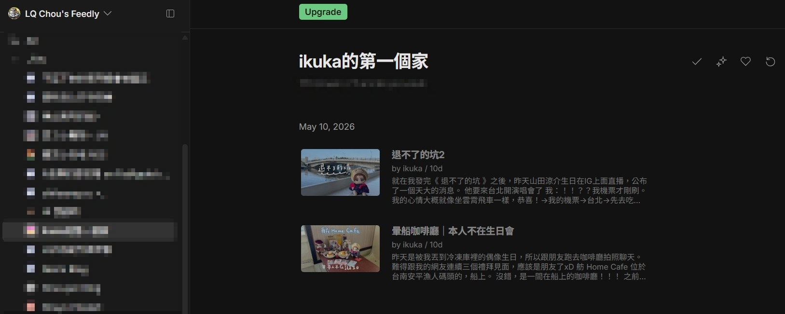

　　就我觀察，多數人比較討厭「已讀不回」。

　　也因此，有些朋友還養成了用預覽訊息的方式偷看訊息，因為如果還沒想到要回什麼，就不會出現「已讀」，可以之後再來回，避開部分人「已讀不回」的地雷。

　　但我還好。ＸＤ

　　阿德勒心理學的「課題分離」非常有道理——對方已經看到我的訊息、收到我的信，我想要傳達的心意已經完成了，我的課題已在此結束，要怎麼想、要怎麼回應（甚至已讀不回）都是對方的課題。或許這也是影響我人生重要的一個觀念也說不定（又無縫接軌 Blogblog 五月話題）。

　　但會有這篇文章的原因，是看到了碩人的[《高職ＦＡＱ》](https://shuojen.com/blog/2026/05/20/highschool)，裡面寫道：

> 這幾天突然看到 RSS 吹起一陣高職討論，像是 EO 的[《後悔讀高職》](https://eoiiio.bearblog.dev/7091/)、JN 的[《讀高職是我一點都不後悔的事情》](https://blog.giveanornot.com/vocational-high-school/)還有 ikuka 的[《讀高職不代表我成績差》](https://blog.ikukaroom.com/vocational-high-school/)。
> 

　　「嗯？ikuka 最近哪有寫什麼文章？」

　　結果一點進網站，還真的有！

　　不知道為什麼我的 RSS 閱讀器 ikuka 文章停在 5/10 再也沒有更新（就算是現在也是，無論如何重整都一樣，目前只能刪掉重加看有沒有改善），要不是碩人這篇文章，我還真不知道居然被 Feedly（RSS 閱讀器）表了。

　　這種「不美麗」的錯過最討厭了 ☹️

　　先前在[部落格挑戰](/mood/blog-questions-challenge/#使用什麼平台來管理部落格為什麼選擇它)時，裡面也提到別人的回信有可能被 mail server 過濾掉跑到垃圾信件匣內，自從我換成 [q@lq7.tw](mailto:q@lq7.tw) 的自訂網域信箱後，也有「別人到底有沒有收到信」的問題。

　　白話一點，「有沒有讀」（無論是自己還是對方）對我來說困擾程度遠大於「已讀不回」。

　　在動漫場次幫 Coser 拍照時，由於這圈的朋友多半使用 IG 或 FB，然而萬惡 Meta 的私訊功能偏偏又是最爛的那種，陌生訊息可能完全被洗掉外有時候出 Bug 根本看不到對方的訊息。所以我根本無法得知到底是因為對方太忙沒看到，還是訊息太多被洗掉，還是本質上出 Bug 以至於沒有回應。就跟寫程式一樣，沒有錯誤訊息的錯誤一直以來都都是大魔王，因為根本不知道卡在哪，只能慢慢設中斷點 Debug。（忽然想到 AI 興起後「中斷點 Debug」該不會要變成~~死語~~失傳絕學了？）

　　總之最近一連串的事情，包括 Ikuka 事件（？）、Coser返圖不讀，Email 寄出後擔心漏信……讓我有感而發一下。有時候也會想，是否「課題分離」條件放寬一點會更好，例如信發出去後我的課題已經結束之類的，剩下的是 IG 和 Email 的課題，但想想這樣好像有點太鄉愿，好好把想說的話交到別人手上的確還算在自己的課題內，那些該死的不可抗力因素不要來干擾Ｒ。

　　但我終究是個幸運的人。那些以為漏掉的絕大多數訊息，總會在某個時候被看到而得到回覆。除了 email 外，今天早上也某位 coser 老師的回覆，表示訊息太多漏掉了，拿到了我的圖後非常喜歡那可愛的構圖。

　　好開心喔 🥹

　　看來有些時候交給宇宙大電波[^1]，緣分到了自然會收得到訊息，其實也不是件壞事。

[^1]: 隨便發明的名詞（還是其實已經有人用了？）但意思差不多就和《進擊的巨人》裡艾爾迪亞人共通的「道路」差不多感。