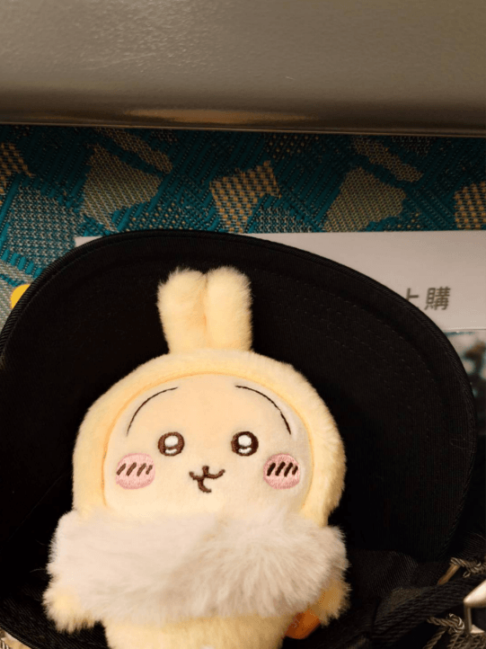

　　周末高鐵上自由座車廂人滿為患。列車行駛中走道突然傳來一陣嘈雜，原來某個座位上的女子暫時離席上廁所時，座位被另一位年長男子坐走了。

　　雖然鄰座乘客一度想要阻止，但男子堅持「自由座只要離開位置大家都可以坐」，規定上寫著「不能用行李佔位」，最後只能讓他坐下。離席的女子上完廁所回來後略顯驚訝，但聽了該男子的說法後非常冷靜，表示「您說得非常有道理」，沒有堅持要回位置，就自行站在走道上。

　　但看著這一切發生，同樣站在走道上的另一位女子非常不滿。她說那位小姐只是去上個廁所，在這種情況下沒人會去強佔位置。

　　「妳把規定找給我看，自由座只要人離開就是不能佔位！」

　　「只是去上個廁所哪算佔位？」

　　兩人爭論不休，最後小姐氣不過，拿起手機決定找列車長來評評理。幾分鐘後，列車長終於來了，對該名佔走座位的男性好言相勸：

　　「這位先生，不好意思，剛剛那位小姐只是去上廁所而已。」

　　「你們公司自己規定離座就是不能佔位，所以我本來就可以坐！」

　　「但是她只是去上廁所，我們原則上不把這樣的行為算是佔位。」　

　　「不要跟我說原則上，我只問你們公司有沒有離席還能用行李佔位的規定？」

　　列車長沉默了數秒後，轉頭詢問位置被佔走的小姐是哪位，表示沒關係，她再另外安排個位置給她。

　　「對吧？我本來就是可以坐，你們的規定……」

　　「先生！我理解你的堅持！既然你不願意讓位那就沒事了！」

　　列車長用了前所未見的強硬語氣打斷了他的話，隨後將被佔走位置的女子帶離了現場。

### 後記

　　四小時前發生的事。

　　雖然我本來就喜愛（？）社會衝突大戲，但真正讓我產生好奇的，是列車長到底會如何處理這樣的糾紛。

　　如果我是列車長，可能只會無奈地和被搶位置的小姐表示，公司的確規定不能用行李佔位，所以也沒辦法。雖然心中認為這樣搶位置作法實在不道德，但實際上也沒有任何規定可以叫他把位置還給上廁所的人。

　　沒想到列車長超越了我的想像，命中了我沒想到的完美答案。

　　理性告訴我列車長為高鐵工作，就得為「理」服務，為「公司的規定」服務。因此照著公司「規定」處理事情是更安全的作法，至於道德譴責就留給乘客，與列車長無關。但這次事件的列車長先以「情」去試圖說服乘客將位置還給小姐，我認為這樣的作法非常地溫暖，非常地像「人類」[^1]。當然，列車長留的最後那一手「保留位」完美解決了這次的紛爭，也是我沒想到的（當然如果是虛構散文我認為該避免這種開外掛的設定以防被讀者吐槽 XD）。

　　最後的最後，佔座位的男子在紛爭平息半小時後拿起椅背的「高鐵乘客守則」想給先前和他爭論的女子看，但那位女子完全不想理他，只和她的男友（還老公？）小聲碎碎念（沒錯，那位爭論女子旁邊也有一個伴，從頭到尾沒有參與「討論」，只偶爾和那位女子小聲講話，我認為這件事情也很有趣，但無關本次事件就暫且略過）。

　　整件事情最可憐的或許就是那位佔位男子了，因為直到最後，他都無法理解自己做錯了什麼，只覺得這個社會為何如此莫名其妙。

　　其實他的確沒做錯什麼，卻似乎又做錯了什麼。

　　我想這就是身為「人」的醍醐味了吧。

　　（高鐵烏薩奇，圖文無關）

[^1]: MyGO!!!!! 高松燈想成為的人類，我想就是這樣的意思。[^2]

[^2]: 這是什麼意思，只有看 MyGO!!!!! 才能知道惹。[^3]

[^3]: 原來註腳當中也可以繼續用註腳，因為這篇文章才測試後發現，很有趣。