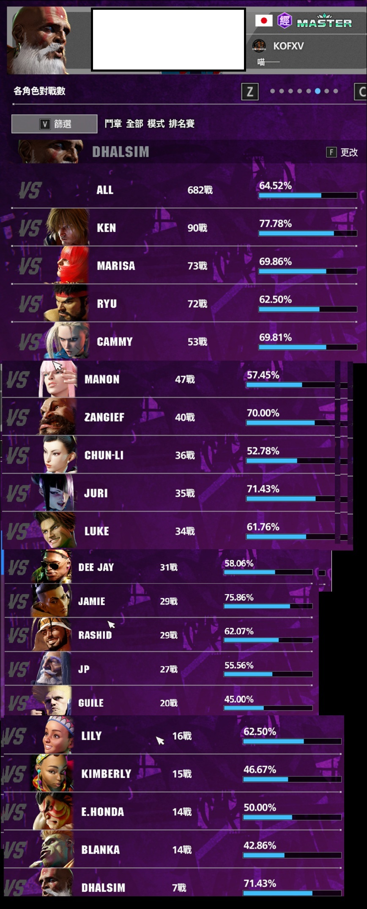

　　2026 年 4 月 29 日，新世代的《快打旋風》職業選手 MenaRD 和傳奇選手梅原大吾，進行了一場搶十的對決。

　　這次對決各方面都受人矚目的原因，包括 MenaRD 是在眾多頂尖職業選手的賽制內拿下史上唯一兩次 Capcom 盃冠軍，也在參賽人數好幾千人的 EVO 賽制拿下三次冠軍。要說 MenaRD 是現在最強的《快打旋風》職業選手，不把「之一」加上去，我想沒人會反對。

　　然而，不知道大家有沒有聽過這樣的笑話。一位不了解電競的朋友問 Faker 到底多偉大時：

　　「這樣吧，你有在看 NBA 嗎？」

　　「有。」

　　「好，拿 NBA 來說，Faker 就是那顆籃球。」

　　沒錯，沒有那顆球，大家都別玩了。梅原大吾就是快打界的「Faker」，從 17 歲拿到第一次冠軍後，在這 20 年間依舊保持強大的競爭力，EVO 冠軍次數（六次）也不足以彰顯生涯輝煌的戰績，同時也是把「玩格鬥遊戲」這件看似不正經的事，推進到能被視為運動員一樣「職業」的人。

　　但最重要的是，梅原大吾從來沒有在搶十對決[^1]中輸過。

　　2010 年梅原在 SSF4 Godsgarden FT10 以 10 比 3 擊敗了 Momochi，2013 年在 MCZ Unveiled PAX Prime 以 10 比 0 完封當年 EVO 冠軍 Xian，同年也以 10 比 2 擊敗 Infiltration（當年冠軍），2018 年，他在「獸道」節目中和當時同樣為傳奇選手的 Tokido 對決，以 10 比 5 勝出。

　　回顧那場與 Tokido 的對決，底下有個讓我笑出來的留言：

>　　「天下第一」和「天」

　　這場對決前，Tokido 剛拿下 2017 年的 EVO 冠軍，打完沒多久，也在 TGU 2018 (Capcom Pro Tour) 拿下冠軍，以當年 Tokido 的競技水準，真的是天下第一也不為過。然而搶十戰有別於一般賽事得和不同的選手和角色競爭，更能在事前針對同一隻角色準備對策，比賽中也有更多時間觀察對手行動並調整自己節奏。

　　所以，當梅原以 10 比 5 贏過 Tokido 後，大家都這樣說：「只要梅原大吾準備好，沒有人能贏他。」

　　然而，就算是 29 歲的 Faker 還能在職業賽場上拚搏，操作和反應也已大不如前。

　　八年過去，在 2026 年的今天，梅原已經 44 歲了。當梅原大吾和 MenaRD 對決的消息出現後，心底第一個想法是「有必要嗎」，因為梅原又不像拳王泰森那樣，只要與網紅打一場拳就能賺進大筆出場費[^2]，更別說遊戲內角色不利[^3]，大部分人在想的已經不是「梅原到底能不能保持搶十的不敗紀錄」，而是「不要被 MenaRD 十比零就不錯了」。

　　如果對比賽內容有興趣的，可以看以下的 YT 一同感受比賽的氣氛。



　　

防

雷

分

格

線

　　

　　昨天早早去睡沒有跟比賽，今天醒來立刻看到比數——10 : 6。

　　現實世界的奇蹟沒那麼常發生。爬了一下格鬥遊戲群組當時的討論，發現開場梅原狀態非常好，中間一度戰到 5 比 5，可惜長局數的比拚之下，最終還是 6 比 10 敗給了 MenaRD。

　　雖然大部分人都認為能拿 6 局對梅原大吾來說已經是超常發揮，MenaRD 在獲勝之後也沒有展露過多興奮，在訪談時也說了「能在這舞台和傳奇選手比上這場是他榮幸」類似感性的話。然而，梅原在最後的訪談卻這樣說：

> 「雖然我下個月就要 45 歲了，但今天的我正值巔峰。如果你贏了，你應該感到驕傲。」
> 

　　這大概是我這輩子聽過最帥的一句話了。

### 後記

　　梅原大吾的那句話，也是促成這篇文章的契機。年齡可以是硬傷，但自己也可以「不這樣認為」。能不心虛地說出「現在的我正值巔峰」，就是最棒的生活態度了。

### 附圖

　　格鬥遊戲從小伴我到大，雖然自己算是 KOF 玩家（嚴格說不能算《快打旋風》玩家），但還是附上《快打旋風六》退坑前最後的排名賽勝率照。我猜下次回坑 FTG 大概就是聖騎士之戰新作或 KOF 新作或快打七了吧（？）

[^1]: 快打旋風一局內為三戰兩勝，贏下來的人會拿下一局。現在格鬥賽制由於時間因素多半都是短盤賽，EVO 八強前都只搶一局，決賽才會搶三局。

[^2]: 58歲拳王泰森（Mike Tyson）與27歲網紅傑克·保羅（Jake Paul）於2024年11月進行的跨世代拳賽，泰森雖落敗但仍獲得約2000萬美元（約新台幣6.4億元）的高額出場費。（ＡＩ摘要）

[^3]: 梅原遊戲內擅長的角色「豪鬼」在版本更新後被削弱，更難應對 MenaRD 的「布蘭卡」。