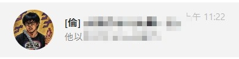

　　「黑話」——這裡泛指那些只有朋友間才聽得懂的用語，多半是某人的口頭禪、慣用語句或內哏而導致。藉最近的「格友」討論之風，分享一些朋友間的黑話。

　

### 「倫」

　　我有個 Line 群組，朋友間都叫他「倫窗」。由來是一群以前就認識的朋友變成了上班族後都會在這窗聊天，發現這樣不就是「薪水小偷」了嗎？當時可能是 [PTT 流行用語](https://pttpedia.fandom.com/zh/wiki/%E8%96%AA%E6%B0%B4%E5%B0%8F%E5%80%AB)的關係，「薪水小倫」的說法就開始廣為使用，但朋友間甚至簡化成和「偷」一樣的用法。比如說：

　　（友人分享事情要做不完了）——「還敢倫啊」

　　（休息期間）——「先讓我倫一下」

　　（今天聊天室未讀訊息超多）——「倫太大了吧」

　　相關類似的黑話還有「大哥哥」，但這個就至少不限於朋友圈，而是「特定宅圈」會出現的黑話，語源出自這張梗圖：

　　從這之後「大哥哥」就被引申為「在正常上班時間做些休閒活動」的朋友，範例用法：

　　「大哥哥為什麼現在在日本」

　　「一群大哥哥」（簡略用法）

　　看來，想辦法倫成有錢人之後就能變成大哥哥了呢。（啥）

　

### 牡丹樓

　　很久以前玩魔術方塊時，聚會多半在「牡丹樓」。有人知道是哪嗎？

　　沒錯，就是「麥當勞」（Mcdonald’s）！

　　我忘了是哪位塊友[^1]開始的風潮，結果久而久之每個人都這樣叫了。事隔多年想起這件事時懷疑或許不只有我們這樣叫（走不出二月同樂會主題），所以偶爾都會向其他朋友測試：

　　「晚餐要不要吃牡丹樓？」

　　「蛤？」

　　嗯，目前還沒有聽得懂的，看來果然是黑話啊。[^2]

　

### .jpg

　　先前在碩人[雙人成行](https://shuojen.com/blog/2026/05/10/it_takes_two)文章底下留言時，才想到這件事。

　　這黑話的奧妙之處是，就算碩人的留言板無法上傳圖片，但我卻上傳了圖片！先前看到 Wiwi 的[動圖正解是 WebP](https://wiwi.blog/blog/animated-webp/) 後，我只能說只要兩個人心有靈犀，最好的正解其實是 .txt。不信的話，請先看完 Wiwi 這篇文章後（只看一點點也可以？），我們來試試。

　　可麗餅躺桌翻肚.gif

　　有看到那張圖了嗎？是不是夠省流？（誤）[^3],[^4]

　　這樣用的起源或許是朋友間很愛傳梗圖，但有些梗圖要傳還得自己去找外 Line 又是超爛軟體會佔空間，因此這樣的替代方式立刻被默默認同後廣為流傳。這招最精妙之處在於，他不是那種「只有朋友間先說好」才能懂的黑話，而是只要兩人都看過圖片就能懂！因此，雖然我無法確定碩人知不知道「大雄閃光」，但根據魔術理論快速分析後，還是果斷地使用了 .jpg 留言法，看起來完全沒問題，真是太棒了！

　　（工商服務可能沒看過圖的朋友，這是「大雄閃光.jpg」本尊）

　　（節錄朋友間其他使用範例）

　

### 大學時期

　　大學某年同寢的朋友黑話多不勝數，例如「北七」講成「北祥」（緣由太複雜不贅述），「不」硬要講成「否」，例如「不去」講成「否去」，「北祥否」＝「北七嗎？」（組合技），所有常吃的餐廳硬要簡寫，例如「ㄚ米ㄚ米」簡稱為「歪」（甚至不是「阿」），導致其他朋友根本不知道我們這寢的室友們到底在說什麼：

　　「歪？」

　　「否。」

　　「乙？」

　　「gogo！」

　　（翻譯：晚上吃啥？要吃ㄚ米ㄚ米嗎？→ 不要。 → 那吃乙級？（另一間餐廳） → gogo！）

　　古人應該也沒想到這年頭還有人講話能比他們更省字的吧？

　

### 後記

　　我覺得這算朋友間最有趣的文化之一（總覺得又是個適合 Blogblog 同樂會的主題，但或許不是每人的朋友都會這樣？）。最近的「格友」和「Wiwi 宇宙」之類的名詞我覺得也是類似的事：

　　「你知道嗎最近有個格友去日本玩欸！」

　　「格友？」

　　「就 Wiwi 宇宙的那個啊～」

　　「Wiwi 宇宙？」

　　不知為何我覺得很棒，見證了社會與文化的形成與誕生。 XD

[^1]: 根據「格友」，魔術方塊朋友應該也可以簡稱為「塊友」？（又一個黑話）

[^2]: 本篇文章發出後以後聽得懂的除了原本魔術方塊朋友們外，還多了本 Blog 讀者們（？）

[^3]: 其實那張圖其實是 .webp，根本不是 .gif，還能無痛轉檔呢。

[^4]: 打完後才發現或許「心盲症」[^5]的朋友無法想像，突然覺得有些抱歉。

[^5]: [https://zh.wikipedia.org/zh-tw/心盲症](https://zh.wikipedia.org/zh-tw/%E5%BF%83%E7%9B%B2%E7%97%87)