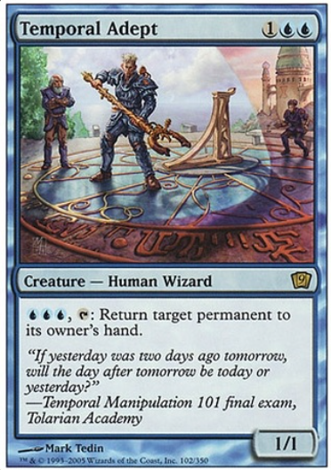

### 前言

　　學生時期我玩了很長一陣子的魔法風雲會（Magic: The Gathering），出社會後也斷斷續續玩著線上版，但這篇無關遊戲本身，而是牌面背景敘述內有趣的謎題，所以將文章發過來讓 Blog 的朋友們可以一起想想看！

### 本文

　　魔法風雲會上我最喜歡的牌面背景敘述——第九版的 「時間專家」（Temporal Adept），以前學生時期朋友們還為這題討論了很久，剛又重新想了一次，意外發現很多雙關部分，以下是問題！

　　在「陶拉里亞大學院時間操縱緒論期末考」上，出現了這麼一道難題......

　　"If yesterday was two days ago tomorrow, will the day after tomorrow be today or yesterday?"

　　「如果昨天到了明天會變成兩天前，請問明天過後應該是今天或昨天？」

　　聽起來根本不知道在講什麼，因為一般麻瓜思考為「到了明天，昨天本身就會變成『兩天前』，所以『明天過後』既不是『今天』或『昨天』，理當就是該是『後天』，本題無解。」

　　但這可是「時間操縱緒論期末考」呢！

　　對於能修這門課的高材生而言，「時間」對他們可能不是現在進行式，也就是如果以「時間不會流動的前提」下考量，昨天「變成」了今天的兩天前，所以明天過後是有可能變成「昨天」的！

　　事隔多年現在想想，「明天過後」這詞也是很曖昧，句中的「the day」、「today」、「yesterday」等等形容日期的名詞，究竟客觀上指的是現實生活中的哪一天？

　　不愧是期末考，果然沒那麼簡單啊，好險我不用修這門課 XD

### 後記

　　這個問題有人真的拿去問了 MTG 的 RD，結果真的得到了回覆：

問：「我用Gatherer翻閱過整個第九版，然後我看到Temporal Adept(時間專家)的背景敘述。絞盡腦汁二十分鐘，只換來頭痛。這問題真的有解嗎？謝謝！」－美國維吉尼亞州里奇蒙的Rick

答1：由魔法風雲會研發部門，Devin Low回答：「Rick，感謝來問。這試題有答案。你差點就能答對了。很明顯，如果昨天到了明天會變成兩天前，那昨天反過來就是兩天後的昨天，這可以導出昨天同時是後天昨天的兩天前跟兩天後。因此，後天的明天一定是個昨天，不然它就不是前面說的後天昨天的兩天後了。同理後天也一定是個明天，因為後天的昨天一定是個昨天，而後天又是那個昨天兩天後的昨天。因此我們可以肯定問題的答案事實上是昨天跟明天，反正不可能是今天。剩下的試題祝你幸運。」

（譯者註：這邊的兩天前是以今天為基準，也就是前天的意思）

答2：由魔法風雲會研發部門，Devin Low回答：「Rick，感謝來問。這試題有答案。你差點就能答對了。先看第一句：『如果昨天到了明天會變成兩天前』。根據這段話的意思，假設今天是星期三。那麼那句話說：『如果昨天(星期二)到了明天(星期四)會變成兩天前』…到了星期四，星期二就真的是兩天前。事實上，對任何「明天」而言，它的兩天前很明顯地都是「昨天」。所有問題的第一部分恆真。這就像在問說『如果香蕉是黃色的，試問後天應該是今天或是昨天？』這跟在問『試問後天應該是今天或是昨天？』是一樣的。」

　　「所以現在來考慮問題的第二部分：『試問後天應該是今天或是昨天？』。一樣，假設今天是星期三。則問題問說『試問後天(星期五)應該是今天(星期三)或是昨天(星期二)？』很明顯」，星期五既不是星期三也不是星期二。同樣地「後天」也不是「今天」或「昨天」。所以這題的正確答案是「以上皆非」。剩下的試題祝你幸運。」

（譯者註：這邊的兩天前是以明天為基準，根本就是昨天）

> 以上感謝為台灣 MTG 社群貢獻良多的水牛比爾翻譯，[原文在此](https://miko.tw/~buffalobill/aw/2005-11.xhtml)
> 

　　看來魔法風雲會研發部門的 Devin Low 也被困在時間洪流與平行時空之中了 XD