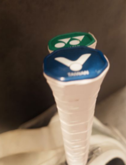

　　好久沒打羽球了（其實也才隔了一周）。

　　不如說，因為如此這般，好久沒上班了。在羽球場邊我不得不思考：當一個員工一星期沒有出現在公司，而公司卻沒什麼差的時候，這間公司真的需要這個員工嗎？

　　嗯，這應該是公司要去思考的事，不是我。總之，今天還是上了班，下班睡了覺，起床前往了羽球場。所謂的「理想日常」，經過這個月的如此這般後似乎又更「鮮明」了。

　　雖然以前沒事時的確思考過許多生死相關的哲學議題，但這次還是第一次將思考範疇拉到「人生的總和就是個一期一會」這件事。雖然這次八月同樂會投稿的回顧我不只看到一篇「如果把人生的每件事情都當作『一期一會』也太累」的論點，但這裡卻讓我想到無論是攝影還是寫作的第一課，就是「如果處處是重點，那就代表『沒有重點』」[^0.5]。

　　這什麼意思呢？也就是說，如果「一期一會」的每件事情都很重要，那反過來說，這世界上就代表沒有一件事情是重要的。

　　更白話一點，這世界上任何事情的重要程度都是比較出來的，跟顏色一樣。一張照片就算 LAB 值當中的 L 是 90，客觀上來講明度超高的顏色，但如果照片的其他地方都是 91 以上，那麼，這個 pixel 其實就是整張照片當中最「暗」的顏色了。

　　這世界每件事情都是一期一會，如果一期一會的事情都很重要，那麼想怎樣想都可以，你也可以決定什麼這些一期一會當中哪些事情是重要的，哪些是不重要的，就算萬物皆一期一會，壓力根本也不用那麼大。

　　比如說一個月後的 10 月 9 號，是我名義上的最後一場同人場次擺攤。但搞到現在，初稿還沒完稿，排版還沒開始排，設計和封面通通還沒定案。這怎麼想都是超超超級重要的一期最後會，但截至目前，天窗的機率正在急速提升中。

　　但我想或許這也只是 P 人正常發揮的一環而已，大概和什麼冠冕堂皇的一期什麼裡多會[^1]沒什麼關係。

　　而且，我一直惦記著以前只花了一星期就將碩士論文從 0 到初稿完稿，因此，就算最後送印的死線是 9 月 27 號，區區一本同人小說，現在算來還有三個禮拜，一個禮拜完稿，兩個禮拜校稿排版搞定封面，根本綽綽有餘，哼哼。

　　可惜千算萬算，就在羽球快打完時才發現漏算了一點，那就是當時可是全職學生，一整天下來除了寫論文外也沒其他事要幹了。我可以整天除了吃飯睡覺以外通通的時間都花在寫論文上，一天寫 16 小時的論文也是合理。但現在的我可是貨真價實的社畜，~~就算上班能偷寫~~一天能心無旁鶩地寫 6 至 8 小時我想就謝天謝地，這樣等比例算來，16 乘以 7 除以 6 等於 18.66666，天啊，如果要花 18 天才有辦法完成初稿的話，現在算來根本就已經死線到不行了。

　　但總歸[「世界上沒有那麼多東西，重要到無法退讓的地步吧」](https://lq7.tw/reading/five-comics-and-animes/)。在這接近永恆的宇宙中，如果人生是趟短到可以忽略不計的旅程，那麼，真的趕不及，這場就繼續賣舊刊，就再報個下一場就好。

　　但，我相信我能如期出刊，應該。

　　[「You will when you believe.」](https://www.youtube.com/watch?v=r-MeDGCu9CU)

[^0.5]: 攝影和寫作都是「減法」，如果要讓別人看到自己的表達，那就一次只講一個重點，其他的部分通通要為這個「重點」服務，照片（或文章）才會鮮明。

[^1]: 對我故意的（？）