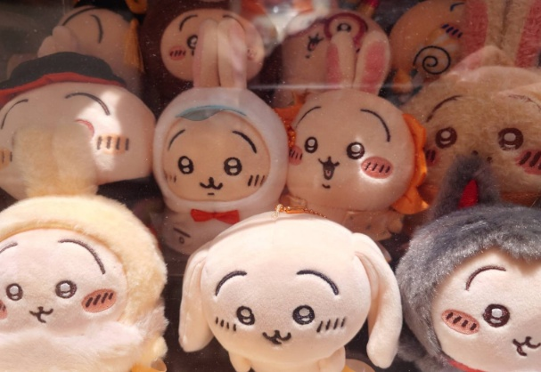

　　（因為又再度忘了拍羽球拍照只好回家後拿內文有提到的吉伊卡哇充數）

　　星期四晚上打羽球，就這樣來到第十集了！！！

　　我看今年下半年就是真正的羽球元年了。以往球隊報名直到當天多半不見得會額滿，結果最近的兩次都是星期二就滿員，搞得像在搶演唱會一樣[^1]，還得等第三塊場到底能否加開，才能滿足各方來打球的民眾。

　　不過無論如何，越來越多人愛運動是件好事。「運動」大概也是史上最有益身心的人類行為了。任何改善身心或提高生活品質的方式，大抵逃不了「多運動」這選項。三高？多運動。精神狀態不佳？多運動。食慾不振？多運動。睡不好？多運動。睪固酮下降？多運動。我看只差「搶不到演唱會的票怎辦」的時候「多運動」了。

　　扯遠了。今天的主題，我想就直接切入 yangbear 本日的[《為什麼要出國》](https://yangbear.bearblog.dev/naze-kaigai-e/)，裡面提到「說了這麼多，就只是找不到人陪我出國的藉口而已」。

　　真巧，我有個[格友](https://wei-lee.me/)剛好會參加[台灣野外活動部](https://twcamp.webotopia.work/)的日本聖地巡禮，「聽說」超級好玩，所以在此幫他強力推薦一下，或許可以考慮報名一起去玩[^2]。

　　唉，幫別人推薦但自己卻不去，實在不知道該怎麼形容這種人。但沒辦法，相較每隔一兩周總會出現幾個莫名在日本打卡的朋友們，我也是「不那麼愛出國」的人。就算現在變得愛拍照，但就有種台灣都還沒拍夠，目前還沒必要為了拍照而特別出國之感。

　　更重要的是，出國基本上也是得花錢，把這些預算拿去買鏡頭，不是更好嗎（誤）

　　以前的我或許有更嚴重的物質主義，下意識認為相較把錢花在「體驗」上，更想花在「有形」而可保存或使用的物品，例如電腦螢幕鍵盤，優先程度就遠大於旅遊、電影、演唱會。我猜養成「不愛出國」的習慣，或多或少也受到這樣的價值觀影響。

　　然而仔細想想，yangbear 的出國理論更精確地說中了心聲，就是我同樣也「不需要出國才能補充生活能量」。雖然喜歡日本，但就算在台灣也有許多能接觸日本文化的活動，如同現在每個周末都參加同人場次，好像也差不多。二月底去東京橫濱輕井澤那周的日本之旅之所以獨一無二，除了看演唱會這件事外，終究是因為當時每天都住在朋友家一起嗨了一周，才如此獨特。

　　But，就是這個 But，如果朋友的家在台中或花蓮，同樣跑去住一周，我實在不敢保證這兩者究竟差了多少。

　　這大概又能扯到我雖然喜歡看電影，但其實不常進電影院看的習慣。沒記錯前幾天進電影院看的吉伊卡哇劇場版，還真是今年第一次進電影院看的電影。理由或許也很明確，第一，我沒那麼急著看「最新電影」，總覺得等到串流能看也差不了多少，反正累積要看的舊電影基本已經消化不完。第二，對我而言看電影是比較個人、私密、安靜的活動，「一群人看電影」意義或許不比「一起吃飯」、「一起打球」或「一起玩遊戲」來得大。第三，我看電影很怕吵，在電影院看電影總會受其他人影響，不如不去。

　　最後，我覺得去電影院反而比在家裡看還要吃虧[^3]，因為在家看電影除了用 IMAX 拍的電影無法體驗外，畫質和音響或許還比電影院好，不信可以問問[李唯](https://wei-lee.me/)。

> 李唯：「有嗎？」（2026.08.06 ——李唯沒有說過這句話）
> 

　　看來似乎得改掉在 Blog 當中一直提到其他格友的毛病了。但這也代表我已把 Blog 當作「社群」，而漸漸不是像當初那樣經營自己人設（而且沒多久就破功）的空間。這也讓我想到，雖然「各式各樣的人」都有可能寫自己的 Blog，但其實光看 [nownownow.com](https://nownownow.com/) 就能發現，在這年代還願意架網站寫個人 Blog，「大概就是那類人」。就算是其他社群軟體，大概也都有著同樣「物以類聚」的要素。事實上，不同社群軟體對我而言就只是不同的「社群」而已。比如說 FB 多半是現實生活中認識的人，IG 就是與攝影師和 Coser 學習的地方，Threads 就是關注邦友最新消息，X（Twitter）則是日本繪師和藝人的情報。

　　雖然「為什麼回去使用社群媒體」這篇文一直懶得生出來，那麼就夾雜在羽球系列文裡面偶爾說說，我想也不錯。

　　說到底，我應該就是對「人類的全部」有著濃厚興趣吧。

　　歡樂的羽球時光又這樣結束了，今天的文之所以比較短（有嗎），是因為最後一小時的休息時間都在和球友聊天，或許羽球系列文斷更的最大敵人就是球友也說不定？

### 後記

　　沒有介紹打完球吃了什麼總覺得儀式感又降低了，於是補了這個後記。今天吃的是麥當勞，結果外帶回家一看居然少放了四塊麥克雞塊和中薯，最後致電麥當勞後，使用熊貓幫我補送到家。雖然漏餐點的確影響心情，但工作忙中出錯乃人之常情[^4]，事情能平安落幕才是最好的事，服務人員辛苦了。

　　那麼，各位下周再見！

[^1]: 這是球隊團長說的，但演唱會多半還是難搶得多，我想搶過的朋友都懂。

[^2]: 其實名額似乎已額滿，想參加都來不及（？）

[^3]: 電影院的投影機燈泡由於大量使用，因此亮度和顯色多半比想像中不足，多半靠的是超高畫質的數位母帶，家裡的家庭劇院嚴格說來，真的比較厲害一點。不過，現在都是買週邊送電影票了，我就不說哪位家人就在我打球的此時此刻跑去**三刷**吉伊卡哇人魚島篇🫴

[^4]: （前）處長對外最喜歡講的一句話就是「只要是人寫的 Code 都會有 Bug」，就算把產線整個搞當機了他也能面不改色地回報 CEO，值得學習（？）