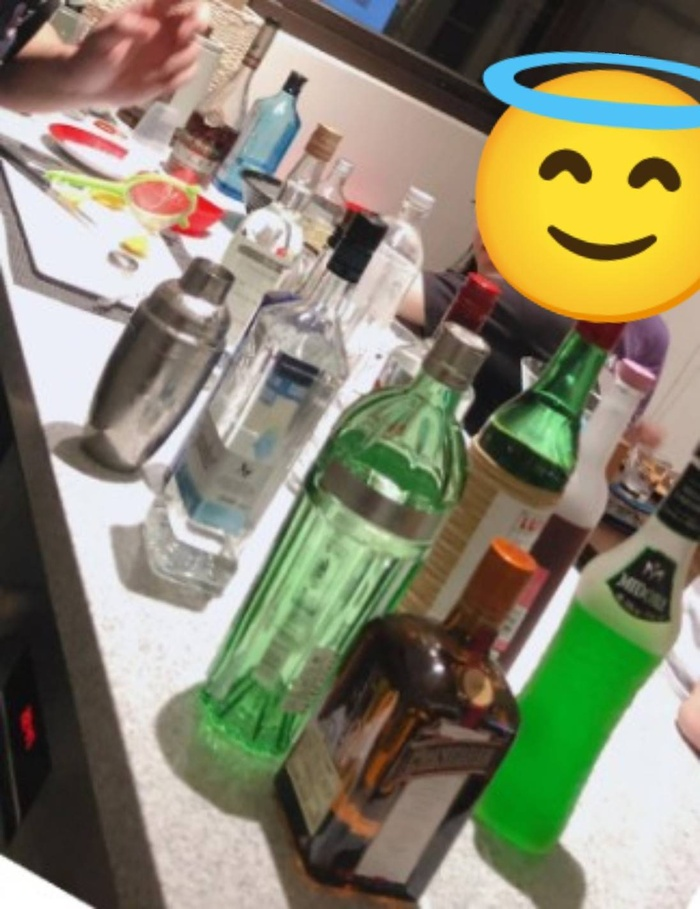

　　有件重要的事得先告知，就是這次的星期四晚上打羽球，不是在球場邊寫的。

　　「為什麼呢？想必又是因為沒有打羽球了？不對，如果沒有打羽球，那就根本不會有「星期四晚上打羽球」這篇文章。既然有『星期四晚上打羽球』，代表星期四晚上真的打了羽球……@#$%^&」

　　其實事情遠比想像中單純，就是昨晚打羽球時，我忘記帶手機了。

　　人家韌性演習斷網半小時，我可是變成三小時而且還加碼數位排毒，厲害了。但其實多數時候我的確希望不把沒手機可用當成大事（除了高鐵票存在手機裡面忘了帶之類），更精確來說，「不產生依賴」是我嚮往的生活哲學。

　　舉個例子，長時間習慣性飲酒，會對酒精產生依賴，為了身體健康，如果不打算繼續喝酒，就需要「戒」酒。

　　以前沉迷過調酒好一陣子，當時家裡甚至有器具能製作出透明冰塊，為了自己做出石榴糖漿，因為把石榴放在袋子裡滾老半天超狼狽，還特地買了榨汁機。當時幾乎天天喝酒的我，也有點害怕「對酒精產生依賴」這件事，於是，我想像有個人站在自己身後般，觀察了「自己」好一陣子。

（朋友來家裡玩時的邊調酒邊聊天的家庭酒吧。照片當下據說在討論 Tequila 到底有多難喝，現在想想我只能說如果是一般的 Jose Cuervo Gold 或 White，那的確難以言喻，但如果是 Don Julio 1942，那可是超級、超級好喝，都是 Tequila 沒錯但不是這樣.jpg）

　　最後發現，我喜歡的不是「酒精」，而是「酒所產生的人類文化」，就算有過和朋友出門喝酒喝到凌晨四點回家吐在路邊的經驗，但我總不特別期待「酒精」。也就是說，當我自認從調酒「畢業」，將家裡幾十支酒連同所有器具都送給了開酒吧的朋友，我就再也沒喝酒了，上次喝酒，或許已經是一年多前朋友結婚的時候。

　　更白話一點，雖然一年多沒沾任何酒精，我也不覺得我在「戒」酒。如果哪天突然想念 Don Julio 1942 、獺祭二割三，甚至是這輩子最喜歡的 Gin Tonic 配方時[^0]，天時地利人和，或許也會點來（調來）嚐嚐。為了健康少喝點酒是一回事，但如果能「喜歡酒」而不對酒精產生依賴，對我來說更能保有體驗人生的最大彈性。

> 「本來無一物，何處惹塵埃？」
> 

　　這樣說來，那些電子產品、手機、甚至社群媒體我想也是同樣道理——「不產生依賴」這件事情遠比「用什麼」重要。BBS 盛行的年代早就印證並彰顯，就算「完全自由不受任何演算法控制的論壇」[^test]，也會有人整天泡在上面，想要把一兩百個「紅勾勾」消掉，對於「總要最先看完新文章」這件事產生強大的依賴性。

　　有件最容易忽略的事，那就是廢文終究是「廢文」[^2]。廢文不會因為這是在完全自由的平台或軟體上由真人打出來的廢文，就比演算法推薦的廢文還來得「不廢」。在演算法推薦系統出來前，這種文章，或更廣義而言，這樣的廢「物」早已以各種形態存在並滲透於人類社會中。

　　現代人以為自己都是被專家精心設計的演算法推薦系統控制，殊不知最強大的演算法推薦系統，其實是人類幾萬年前就沒在繼續進化的大腦而已。

　　怎麼又離題了。這次的文章原本預定像[上次一樣](/mood/thursday-badminton-10/)，以 yangbear 的《[居然和竟然](https://yangbear.bearblog.dev/masaka/)》開場，不知怎麼突然搞成這樣，真是抱歉。回歸正（？）題，雖然不確定自身的正式文章或小說使用率，但如果是閒聊，我是完完全全「居然」派。原因單純只是「居」是一聲，語感上如果有相似詞且能用一聲，我似乎會更傾向一聲。

　　講得更仔細一點，我覺得「三聲」或「四聲」，比一聲「兇」一點。這邊提到了「一點」，也讓我想到先前的小說校稿時，不知道把多少個「一點」改成了「一些」，也是因為我認為「一些」念起來比「一點」來得更輕，也更符合自己的語感。

　　一篇文章（甚至攝影照片、其他藝術）」，我想就是有了自己的喜好、觀點與習慣，一點一滴建構出來後，形成了「作者的風格」。這樣的風格，是那些整天照抄 AI 文筆的人，就算把所有的「不是…..而是……」用法改掉，就算看起來有多會使用標點符號，也無法體會的。

　　但我想也不是所有人都想要體會這種事情，嗯，我也想是。啊，講到這個就好煩，因為我不知道何時才能生出 AI 系列文續集。主要原因當然是最近所有事情卡在一起，加上十月同人場次報名上了，有《ANOSOYO SCORE FINALE》九月前要生出初稿的壓力，理想的日常似乎開始變得不那麼日常的時候，背上的發條似乎不自覺多轉了兩圈。

　　唉，希望年底前有機會生出 AI 系列文續集，如果有哪次的同樂會主題剛好可以順水推舟地讓我打上這篇文章，那是最好。總之，為了我的偶像（之一）againitsme，我想我會努力。

　　說好不亂提其他格友的毛病又犯了，好吧，那看來這篇文章就到此為止，原本還想提到昨天和[格友劉昕](https://shuaixin.cc/about/)討論的「訂閱制」，但我想這部分劉昕大大絕對有自行發揮的空間與潛力，在此暫且不幫他續上狗尾[^3]。

　　最後的最後，在這篇文章發出的吋前，沒想到能在 Tian-Yan 的 Blog 中看到「[應無所住，而生其心](https://tianyanfeng.blog/flow-dont-cling/)」的討論，有點開心。「不過度依賴任何事物」，我想也是「無住」的其中一種體現吧。能在這邊前後呼應，也是意料之外的事。

　　星期四晚上打羽球（早已結束），我們下周再見。

### 後記

　　怎麼又有後記？因為還是想將沒帶手機的事做個結尾。因為沒帶手機，所以和另一位最近常來打球的球友聊天，先聊到對方是否在工作 → 還在念書快畢業了，喔喔大學生嗎 → 研究所，念哪方面的啊 → ＯＯＯＯ系。

　　越聽越不對勁，只好用了非常隱諱的問法 → 哪一組的啊？Ｏ組。

　　靠邀啊，居然是同所同組學弟，這世界是能這麼小的嗎？由於攀上了關係，也得知了系上近況，同時增進了球友間的情誼。

　　我想這就是塞翁失馬焉知非福的故事了，大家下次參加活動或聚會時也可以故意將手機放在家裡，或許也會有意想不到的發現喔！當然前提是，不要將高鐵票存在手機裡面後再忘記帶就好[^4]。

[^0]: 如果有朋友想知道也無坊，這邊大方公布配方：Tanqueray No.10（坦奎麗十）加上 Fever-Tree Tonic Water 地中海口味（藍色那支），檸檬汁可加可不加，但檸檬皮一定要削一點進去，剩下塗在杯緣，透明冰塊，比例操作請各憑本事。但就算不熟操作，以上東西加在一起也絕對比一般酒吧用舒味思調出來的好喝百倍。

[^test]: 其實現在也依舊存在，可以來[體驗看看](https://term.ptt.cc)。

[^2]: 打這段時一直想到[廢文小天地](https://trashposts.com/)，只好重申就我觀察此 Blog 比較像是此地無銀三百兩的意思，請大家不需特別理會他的標題（？）

[^3]: 「狗尾續貂」的冷知識（現在都幾月了）：乍看字面上很像是在狗的尾巴後面續上貂很多此一舉，但其實是裝飾在官帽上的貂尾不夠用，便用狗尾代替。（From [教育部成語典](https://dict.idioms.moe.edu.tw/idiomView.jsp?ID=-503&webMd=1&la=0)）

[^4]: 會一直提這個就代表，嗯，各位知道的（但不是我）。