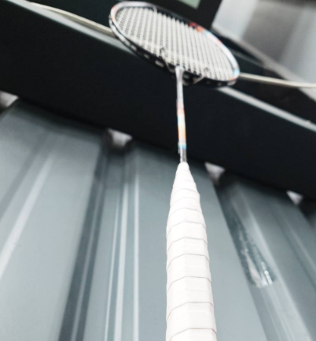

　　星期四晚上好久沒打羽球。

　　不對，掐指一算，也才又隔一周沒打而已。眼看 Blog 上次發文日期 9 月 11 號，已經不是好久沒打羽球的問題，而是好久沒發文了。但相信有認真關注的朋友們或許能猜到，原因是因為最近在全力趕稿，所以沒任何心力搞其他事情，甚至連羽球都主動沒去打了。

　　謝天謝地，今天也是因為排版總算大致告一段落，明天再怎樣都有辦法跟搞定送印的結果，才能來放心打羽球。（編按：在潤飾本文時已將小說送印，可喜可賀，可口可樂。）

　　但仔細回想上周沒打羽球，在家裡似乎也沒認真趕稿，到底在幹啥來著？好像在看英雄聯盟季後賽。其實當時就有料到「沒去打球真的就會認真趕稿嗎」這件事，結果還是用實際行動證明「最了解自己的果然還是自己」。

　　不過，多虧這次的同人小說，我發現我還是能進入「做好一本書」的心流中。雖然以往為求完美主義，都直接付費委託專業人士排版，但這次時程實在太趕，最後還把 Tetsuko 老師（aka 我太太）拖了下水，請她幫忙做全書設計。原本打算排版也奢求她看能不能行，於是也請她試著學了一下 Indesign，但後來發現 Adobe 系列軟體如果不認真上課，只靠助理似乎有點無法應付。

　　於是，「自己的小說自己排」，最後還是親自下海，打算使用連[劉昕大大](https://shuaixin.cc/)都嫌難用的 W 開頭傳奇文書軟體。

　　實際用起來，其實還好嘛。畢竟遙想當年，我的碩士論文不是用什麼 Latex 編輯器，也是用了 W 開頭傳奇文書軟體就搞定一切。而且這可是 2026 年，有不懂的功能問個助理就解決了，不到一天我就成為「W 開頭傳奇文書軟體大師」，那些什麼版面配置，頁首頁尾，基偶數頁，甚至連太太都不知道的「分節符號」都運用自如，雖然和排版專業人士的美感經驗有一定程度差距（字距之類的問題），但就跟第一本同人小說一樣，如果以第一次（扣掉論文）排小說而言，或許可以給自己一個鼓勵獎。

　　從某時期開始，我發現做很多沒有認真計劃的事情，在做之前似乎都能預知結果。比如說跳 PIU 跳舞機時，自己的第六感大概就能知道今天這個狀態，選下這首歌後到底能不能過。如同年初預計的七萬字小說，不知為何在心底總有「這大概不成」之感。但換成了同樣非常趕的三萬字新刊，同樣找不到封面繪師全書設計和排版加上還有一萬五千多字沒寫完，在一星期前卻有種「不管怎樣事情一定會順利」的感覺。

　　難道這真的是[「You will when you believe」](https://www.youtube.com/watch?v=r-MeDGCu9CU)的力量（呼應羽球十四），又或是未卜先知還是馬後砲，我想就是神經科學或認知心理學的範疇惹。就跟先前寫的[某篇文章](https://lq7.tw/thinking/before-and-after-being-a-pro/)一樣，「要成為專業人士，就先覺得自己是專業人士」，搞不好就是因為自己覺得不行，所以才導致真的不行，進而影響了世界線也說不定。

　　說到「影響世界線」這回事，則不得不提最近看到或許是這輩子最精彩的電競社群賽「[Valorant 鱷魔盃](https://crocodemon.com/)」的一幕。



　

　　四強賽時，有位選手在輸了本局整隊就放假的關鍵賽末點，全隊剩下一人，對面卻還有將近滿血的四人時，一打四，將比賽拖入了延長賽。

　　此後，整隊氣勢大增，延長賽以14：12獲勝，比賽大分１比１進入第三局，然而這選手所處的隊伍勢如破竹，拿下最後的勝利，前進冠亞賽。

　　這被稱之為改變世界線的關鍵 play，整隊在最後的最後也拿到了冠軍。選手事後採訪，當下她完全沒注意現在比分到底幾比幾，只專注在操作每個遊戲內的動作上。

　　我想也是，不管重播幾次，這操作的每個 frame 都是如此不可思議。

　　或許該解釋一下，這個 play 到底有多不可能。如果以籃球來說，大概就是 T-mac 35秒得 13 分逆轉馬刺，如果以足球來說大概是 2005 歐冠決賽利物浦０比３落後的逆轉。如果有一個機會，讓這個 Valorant 四強賽的時光倒流，讓所有選手再回到當下玩 100 次，以當時的情況，或許 100 次都是對方勝利。

　　事後復盤，對手四人勝券在握但因為緊張沒溝通好給出了機會，Yuzumi 選手的完美操作也把握了機會，因此造就了奇蹟。

　　這也是為何我如此喜歡運動或電競賽事的原因之一了。奇異博士那一億多分之一的機率，是真的有可能不只出現在電影中。就算是社群賽，每個選手都認真訓練了一個多月，為這競賽投入心血，有歡笑有爭吵，但最後一切，都凝聚在場上變成了精彩的結果。

　　從學生時期我就發現，真正精彩的比賽不一定是世界頂尖選手才有辦法達成。以前在校時，就算是校隊乙組的羽球或排球比賽，也時常出現精采絕倫的對決。果然，人類只有在「一生懸命」時，才配得上「萬物之靈」的稱號也說不定。

　　但才打完這句話我就後悔了，畢竟不只是人類，動物大部分也都一生懸命地過生活，看來人類可能沒那麼配當萬物之靈也說不定。

　　最後，星期四晚上打羽球，這篇文章可能不會周五發，那是因為中秋節要來總校稿後將小說送印，因此保守估計這篇文章最快星期六會出現在 Blog 上。（編按：完全沒猜錯，現在潤稿剛好潤到已是 9 月 26 日 00 點 23 分🫠）

　　我想這也是計畫趕不上變化的一部分了。星期四晚上打羽球，我們中秋節快樂。