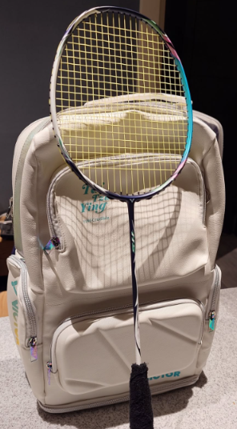

　　（本周再度忘了拍場照只好再度拿舊照充數）

　　星期四，晚上，打羽球！

　　最近關注亞運英雄聯盟項目時，被早上八點的賽程給嚇到。遙想先前練跑，幾乎所有馬拉松比賽都是超離譜的~~老人時間~~清晨時間，讓我非常痛苦。因此就算亞運在日本不用調時差，但多半凌晨四點睡中午過後才起床的電競選手，還是得調個作息才有辦法應付早上八點的比賽。

　　當然，LOL 都有在早八打的比賽了，馬拉松也有少數辦在下午的，例如我的初馬（或許也是最後馬）就是從下午起跑的台南星光馬拉松，也非常適合我的運動作息。先前約朋友打羽球時，由於他帶小孩的作息也是非常早，所以都打早上七點到九點的早晨時段（也比較便宜），結果打了一次的感想是「這裡是哪，我是誰，現在在幹嘛」，身體根本無法適應。

　　或許那些 LOL 職業選手最適合參加先前九月的同樂會投稿也說不定，畢竟對他們而言「正常作息」就是凌晨四五點才睡，「晚上不睡覺在幹嘛？在訓練」。

　　不知怎地寫著寫著就變成（已截止的）九月同樂會文章投稿，這可是意料之外。但真正的「意料之外」，是原本下午就想直接開一篇標題為「意料之外」的文章，但後來想想晚上就能在羽球場邊寫廢文，於是乾脆合併在此，或許扯到其他格友時也比較低調（有嗎）。

　　那麼，就直接切入重點吧：

> 說到「被控制」如果要廣義一點，我覺得人根本就沒有所謂的[自主思考](https://yangbear.bearblog.dev/3763/)，因為你之所以為你，就是從出生那一刻起開始[被塑造](https://yangbear.bearblog.dev/moshimo-kioku-ushinau/)，任何以為的「自己的選擇」都是因為過往經驗而造成的必然。所以如果要說「我真的被控制了」，那也不能說錯。但狹義一點解釋，首頁上推給我的影片，我透過我目前的喜好感官，去「選擇」了一個標題和封面圖有興趣的內容點入，而那些我看了就討厭的[標題殺人](https://yangbear.bearblog.dev/1517/)影片或是明顯有想迎合演算法跡象的影片，我認為我是「有選擇性的略過」，不感受到被控制，也不存在很大的厭惡感。
> 

　　看到格友 [yangbear](https://yangbear.bearblog.dev/) [^0.5]在〈[微醺](https://yangbear.bearblog.dev/horoyoi/)〉裡面的這個段落時差點哭出來[^1]，因為我完全沒有預料到此 Blog 會出現這樣的文字，內心有種難以言喻的感受（開心的部分）。

　　就算是 Blog，許多認真寫作的格友們發表的文章主題和文筆，也漸漸隨著時間變化。但或許這也可以從完全相反的角度解釋：「或許格友們本身就是這樣，只是看了越多文章後，越來越發現大家的另外一面，又或者是這些朋友越來越願意分享他們的另一面而已。」

　　類似的事情讓我想到另一位格友[李唯](https://wei-lee.me/)有個超棒的例子（李唯：又我？），就是他有在跳舞，然後前陣子聊到居然和我某陣子學 Locking 的老師認識。雖然格友兼邦友[^2]臥虎藏龍不稀奇，但「李唯有在跳 Locking」這件事也讓我超級意料之外。

　　在同人場次拍照時，和剛認識的朋友聊到我會去同人場次擺攤賣小說，朋友非常驚訝，表示「看我這樣居然有在寫小說」這件事反倒讓人意外。

　　「『看我這樣』是什麼意思🤔」

　　「喔就是，你看起來比較像跳舞的🫴」

　　可惡的刻板印象（搥地板.jpg）！不能因為每次去拍照都穿得比較街頭就這樣，不對，就算真的有在跳舞，有在跳舞的人難道就不能寫小說嗎！這是 double 刻板印象！

　　唉，龜笑鱉無尾，我也是憑刻板印象才會覺得「李唯有在跳 Locking」是出乎意料，真是抱歉。畢竟生物學或演化論早告訴我們，動物不靠刻板印象早就活不下來了，為了生存，還是繼續覺得「李唯有在跳 Locking 是出乎意料」才是上策（到底什麼結論）。

　　接著出乎意料的事（其實好像比上述事情還沒那麼出乎意料的出乎意料），則是昨天下午看到 [Tian-Yan](https://tianyanfeng.blog/) 的[金剛經筆記](https://tianyanfeng.blog/attachment-to-goodness/)，談到了「執著」這件事，看到這篇文章後我也立刻回信，表達了對「執著」的看法。

　　但或許我必須先白話一點解釋「即非善法，是名善法」的意思，這篇文章或許才能繼續下去。這段話我流解釋是「當我在行善時，心中沒有『我在行善』的想法，才是真正的『善』。」

　　乍聽之下很奇怪，但其實套用在任何生活經驗上，或許也不難理解。[這篇文章](/mood/thursday-badminton-15/)提到租咪改變世界線的 play，「當下她完全沒注意現在比分到底幾比幾，只專注在操作每個遊戲內的動作上」就是「即非善法」的最好例子。但凡被比數或「現在我到底能不能逆轉」的情緒[^3]或雜念影響，做出完美行動的機率反而會降低。

　　但撇開這些，「人到底該不該執著」或許是窮極一生都無法準確拿捏的事。如果真的什麼事情都「不執著」，那世俗那些較為困難事情或許根本無法辦到。例如，Faker 能成為世界最頂尖的 LOL 選手，難道真的「不執著」嗎？我妹要考上全台灣最頂尖的學校和科系，難道真的「不執著」嗎？

　　金剛經或佛教認為的答案或許是：「不執著的執著，才是真正好的執著。」但就經驗而言，雖然有些頂尖人物或多或少會這樣想，但其他同樣達到成就的人，更多的是不但執著，可能還要有接近走火入魔的狀態。

　　如同如果要能過 [IIDX 皆傳](/music/iidx-dp-10-dan/)，但凡有一點不執著，早就像我去[喝喝酒曬太陽](https://lq7.tw/thinking/before-and-after-being-a-pro/#%E4%B8%8B%E7%AF%87%E6%88%90%E7%82%BA%E5%B0%88%E6%A5%AD%E4%BA%BA%E5%A3%AB%E4%B9%8B%E5%BE%8C)了，還在跟這些白癡歌曲奮戰。Faker 從 S3 打到現在但凡有一點「不執著」，早就跟其他同期選手一樣退役了，電競選手的訓練如此辛苦，競爭又如此激烈，沒「執著」於賽場的心態，根本不可能保持自己的狀態。要像我妹考上PR 99.99 的科系，但凡沒有「超越ＯＯＯ、ＸＸＸ、和自己」[^4]而有一絲「沒考上也算了」的想法，我想也很難達成吧。

　　唉，這些道理雖然我能懂，但我也能完全懂「不執著的執著」想表達的意思，「不執著」的「執著」有時候比較厲害，像我這種個性的人，有時候反而較受惠於「不執著的執著」的概念。但容我不在此熱鬧的羽球場邊闡述其中的醍醐味，暫且先留給大家自行想像。

　　最後趁還沒打完羽球前，我想順帶聊聊 Tian-Yan 剛[那篇文章](https://tianyanfeng.blog/attachment-to-goodness/)後面聊到的「用不用社群媒體」這件事。

　　我只能說，許多格友都會用 IG 跟我聊天，畢竟，IG 這類不管把它當成通訊軟體還社群媒體，講幹話或傳幹片連結還是比較方便。雖然現在我也很習慣寫 email 跟人聊天了，但如果只是講句幹話還是傳幹片還要寫 email（或者反過來，我收到了封 email，點開來是幹片），感性上覺得那乾脆就別寄了。

　　這也讓我觀察到一個有趣的現象，那就是「比較有得聊」，或者就算沒聊但「Blog 文章內容較吸引我」的格友，幾乎還是有在用社群軟體。

　　我也不知道為何。可能是這些朋友~~比較搞耍~~，呃，比較有幽默感？

　　：「你說誰？」

　　先前某篇文章中提過（自己沒設搜尋搞到自己）[^5]類似的概念，那就是如果我突然變成了神，能決定往後的人類只能保留一種情緒，那麼我大概會選擇「幽默感」吧。任何其他情緒都有機會導致世界的毀滅，人類想要邁向大同，大概只剩下幽默感一途了。

　　但依照人類的習性，這項技能（？）大概只會越來越稀有，和「不執著的執著」差不多。

　　不對，這樣譬喻大概又會出問題，畢竟或許一般人還能想像幽默感是什麼意思，但「不執著的執著」，又或是「執著的不執著」到底誰能懂，才是真正的問題。唉，搞得在這最後的當下，難道我還是得解釋「不執著的執著」嗎？

　　或許我可以先用個更長一點的說法來將定義定得更窄一點，比如說：「不要執著在不該執著的事情上。」

　　但這樣一來事情又更複雜了。到底哪些事情該歸類為「不該執著的事情」，根本是自由心證。雖然大家或許普遍都能認同運動比賽中「失誤就失誤了」，鋼琴演奏中「彈錯就彈錯了」，別執著已經發生的事，才能打好下一個 play，彈好下一小節。

　　但有些事情或許就沒那麼一番兩瞪眼了。像我爸應該就算是個執著的人，[Wiwi](http://wiwi.blog/) 整套「Linux 和自由軟體推廣論述」，早在 Redhat 開始走紅時就聽我爸津津樂道「Linux 才是電腦的正途」，「遠離邪惡的 W 開頭付費軟體」，並開心展示 Linux 跑得有多快，複製檔案甚至沒看它跳出「移動檔案的動畫」就複製完成，我爸的話語和表情至今歷歷在目。

　　Android 席捲全球時，某天他還向我抱怨「為什麼 based on Linux 的軟體可以不把程式碼公開還向大家收錢？」，沒錯，我爸就是如此基本教義派，你用了「Linux」沒有 open source 就是違反 Linux 的基本教義，什麼之後的鬼商用約定和規則他都不管。

　　所以，其實我不確定我爸什麼時候開始沒那麼「執著」於自由軟體或 Linux  了。是同意了「Linux is only free if your time has no value」嗎？還是發現如果只是用電腦看看 YT 或電影，或許「邪惡的 W 開頭付費軟體」也沒那麼邪惡？

　　看到網路上那些自由軟體的擁護者，讓我倍感懷念。或許就算現在的我和我爸想法不盡相同，也再也無法知道我爸某天突然「不執著」的答案，但我想我也會去試著「不執著」去討論「自由軟體到底是不是正途」這件事。

　　用不用自由軟體，就和用不用社群軟體的本質相同。如果能「執著於不執著」，那麼我想，用不用都好。

　　星期四打羽球，今天再度買了麻辣臭豆腐結束這回合，我們下周再見。

[^0.5]: [我的部落卷（二）](https://lq7.tw/mood/my-blogroll-2/)

[^1]: 「差點」代表沒哭，請不用擔心（啥）。

[^2]: 「邦友」——同為喜歡「Bang Dream 少女樂團」（簡稱邦邦）的朋友（雖然記得先前解釋過但還是為不確定存不存在的新讀者服務，或許該認真考慮全域註腳的必要性）

[^3]: 文言一點大概是「相」，那麼「相」又是什麼意思呢，其實就是「相由心生」的「相」，那麼「相由心生」的「相」又是什麼意思呢……羽球打完了我們下周再見（逃跑）。

[^4]: [好圖再度推薦](/mood/my-sister/) 🫴

[^5]: 感謝 yangbear 的~大宇宙電波~[最新文章](https://yangbear.bearblog.dev/n1-goukaku-suru-niwa/)讓我在格友人均 N1 後找到先前提過的[「幽默感」段落](https://lq7.tw/mood/chat-2026-07-29/#:~:text=%E3%80%8C%E5%B9%BD%E9%BB%98%E6%84%9F%E3%80%8D%E9%81%A0%E6%AF%94%E3%80%8C%E6%9C%83%E6%80%9D%E8%80%83%E3%80%8D%E4%BE%86%E5%BE%97%E9%87%8D%E8%A6%81)。