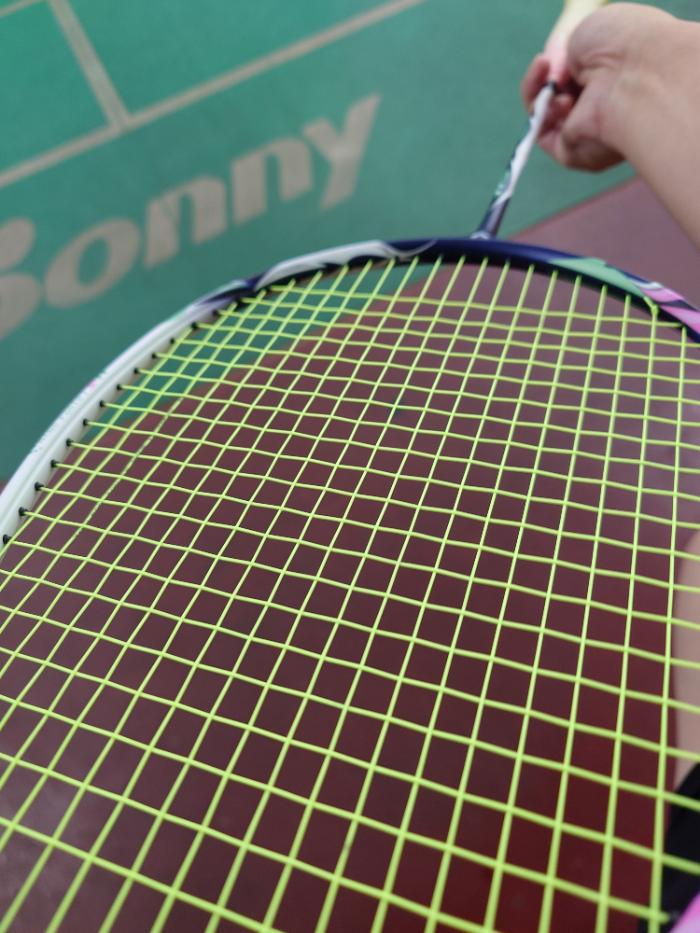

　　星期四晚上又在打羽球。

　　突然覺得可以發展一個文字 podcast 系列，就是星期四打羽球的場邊無謂想像之類的。雖然不習慣用手機寫文，或許試試看習慣一下也不錯。

　　然後開幕就連上了四場。

　　怎麼這麼累！一個小時居然沒休息過 🥵

　　總之，今天就來聊聊準備寫念高中高職的話題。一直遲遲沒有下筆的原因，是因為如果參戰了可能就要講起高中生活之類的事，但是我實在不太想直接暴露這種隱私，比如說高中念哪裡之類的。

　　咦？

> 綜觀以上，我應該算沒那麼在意隱私的人。（節錄自[隱私與紀念品](/mood/privacy-and-mementos/)—— LQ7 撰）
> 

　　哎呀，不是這樣子的。這就跟每次我和朋友說「我沒那麼在意金錢」的時候，朋友總是回「那趕快把錢匯給我」差不多意思。請讓我娓娓道來，這邏輯上當然有瑕疵，因為就算我不在意隱私，也不代表就得光著身體在街上裸奔一樣，這有主動和被動之分，對吧？

　　離題了。但其實講到「關於我」的頁面，我的確沒有打太多生平或類似履歷的東西。我的想法是，我不太希望一個不小心點到網站的人，這麼快就靠「我的生平」之類的認識我。所以在把「職業」打上去的時候，我也不是那麼情願，但因為資訊本科大概是我最不重視的事情，最後想想好像還是打了。

　　我心中的理想，是像我的偶像（？）[yangbear](https://yangbear.bearblog.dev/) 那樣，明明什麼都不講，但在文章中可以讓讀者自行猜想職業、興趣與生活，這樣也很像解謎遊戲，蒐集線索後解開謎題逃脫密室，呃不是，漸漸了解這個人。

　　這樣不是很棒嗎？付出多少，收穫就多少。和魔術有句名言差不多：

> 魔術的大門是關著，但沒有鎖上。
> 

　　之前我試過一個無聊的事，就是開啟無痕視窗後，僅用 [lq7.tw](http://lq7.tw) 的已經線索，到底能搜出多少關於 LQ7 的事。

　　結果天啊，大概只差身分證字號和住址，其他根本無所遁形！！！

> LQ7 個資的大門是關著，但沒有鎖上。
> 

　　但相比之前[十塊錢就能開的大門]((/mood/privacy-and-mementos/))，這還是多少得費點心力，或許和 Neutral 的密室逃脫難度差不多也說不定。

　　又離題了。總之，網路的力量真不可小覷，就如同我以為 [Neutral 的 Elements](/mood/neutral-room-escape-games/) 再也玩不到的時候，Wiwi 卻能找到[其他網站的留檔](https://archive.org/details/ele-2_202503)一樣。

　　這樣說來，搞不好 Wiwi 隨便查一下就能知道我的身分證字號也說不定？🤔

　　話說回來參與高中話題還有另外一個更嚴重的事，就是這樣大概會暴露年齡。

　　雖然其他文章或多或少都會顯示出自己差不多是「那個年代附近」的人，但就跟密室逃脫一樣，有個不自己戳破的謎題，還是有一定的美感，年齡也可以是男生的秘密，不是嗎 😡

　　然後，之前[要不要回到過去](https://eoiiio.bearblog.dev/7145/)的話題其實也有點想加入。因為如果是我，一定是二話不說選擇回到過去的人。倒不是現在過得有多不好，而是……時光倒流這件事情本身不是超級有趣嗎！！！

　　這可是世界上最有錢有權的人都無法體驗的事欸！我這人最沒辦法拒絕有趣的事了。

　　只是冷靜想想要跟現在的太太道別，突然有點感傷。但太太知道我要去時光旅行，應該也會答應的吧？！（太太其實偶爾會看我 Blog，看到不知道作何感想）

　　等等，這樣可能還是要先確定一下，是跳到一個沒有我的平行時空，還是整個世界時光倒流？這或許也是有一點差異。當然記憶應該是帶著？不然哪叫時光倒流，如果是這樣，搞不好現在的這次就是時光倒流了，只是自己不知道🤔

　　如果記憶能帶著回到學生時期，有趣程度或許就和《我推的孩子》劇情一樣有趣吧？

　　只是主角最後好像……嗯，反正這根本不是我.jpg（並沒有這張圖）。

　　記得日本以前有個節目，在路上找陌生人幫他從原本的租屋處搬到新的地方，並支付費用。

　　想當然爾，許多日本人被問到的時候多半會拒絕，雖然多數人沒說原因，但也不難猜到，就是「住得好好的幹嘛搬？」

　　但當時和我一起看這節目的學長就說「如果是我一定答應」。當時整天和學長混在一起的我也認為會答應。

　　因為很有趣啊。誰能拒絕有趣的事？（again）

　　或許我們感興趣的，正是那種獨一無二的體驗吧。

　　有句話是這樣說的：

> You can't leave a footprint that lasts if you're always walking on tiptoe.
> 

　　「你無法留下足跡，如果你總是墊著腳尖走路。」

　　我其實沒想留下什麼足跡，但這世界上的萬物總是和鋼之煉金術士說的一樣，都是等價交換。做任何一件事，都是犧牲了上萬件事情才有辦法去做。

　　比如說，我現在正回家潤這篇文章的稿的同時，我就犧牲了修圖的時間、看小說的時間、看電影的時間、打一場 LOL 的時間、冥想發呆的時間……數也數不清。

　　任何體驗，都是犧牲其他的體驗換來的。

　　看來，只能去跟薩諾斯借個手套了？

　　時光飛逝歲月如梭，三小時的羽球時光總是過得特別快，感謝各位收看本次星期四羽球場邊胡思亂想，就讓我們在想著等等要吃麥當勞還是麻辣臭豆腐的晚餐中結束這回合吧。

　　我們下次見！（還有下次？）

### 後記

　　最後吃了加了三份豬肉片還有高麗菜的麻辣臭豆腐，好飽。