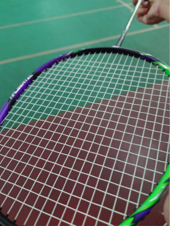

　　哇，今天雨好大！

　　歡迎收看本星期的星期四晚上打羽球場邊腦內碎碎念。

　　首先，為什麼上個星期沒有「星期四晚上打羽球」呢？絕對不是偷懶，而是上個星期休團了，沒有打羽球。沒有打羽球，自然就沒有星期四晚上打羽球，也就沒有文章，非常合理。

　　羽球果然是個很棒的運動Ｒ。就算下著大雨，只要能安全到達羽球場，就可以吹著冷氣在室內享受貴族運動了。別的先不提，羽球發明時還真是貴族運動，想想一顆球隨隨便便就會打壞，實在是很奢侈的運動。大家如果有關注羽球比賽，可以稍微觀察選手換球的次數，他們用的球一顆要價 150 元，所以一場比賽打下來，光球的成本就非常高昂。

　　前陣子羽球價格漲得非常兇，許多球友都在抱怨。但其實如果撇開球類，還是有遠比羽球更貴族的運動。

　　比如說水肺潛水。畢竟攸關人身安全，這不是買個潛水衣跳下水就完事的運動，至少得買個好點的潛水錶和花錢上課考證照，才能享受潛水的樂趣。比如說單車，雖然我也只騎了幾年，但花費早就遠超過羽球，當你以為是買台幾千塊的車就可以開心騎，就完全落入了這個「假裝不是貴族運動」的陷阱。想要「認真」騎，光腳踏車的「踏板」就和我現在拿的羽球拍差不多貴（想知道多貴的可以[看這裡](https://www.syoungbike.com/products/%E3%80%90shimano%E3%80%91ultegra-pd-r8000-%E5%85%AC%E8%B7%AF%E8%BB%8A-%E7%A2%B3%E7%BA%96%E7%B6%AD%E5%8D%A1%E8%B8%8F)）。比如說賽車，以前有在看 F1 的我前陣子也看了些賽車的紀錄片以及參與後勤的 YouTube 影片，如果你想當個賽車手，最好就是要有個有錢的老爸，從小就可以燒錢讓你在F4開賽車，開一開看能不能晉級成F3、F2、F1。就算只是業餘玩玩卡丁車，最便宜的200cc 8分鐘也差不多要價 370台票，這價格一人參加羽球球隊連球加場地打三小時還有找。

　　或許這就是社會現實吧。羽球看似貴族運動，實則比上永遠不足。就算是攝影，如果你想要拍一些極端的生態攝影或者星空大片，自己想用一台 Sony A1m2 可是要價 18 萬，一隻 600 GM 定焦可要 40 萬。上低音號的高坂麗奈小時候彈鋼琴程度遠超其他小朋友，其他小朋友哭著說因為她們家裡不像高坂家裡有鋼琴可以用，無法練習當然程度跟不上。

　　忘了在哪個格友的 Blog 看到某張年齡 vs 金錢的折線圖，年輕時沒錢但有時間，反應力也比較快，精神也容易集中得久，中年的時候累積了些資產，雖然時間沒有這麼多但可以用錢換時間，更有效率。但上天終究沒有想像中的那麼公平，有些人年輕的時候就很有錢，像我主管省吃儉用，午休用的露營椅只捨得買一張 200 元的二手品，卻說要給小孩留下幾千萬的資產是他唯一能做的事。

　　唉，我其實非常敬佩他。如果是我，大概會申請退休，然後買台 A1m2 和 600 GM 跑去非洲拍動物大遷徙了。

　　現在玩攝影能玩得比想像中舒服，也歸功收入比國民平均年收好上一點的關係。還真無法想像學生時期一個月的飯錢加上零用錢總共 8000 元，那時沒有打工居然還打得起羽球，覺得自己非常厲害。我無法想像學生時期的我如果突然說想要玩攝影，到底該怎麼「玩」。人其實就是這麼矛盾的生物，一邊說著錢不重要，一邊享受著高收入帶來的紅利，一邊說著學歷不重要，一邊享受著高學歷帶來的好處，一邊說著每個價值觀與藝術都有其價值，心底的惡魔一邊想著「會喜歡那種層次東西的人還真沒救，夏蟲不可語冰」。

　　話題怎麼突然就變得這麼嚴肅，但我想這就是場邊胡思亂想的好處，胡思亂想畢竟就是胡思亂想，隨時可以換個話題。真的想從事這些活動，一定能找到不那麼花錢的辦法，但，花錢總是最有效率的辦法之一。

　　這大概就是最近的心得了，但，還是想想輕鬆一點的話題吧。最近有什麼比較輕鬆的話題呢？我想就是蕎麥麵和烏龍麵的話題。原本兩個禮拜前看到某篇文章就想說趁打羽球的時候來寫一下，但是我連那篇文章在哪看都忘記了，有夠可憐。總之，不管是烏龍麵還是蕎麥麵我都超愛吃，但最好吃的通通都在日本，台灣九成的蕎麥麵和烏龍麵都差強人意。上次在台灣吃到最好吃的烏龍麵大概就是土三寒六，但也是好幾年前的事，畢竟有點太遠，也沒好吃到我特地要跑過去吃的地步，是說這間店我一直以為倒了，但剛剛查了一下居然還開著，只是換了位置。台灣有群人特別愛吃拉麵，導致幾年前日式拉麵店如雨後春筍般冒出，現在要吃到好吃的拉麵不用特別跑日本。但說到烏龍麵，除了讚岐，就是丸龜，然後還是讚岐，又是丸龜。唉，希望台灣人能再加油一點，別再吃拉麵了，希望更多厲害的烏龍麵和蕎麥麵店來台灣開店，這兩者尤其是蕎麥麵，不只更健康，還更吃不膩喔。

　　再來還有什麼其他想要聊的話題呢？其實很多，包括什麼[部落格社群](https://shuojen.com/blog/2026/06/11/blogthought)啊，「為什麼回去用社群軟體」啊，最近拍照的心得啊，[狼人殺](https://yangbear.bearblog.dev/6307/)啊，[熱帶雨林](https://shuyulin1127.com/music-and-memories/)啊，小說的進度啊……。

　　那壺不開提那壺。小說的進度目前還是０，真抱歉。原因也很明顯，我幫我的[音樂遊戲回憶辦了場葬禮](/music/iidx-dp-10-dan/)，這篇文章花了我一個禮拜的時間，葬禮還真隆重。

　　所以[放棄日更（again）](/mood/giving-up-daily-posting-2/)根本沒用！！！沒有限制一篇文章最多寫多久，還是整個禮拜在寫 BlogＲＲＲＲＲ！

　　看來似乎要更硬性規定，星期二和星期五的 Blog 文章只能當天完成，不能跨天之類的。不然我看到七月小說還是０個字，屆時我攤位根本就連報都不用報了。

　　好啦，今天由於人數較少，所以在場邊的胡思亂想時間也比較短。上次原本已經打定主意今天要吃上上禮拜沒吃到的麥當勞，但由於冰箱裡還有一個全新完整的池上便當，於是今天就回家吃池上便當了，麥當勞我想就要留到下禮拜再來吃。

　　星期四打羽球，我們下次見。（揮手）