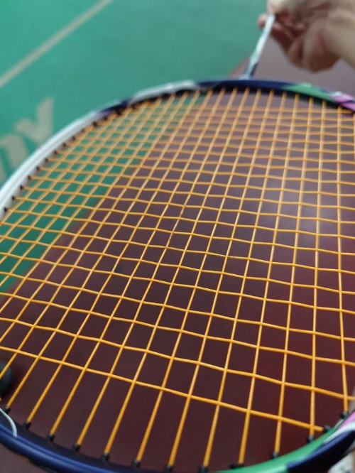
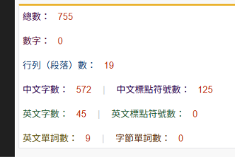

　　歡迎收看大家（誰）最愛的星期四晚上打羽球。不知怎地這真變成了一個系列，但也是不錯，畢竟現在一個星期只有星期二和星期五的 quota 能發文，其中一天拿來發閒聊回，いいじゃない？

　　但我想有眼尖的讀者立刻發現，到目前為止本星期已有兩篇文章。

　　沒錯！因為臨時起意想寫關於跳舞機的事，本來想說鑽個漏洞，之前在[放棄日更（again）](/mood/giving-up-daily-posting-2/)裡面說只能在星期二和星期五發文但沒說一天能發幾篇文章，於是就在星期二連續發了兩篇，真是太聰明了。

　　結果發完之後跑回去確認才發現：

> 所以我決定從六月開始，一星期就最多兩篇文章！我看就先定在星期二和星期五。其他時間就算有話也不能說，必須把廢話能量強制用在小說進度上！ From 放棄日更（again）
> 

　　唉，以前的我早就算計到未來的我會使用這種小人招數，早就寫死了「兩篇」這規則。以前的我比現在的我更聰明。

　　只好現在更改規則，一個禮拜最多三篇 🫠（咦）

　　總之，最近較為冗長的廢文莫過於六月同樂會投稿的兩篇關於音樂遊戲的文章了。原本想說是妥妥的自嗨文，但沒想到來信回饋的讀者意外不少，看來只要是個遊戲玩家，都能理解對一件超級沒用的事情超級認真時有多「開心」，是嗎？

　　然而，就在想說今天場邊的胡思亂想要來聊聊七月應該是最難寫的同樂會主題「冷門知識」，沒想到同樂會主題就在[今天發出了](https://shuaixin.cc/Fun-Fact/)，看來這就是[宇宙大電波](/mood/read-but-no-reply/)的厲害。

　　為什麼說這次是最難寫的主題呢？那是因為如果放寬標準，當一個知識「沒人在乎」，那其實就只是「沒人在乎」的知識，而不是「冷門知識」。

　　舉些例子。比如說「魔法氣泡競技規則版面內能做出來的最大連鎖是 19 連鎖」[^1]，或者「人造羽毛的羽球比大部分的天然羽毛球貴」。這些知識如果沒在玩魔法氣泡或者沒在打羽球的人我想是不可能知道的，但如果圈內人士應該是常識，這充其量只能說「冷門興趣中的知識」，而不是「冷門知識」（當然，羽球也不太能算冷門活動就是了）。例如同樂會主持人劉昕的例子「羊其實是牛科」，對完全沒有研究動物的朋友可能不會知道，但如果很喜歡羊的朋友或者專業人士，應該也不難知道這件事。雖然我沒那麼特別喜歡羊，也因為非常喜歡動物的關係，這件事情姑且也是知道的。如果更加延伸，比如說「犀牛」其實不是牛，而是「犀」[^2]，比如說生活在喜瑪拉雅的「羚牛」其實也被分在「羊亞科」（也就是說，雖然牠叫「牛」，但其實比較像是羊），如果要深入來講，大概就要講到奇蹄目和偶蹄目，讓大家知道生物學到底怎麼分類這些生物。最近因為在拍鳥，所以對鳥類也比較熟，比如像是「擬啄木」類的五色鳥其實不會「啄木」而只會「挖木」[^3]，也是最近才知道的冷知識。

　　關於「冷門興趣中的知識」，就連寫作也是。比如說之前就算寫了「[無時無刻不](/writing/double-negative-in-chinese/)」和其[續集](/writing/double-negative-in-chinese-2/)，終究還是看到一堆朋友沒有加不。當然，我認為這也不是什麼大事，人就是比較關注自己「在意」的事情，沒那麼在意文學或寫作的人，這件事情聽過就忘了，就跟如果知道魔法氣泡最多是 19 連鎖，或許下個禮拜就同樣會忘記一樣，因為不關心「魔法氣泡」這遊戲的人連玩法都搞不清楚，更別說什麼 19 不 19 連鎖了。

　　所以，我想寫出來的冷門知識，比較像是劉昕大大的另外一個例子，也是他的投稿：[麻辣「麻」的由來](https://shuaixin.cc/50-Hz/)。辣是痛覺這個很多人都知道，但麻辣的麻到底是「什麼覺」，就算我做菜做了這麼多年，似乎也沒有特地想過，而有在做菜的廚師的確不見得知道。假設有英雄聯盟阿卡利專精玩家，突然被告知完全不知道的阿卡利機制，那麼我想就是真正的「冷門知識」了。

　　連圈內人士都沒聽說的冷門知識，超帥的不是嗎。

　　而且那篇講述「麻」的原因，聽起來就超給掰的，就算看完也是一個記不住專有名詞的程度，以後將這個冷知識講給別人聽時，真的顯得自己是個煩宅，呃不是，知識淵博。

　　唉，但是我最近真是沒什麼好點子，畢竟那些看似一卡車的興趣真要說有多專業能講出連圈內人士都不知道的冷門知識，還是有點難度。只好再讓我仔細想想了。

　　不知道為什麼最近胡思亂想的議題都這麼認真，害我一回到場邊就開始腦力激盪，感覺休息都不休息了。要不是今天球隊收滿了人，不然根本沒這麼多時間胡思亂想（到底是來胡思亂想還是來打球）。

　　再度回歸輕鬆（？）點的話題好了。最近買了動畫瘋的一個月會員。雖然我之前都是超絕免費仔，但因為想想「[時薪理論](https://chihyang.cc/posts/my-hour-rate/)」後還是毅然決然買下去省那個 30 秒廣告。然後也是因為這樣，就想說趕快把想看的動畫都看一看。

　　於是，我看了許多動畫的「第一集」。為什麼是第一集呢，因為想說看了如果有興趣，我就會繼續點開第二集。結果我看了「上衣那牡丹」、「黃昏旅店」、「靠死亡遊戲混飯吃」、「momo女孩」的第一集，最後只有黃昏旅店前進到了第三集，但也就是第三集了，應該不會點開第四集。

　　不知道捏。現在動畫都做得很精美，但上次看到讓人一直想點下去的，除了虛構推理之外，大概就是奇巧計程車了吧。不知道是我從動畫畢業了還是怎樣。或許搞到最後，我還是比較喜歡有推理要素的動畫，像黃昏旅店大概也是因為這樣，所以才前進到第三集。

　　最後一次看到沒有推理要素卻覺得很好看的動畫，該不會就是男子高校生的日常了吧！真是太可怕了！

　　說實在，也不是不喜歡一群女生喝酒抽煙搞百合，但就，這種動畫感覺很需要某個狀態，才會想要看下去。嗯，不是不看，總是遲早要看，只是不是現在。[^4]

　　歡樂的羽球時光總是又過得特別快。原本今天說好要吃麥當勞的，但想想明天就是端午節了，加上昨天吃了一堆炸物，如果再吃麥當勞實在有點過於不健康，於是決定吃個粽子順便提前過過節。

　　但其實，粽子本身也超不健康，又油又一堆難消化的澱粉。算了，就跟小說一樣，今天終究還是計畫趕不上變化，麥當勞還是移到下禮拜再吃了。

　　等等，有人提到小說嗎？

　　這禮拜進度終於不是 0 個字了！我有寫了 755 字！

　　照這進度，一百天後就完稿了，剛好來不及呢。

　　星期四打羽球，我們下星期再見，祝大家端午節快樂😇

### 後記

　　我一直以為這篇昨天（今天？）睡前就發了，結果醒來的時候才發現只是躺在本地，所以現在才出現 🫠

[^1]: 在特定的競技規則下是這樣，但也不全然是，但我想也不用解釋太多，因為沒人在乎 (X)

[^2]: 正確來說犀牛是「犀科」，不在「牛科」，比羊還不算「牛」。

[^3]: 擬啄木系列的鳥如台灣常見的五色鳥，其實不是啄木鳥科而是「鬚鴷科」，牠們的大腦沒有防腦震盪機制，所以無法像啄木鳥那樣一直啄啄啄（會腦震盪ＸＤ），所以雖然習性差不多都是找樹洞鑽，但他們只能找些比較軟的木頭（腐樹）慢慢挖，或者找其他已經挖好的洞進去住。

[^4]: 結果一語成讖，就在打完羽球回來看了第二集之後就接著第三集……然後有點想看第四集了。估計周末會把上衣那牡丹全部看完，百合真強大 🫠