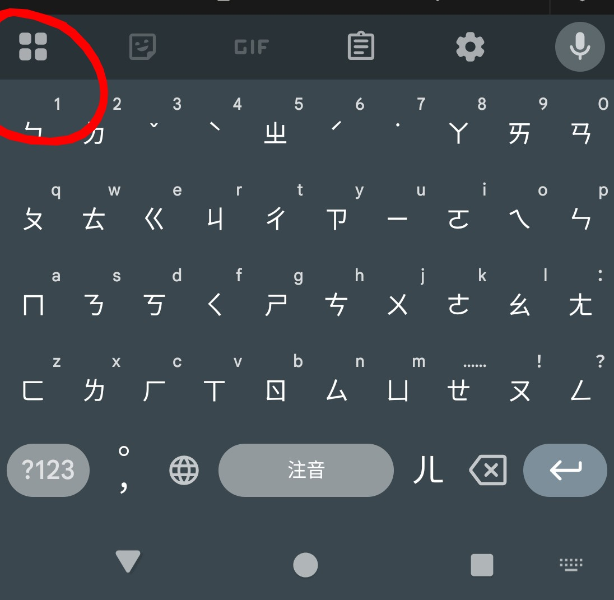

　　（回到家才發現今天忘了拍張場邊羽球拍的照片，只好羽球拍.jpg）

　　今天怎麼又暴雨 🫠

　　但星期四晚上的羽球只要沒停團，就是該去打。總不能因為這種小（？）事就懶得出門。自從開始拍照以後，因為週末較常出門，也漸漸比較在意天氣。最近的天氣真的很搞，平日上班時天氣很好，然後一到假日就開始下雨，完全針對常日班社畜，真是離譜。

　　而且今天也因下雨的關係，到現在已經開打 40 分鐘卻只有五個人。上禮拜是 16 人滿員的說，所以看來今天場邊胡思亂想時間也變得非常嚴苛，或許會變成「吃麥當勞時」胡思亂想也說不定。

　　在來羽球場前剛好看到 ikuka 大大的[日Ｋ文章](https://blog.ikukaroom.com/tetsudo-karaoke/)，就直接來聊聊日Ｋ好了。先前和在日本工作許久的朋友們唱歌，被說「只聽你唱歌的話會覺得你日文超厲害的，和當初我剛來日本工作的時候日本人也這樣說我一樣」。

　　沒錯，言下之意，雖然在 Blog 寫了一堆頭頭是道關於日文的文章，也唱了非常久的日文歌，其實，我的日文真沒那麼好。雖然一人去日本自助旅行能與日本人簡單溝通，但至少比台灣人平均水準（N1？！）差得多。一直想找個時間去考卻總是不了了之的日檢，現在想想保守估計裸考或許連 N3 都不見得能過。

　　這讓我想到很久以前聽到的一句不知道能不能算格言的話：「每個男生心裡都有個聲音一直在問自己是不是比別人厲害，而女生則是在問自己是不是很漂亮。」

　　撇開男女，我認為同時有這兩種內心話小惡魔也完全正常，因為就算是我，也很少在這裡寫出「其實沒那麼厲害的事情」，然後沒事也不想輕易露臉（覺得自己不漂亮？！），這就是所謂內心話小惡魔們的厲害之處。

　　但，我總是欽佩能坦然將自己「弱點」攤在陽光下的人，所以今天乾脆來聊聊那些「沒那麼厲害」的事情吧。

　　比如說，喜愛任何運動的我，從來沒有打過保齡球。

　　其實，網球我也沒打過，但畢竟網球天生就不是那麼容易接觸到的運動（就算是棒球，拿個手套傳接球和用軟式棒球揮棒還是有的），但唸大學時，我可是選修過半年高爾夫和壁球的人。高爾夫和壁球我都玩過了，而且我念的大學本身就有保齡球館，但，陰錯陽差之下體育課從來沒選到保齡球，而這輩子真的也完全沒打過。

　　就算現在只要騎車不用十幾分鐘就能到保齡球場，但我依舊連遊樂場那種「保齡球遊戲」都沒玩過，自己想想也是非常不可思議。現在甚至覺得「一輩子沒打過保齡球」這個梗反而有點好笑。

　　再來是關於打字當中「沒那麼厲害」的事，就是我其實不知道怎麼用電腦打出「小黃臉」。

　　說到小黃臉，容我先岔個題，因為還真不知道有多少人看到「小黃臉」這三個字時，第一個想到的是什麼。

　　第一次看到這詞，是看許多年輕人現在的自我介紹，會將自己的「雷點」和「可能雷你」的部分打出來。我覺得是個不錯的風氣，比如說有人怕蛇，那麼我在分享我認為可愛的蛇的照片時，可能就會顧慮到朋友而不傳在有這朋友的群組，就算是兩個陌生人也可以互相體諒，避開對方的雷點。

　　所以，我就看到不只一個人的自介，在「可能雷你」的地方打上「小黃臉」。

　　當時我就在想，到底是什麼意思？是指自己臉很黃？現在有些人不喜歡跟臉比較黃的人交朋友？還是因為不化妝的關係會雷到人？亞洲人啊不都是小黃臉？🤔

　　結果某天突然驚覺，小黃臉就是指「🤔」！！！

　　天啊，以前都用顏文字的我，和年輕人（？）聊天的時候都刻意將以前常用的「XD」、「==」、「@@」轉換成🫠🤣😇🥹🤔😱🥲🥰，結果這居然有可能雷到人，真是始料未及。

　　但其實目前看到自介小黃臉幾乎都是打在「可能雷你」的區域，還沒看過打在「雷點」區域的朋友就是了。

　　總之這就是小黃臉的故事，離題了。之所以提到小黃臉，就是我一直不知道電腦版要怎麼快速打出小黃臉表情符號。

　　像現在坐在場邊用手機打字，安卓google注音只要點開旁邊的這個就可以快速選到表情符號，也難怪在這手機世代，小黃臉會如此迅速流行起來。

　　但身為一個更常在電腦打文章的人，我還真不知道在 Windows 注音底下要怎麼打出小黃臉。老實說我也懶得去研究，於是就會常駐一個「[小黃臉網頁](https://tw.piliapp.com/facebook-symbols/)」，只要點擊想要的符號就會複製，這樣就可以即使用電腦打字也可以裝得很年輕，真是太棒惹。[^1]

　　講到裝年輕，又不得不提先前和[李唯](https://travlog.wei-lee.me/)聊天時，他看到我打「超好笑」後說這是「年輕人用語」，我問為什麼，他說「超好笑」就是年輕人的用法，老人都用「笑死」。

　　哎呀，又跟年輕人（？）學到一個新知，雖然現在好像兩個都會用，但以後千萬注意不要輕易打出「笑死」才是上策[^2]。

　　天啊，文章還沒打完，但歡樂的羽球時光總是過得特別快，剩下的我看只能買完麥當勞再說了。這種暴雨天氣，最適合吃麥當勞了（？）。或許大家覺得暴雨時開車買麥當勞走得來速不用下車最開心，但其實我是個超不喜歡得來速的人。畢竟萬一後面有車，排在那邊就有一個點餐的壓力，所以我寧可停好車進到麥當勞內用點餐機慢慢考慮要吃什麼，而且，暴雨時在得來速用手機刷會員或者優惠券，實在超狼狽，不是嗎？

　　在麥當勞裡面等餐也在繼續打著文章的我，忽然覺得自己很認真。或許我就是個超級愛自言自語的人，或許這種打文章方式也是最適合我的方式，雖然有點囉嗦，但如果小說也能這樣打，真的是一星期就寫好也說不定。

　　怎麼每次都要提到小說！吼，這禮拜又幾乎沒進度了啦，除了最近上班有點過於認真（？）之外，每天回家都在還之前照片還沒修完的債，一個禮拜又這樣過去了。

　　唉，好吧，那也沒辦法。或許該開個賭盤，那存在腦海中的七萬字小說，十月究竟生得生不出來。真搞不懂去年現在的我是怎麼以一個禮拜五千字的速度寫出《D.S. al Fine》的？真是太可怕了。雖然我還有類似「請事假寫小說」這種殺手鐧，但不到最後關頭應該不會輕易使用，成本實在有點高。

　　總之就是這樣啦，感謝大家收看，下周的晚餐，我猜沒下雨的話，又會回到麻辣臭豆腐了。說起來也是一個月沒吃了呢。

　　馬搭來咻！[^3]

　　

[^1]: 但因為這篇文章，就在潤稿時終於忍不住 google 了一下小黃臉要怎麼在電腦上打出來，答案是 win 鍵 + 句號。果然做事情都需要一個動力，這樣我終於可以把「小黃臉複製網頁」關掉了🤣（這個🤣就是用 win 鍵 + 句號打出來的 XD）

[^2]: 回家跟太太討論發現好像講話時比較常講超好笑，但打字就比較會打出笑死，看來就是在年輕人和老人間反覆橫跳的兩人。

[^3]: また来週的日文空耳。 = See you next week = 下周見。