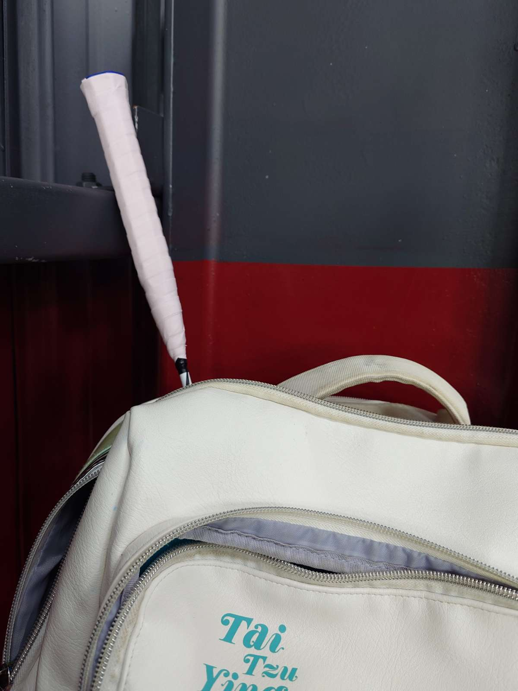

　　今天明明有夠熱，但羽球團卻滿員，看來反正室內有冷氣，熱根本無法影響任何人打球的意願，下大雨才會。的確，下雨時騎車出門非常麻煩，人穿雨衣就算了，羽球拍如果像我一樣是這樣插在包外面，握把布會變得超不防滑不說，木柄淋到雨可是會發霉壞掉，還要找塑膠套來套，煩上加煩。

　　其實最近有靈感時，都會特地筆記今天要在場邊打些什麼廢文。結果第一條筆記居然又和本月的冷知識有些關係：前陣子忽然好奇打這麼久羽球的我，會不會同樣有不知道的羽球冷知識？

　　結果一查還真的有！😱

　　一般球場上使用的羽毛球，九成九都還是以天然羽毛為主，而天然羽毛基本又分為鴨毛和鵝毛，平價的練習球多為鴨毛，而比較好的羽球則是用鵝毛，用的都是翅膀的毛。然而，不是所有翅膀上的鵝毛都能用，越高級的球，就只用比較好的那幾根。

　　以上都是我本來就知道的知識，而真正不知道的是……

　　最高等級的比賽用球，都只用「左邊翅膀」的鵝毛去做！

　　因為鵝的兩隻翅膀羽毛弧度不同，就算再便宜的球，都不能混用左翅和右翅的羽毛。但問題來了，因為如果全左翅和全右翅，球的旋轉方向會不一樣，為了不讓選手產生混淆，例如 [YY AS-50](https://www.yonex.com.tw/product/d/AEROSENSA%2050/2095) 鐵定只用左翅羽毛來生產。

　　又學到一個冷知識了，但這或許也只是我沒那麼厲害，從來沒觀察打出去的羽球到底是順時針還是逆時針旋轉，又或是沒那麼關心羽球的生產過程而已。如同前天坐在朋友車內提到高雄車站時，我喜孜孜分享了在同樂會學到的[高雄屏東車站和松山桃園機場冷知識](https://shuojen.com/blog/2026/06/20/fun_fact)，結果車內其他兩位朋友居然都知道。

　　到底怎麼回事？難道我就是冷知識四天王中最弱的那個？😡

　　算了，只好使出殺手鐧，講個絕對沒人知道的 LQ7 冷知識，那就是我和某Ａ姓網球選手同天生日。

　　唉，這樣講好像跟摩斯密碼一樣，只好補充，我也和松本潤同一天生日喔。

　　（所以呢？）

　　前陣子才驚訝發現，就算是有接觸日本文化的年輕人，還真有人不知道松本潤是誰。五月底看了「嵐」最後一場演唱會的轉播，明明也沒特別喜歡他們，二十幾年來這麼多首歌依舊只會唱其中的兩首[^1]，但告別演唱會的時候卻還是有謎之感動一樣。如果我是底下的粉絲應該真的會從頭哭到尾，完全可以同理那些粉絲的心情。

　　這讓我同時想到了另外一個已經解散的團體——「BiSH」。直到她們解散了，我才開始聽、開始喜歡她們的歌曲。總覺得這就和芙莉蓮故事中，在辛梅爾死後才漸漸發現他的意念一樣。呃，人家只是團體解散但還是活得好好的，而且 AiNA THE END 也還有在活動，超沒禮貌。

　　但如果真要說作者過世後才深受啟發的作品，則不得不提多年前在朋友家一口氣看完的整套《火之鳥》。說到原作手塚治虫老師，大家對他的印象應該都是《怪醫黑傑克》這部名作，以及他其實真的是醫生這件事（我猜這或許又是個冷知識），但如果只推薦一部作品，那還得必須是《火之鳥》。很難想像在那個年代居然有「漫畫家」用這樣的作品傳遞這樣的思想，看到維基百科寫著這作品是手塚老師的「生命之作」，我想一點也不為過，剛看完漫畫的那一陣子甚至睡不太好，滿腦子都在思考這部漫畫裡面的事情。

　　又離題了，原本列了一堆想「想」的主題，最後又脫稿進行，但我想這就是羽球場邊胡思亂想的醍醐味。是說，自從星期二發了那篇工作相關心得文後，隔天朋友就如同接收到宇宙大電波（怎麼又來）般，在群組說部門被裁撤要開始找工作的事。

　　所以我就立刻將[那篇文](/mood/works/)丟給他看，一起同病相憐（？）了，有點好笑。收到消息後Ｐ人如我打著如意算盤想說等公司正式告知也不遲（因為現在看起來還營運得好好的），連履歷都還懶得更新的時候，把我找進這間公司的主管跟我說他比較急性子，「像他這年紀真的不好找工作」，所以立刻投了二十幾份的履歷。

　　二十幾份！我這輩子投的履歷不知道有沒有五份。從以前開始我大概就是這樣的人，例如研究所多半如果考試時間沒有衝到，大家都會多報些不同的學校，但當時的我因為懶（？）所以只報了一間，想說沒上就算了先去當兵再說，結果就算當天吃壞肚子腸胃炎，考試卻非常順利，最後也莫名其妙（？）就考上了。找工作也是，當時教樂器也沒想太多，因為朋友在這間教我就一起加入，完全沒考慮什麼樂器行間的勢力版圖問題。而資訊業的工作到目前為止是第三間公司，第一間是玩音樂遊戲朋友介紹（對你沒聽錯），第二間是投了家裡附近的某間公司履歷結果就莫名進去，現在這間則是這位投了二十幾份履歷的主管找我進去。

　　所以下一份工作如果最後搞成什麼格友介紹，大概也不會覺得多意外（啥）。

　　追根究柢，我發現我就是不想把腦力花在這種「怎樣都好」的事上，或許我的心態就是「有時間思考這個不如回去重看《火之鳥》或許更充實」也說不定。

　　回到我主管，就是之前說的那位想要留幾千萬資產給兒女的厲害人物。是說，有幾千萬資產還那麼急著找下一份工作，又讓我更「欽佩」了。

　　但其實，我也不是討厭「只想急著賺錢工作」這樣的價值觀。如果是馬斯克，我就很能理解他為什麼想要賺更多的錢，因為他計畫想要讓人類移民火星。這理由非常合理又合乎邏輯，如果想要完成這類遠大的夢想，以他現在的資產的確遠遠不夠。因此精確一點說，價值觀不合的不是「賺錢」本身，而是背後的動機。比起「現在急著賺錢是為了留給子女」，我覺得「讓人類移民火星」更能感同身受一點。

　　這也讓我回想起同樂會三月主題「理想的日常」，當時甚至有點期待會看到那種「我要賺很多錢，開名車買好房」的心得。其實如果真能看到，反而比我這種「曬曬太陽喝喝酒和朋友玩音樂」的「考試標準答案」來得新奇有趣許多，也比我主管那個「賺錢留給兒女」的工作心態還更能說服我。

　　但這種人在外打拼都來不及，應該沒有那種美國時間投稿同樂會吧。🫠

　　最後的最後，趁這剩下 40 分鐘就要離開羽球場的時間，來聊聊最近看完的一部動畫——《上伊那牡丹，醉姿如百合》（底下有劇情微微微雷請注意）。

　　看完後我唯一的心得，就是認為十月的小說可能要計畫趕不上變化了。

　　比起《Ave Mujica》的曠世鉅作 IF 線，我想改寫《牡丹》裡面學姊的故事！🥵

　　這部動畫各方面都很微妙，例如 12 集每集畫風都不同（朋友還補充連漫畫都是這樣，每集髮色都在變，難道這就是忠於原作的一種）。但就跟 MyGO!!!!! 一樣，有非常多令人遐想的空間，更重要的是，這大概是我這幾年來最喜歡的動畫片頭音樂影片了[^2]。相較於絕對不能跳過的片尾，這部的片頭我也從來沒有跳過，超喜歡這 mv 第一視角的運鏡，也很喜歡那「消菸如百合」的學姊[^3]。

　　整部動畫我最喜歡的也是第六集，所以我想寫的故事，是學姊和舍監，想把她們沒說完的故事講完，這樣學姊才能跟景蘭安心在一起吧（啥）。

　　今天就這樣了。其實離開球場前，最後這整段都還沒打完，於是回家吃完肉粽碗粿控肉飯燙青菜金針排骨湯後，一邊校稿一邊把它補完了。

　　什麼？你問為什麼沒有吃上周說要吃的麻辣臭豆腐？

　　因為去的時候說已經賣完了，氣瘋！下周一定要吃到！ 😡

[^1]: 分別是《A.RA.SHI》和《感謝カンゲキ雨嵐》，而且兩首都是我完全不會日文時就能空耳唱的程度。

[^2]: 打這句話的時候猶豫了一下，因為我想到了[《芙利蓮》第2期 op 「lulu.」by Mrs. GREEN APPLE](https://www.youtube.com/watch?v=C0BG3B7aksU)。但本質上還是不太一樣，lulu. 比較像是結合畫面騙人眼淚（？）的感動，但《牡丹》卻是喜歡那畫面的分鏡與表達方式，兩者各有千秋。

[^3]: 朋友拍了學姊如何消菸的影片，原本想東施效顰但想想還是直接[貼他連結](https://www.threads.com/@yowayroger_collection/post/DZmADSNkzyb)就好（脆影片注意，需有帳號方可觀賞）。