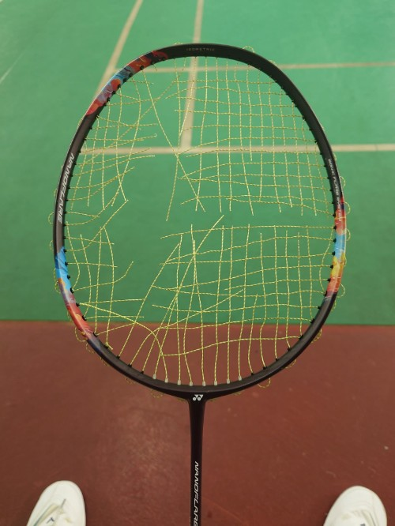

　　（本次又忘了拍羽球拍照，所以拿了張之前斷線的照片充數）

　　常看本系列的讀者大概也都能猜到，上星期沒有「星期四晚上打羽球」的原因，當然又是因為上星期四又沒打羽球了。但這次不是因為停團，而是我在上星期二下午喝了杯無糖手搖飲料後，身體就變得超不對勁，喉嚨上顎腫腫的，根據多年經驗完全就是個感冒前兆（飲料中毒？！）。

　　關於感冒，我也是多喝水讓感冒自己好的那派，但就在星期三睡醒當天感冒症狀沒有好轉時，突然有種想要請假~~在家修圖~~的心情，於是就請了病假去看醫生。經過一天的修養，星期四似乎變好了點，於是就去上班，還在猶豫晚上要不要抱病打球時，報名人數居然就滿了！

　　通常原本羽球團人數上限是 16 人，但直到中午報名人數只有八人左右，團長以為沒人要報就取消了一塊場地，導致直接滿員。不過現在想想其實沒去打球也不是壞事，因為一到晚上，不知道為何病情突然又惡化了，咳到肺都快咳出來，只好星期五又請了一次假，請醫生調整一下藥的配方。

　　結果看完醫生一回到家，就看到某格友寫了篇「[夏天感冒到底是不是笨蛋](https://yangbear.bearblog.dev/natsukaze/)」的文章。

　　🤔……。



　　沒事，當時腦內只響起了齊魯諾的算術教室.mp4（上面這首歌），沒有任何其他想法。（更精確來說是 0:22 開始的旋律，盼君領會）

　　離題了。總之，羽球場邊碎碎念已真的變成某種文字 podcast，但其實自己沒有聽任何 podcast 的習慣，理由是比起 podcast，我更喜歡將這種「耳朵空閒」的時間拿來聽音樂。事實上如果以 wiwi 的 [cpdown 理論](https://wiwi.blog/blog/cpdown)來說，podcast 或許才是真正需要 Cpdown 這類軟體的節目形式。假設一小時的 podcast 文本是 7000 至 9000 字，對我而言大概十分鐘內就能讀完，省下的時間並非一般呢。

　　當然，我也能猜到有人會說「podcast 可以擺在一旁順便聽」，其實這個「有人」就是我太太，她平常會邊作設計邊聽 podcast。但我從以前就無法一心二用，以前假裝躲在房間聽音樂讀書，其實根本就只有聽音樂，完全沒在讀書，真要讀書時是聽不了半點音樂，同樣道理在工作上也是一樣，印象很深的是之前上主播台播報遊戲時，導播在耳機裡面講話提醒等等要進廣告直接讓我當下的口條整個打結。雖然這種事情訓練後的確會改善，但我知道有人天生就能一心多用，想想這很大一部分的確也滿講天分的。

　　又扯遠了，因為今天胡思亂想也快黔驢技窮，所以趕快回頭看看今天的小抄。除了先前提到的「感冒事件」外，只剩下「魔鬼的計謀２」和「冷知識續」，原本想來談談「魔鬼的計謀２」，但不知為何現在坐在場邊很難打出個什麼像樣的節目心得，因此果斷放棄談論「魔鬼的計謀２」這件事，只剩下「冷知識續」這條路了。

　　翻開六月初就做好的草稿，早在七月開始之前，我就把我認為值得寫的「冷知識們」列了出來。第一條記得剛好是在同樂會公布沒多久時看到的冷知識，也就是物理學界的「真隨機」終於被做出來了。這什麼意思呢？就是這世界上的隨機其實都「有辦法預測」。原本想詳細解釋，但我認為不如直接回家放當初的影片，讓有興趣的人看就好。



　　（泛科學是個優質的科普頻道，推薦各位有空可以看看）

　　再來我看看我還寫了什麼，只有一個手機螢幕還真麻煩，只能切出去再切回來，無法對照著寫。喔，我看到裡面有兩條截至目前同樂會已經出現在他人投稿中的內容，分別是「Qwerty鍵盤」，以及「壓軸」。壓軸沒啥好特別補充的部分，請看同樂會內的投稿就好，而 qwerty 鍵盤則是可以在此適度補充：因為當初這鍵盤配列被發明出來就是為了「讓人們不要打字打得這麼快」（雖然他終究小看了人類的適應力），如果想在物理上縮短距離，之後有其他人發明理論上手指移動位置更短的配列（如 [Dvorak 配置](https://zh.wikipedia.org/zh-tw/%E5%BE%B7%E6%B2%83%E5%A4%8F%E5%85%8B%E9%8D%B5%E7%9B%A4)）。但就算資訊本科的我，這輩子依舊還沒認識使用 Dvorak 配置的人[^1]，畢竟如果需要用到公用電腦之類的，就和輸入法一樣容易出現麻煩，這大概也是我放棄嘸蝦米輸人法的原因之一。

　　說到嘸蝦米，有個冷知識就是嘸蝦米的「嘸」其實不是念「無」，是念「腐」喔[^2]！不過我想這應該是每個接觸嘸蝦米的朋友第一個學到的冷知識吧（？）

　　講到語言，我也在筆記裡面記錄了兩個成語的冷知識，包括「炙手可熱」和「空穴來風」。空穴來風顧名思義，因為有「空穴」所以才「來了風」，原意和「無風不起浪」其實差不多，但現在已經被引申成「子虛烏有」，完全和原意相反。另外「炙手可熱」原意也是「地位尊貴」或「權勢極大」，但後來也被引申成「熱門」的意思。

　　然而，這兩個成語在使用上我其實也是從善如流。畢竟「引申」就只是約定成俗，和「無時無刻不」的邏輯謬誤有根本上的差異，無時無刻不會因為使用了正確的用法（加了不）反而讓別人看不懂，但如果「這件事完全是空穴來風」如果想表達的意思是「這件事其來有自」，那就可能會引起天大誤會。

　　好了，大概就這樣了。距離離開羽球場還有半小時的時間，原本還在腦內沙盤推演總覺得有什麼東西漏想，結果打開 Feedly 就看到了 ikuka 大大發了[八月同樂會主題「一期一會」](https://blog.ikukaroom.com/ichigo-ichie/)，是個很可愛的主題呢。

　　……。

　　等等，我的[木柵動物園小故事](/mood/super-mission/)是不是早發了兩天！！！😱

　　雖然 BlogBlog 同樂會一向歡迎舊文投稿，但我這人~~比較怪~~比較喜歡寫新文。畢竟「為了投稿而寫出來的文」有種儀式感，而我最喜歡的大概就是這種儀式感了。

　　人生嘛，一期一會的事情那麼多，怎麼可能只有木柵動物園呢（？）

　　好了，希望下周二就能將八月的投稿投出，然後今天麻辣臭豆腐終於在我趕到的時候還沒有開始收，真是太好了，終於能吃到久違的麻辣臭豆腐了。

### 後記

　　就在回家潤稿時又發現了驚愕的事實，那就是在看八月同樂會介紹文時：

> 大家早午晚安大家好，我是ikuka，唸作「一苦卡」，8月份的BlogBlog同樂會由我來主持，請多指教☆(・ω<)

　　什麼！！！原來是「一苦卡」！！！我都暗自在心裡念「宜哭卡」，真是失禮，或許是因為 ikea 害的，唉，之前澳洲打工遊學時瑞典人念 ikea，所以我也跟著唸 ikea，不知道大家怎麼念 ikea？（扯開話題）

　　好的，各位下週再見！

[^1]: 如果有使用 Dvorak 配置的讀者可以寄信告訴我，那麼就會成為我第一位認識使用 Dvorak 配置的人 🫠

[^2]: 回家查了下居然還能念「五」，真神奇，我記得以前只能唸「腐」，難道又是某種曼德拉效應？！