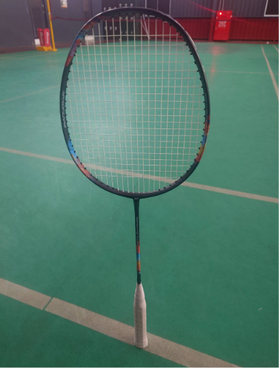

　　星期四晚上又在打羽球，明明六分鐘後就要開打，球場卻只有我一人🫠

　　看來的確該解決一下社會普遍高工時的問題了。球友多半是上班族，而七點這時間不是每個人都有辦法準時趕到，因此就算今天報名人數滿員，還是有不少球友會大概在七點半左右才到，也是正常的事。

　　如果有看到[上篇文章](/mood/blogger-journey/)的朋友，也能知道李唯大大來玩的事，此時此刻他正準備北上，但聽說台鐵出了些問題似乎無限期誤點，希望之後的行程不要 Delay 才好。綜合這幾天和李唯聊天，又在今天看到 Wiwi 討論[關於更年期](https://wiwi.blog/blog/manopause)的問題，讓我想起在這趟旅程中像李唯這樣的「年輕人」偶爾也會提到以前年輕時可以吃很多，現在這年紀似乎沒有辦法的「成人」話題，而我多半只能在旁哈哈哈哈。

　　雖然我的確容易被誤認成大學生[^1]，但在日常生活上還是完全感受到歲月催人老的生理事實，無法騙自己。例如越來越記不住「名字」，比如說要和李唯推薦好吃的店名，雖然就算連招牌顏色和餐廳樣子都歷歷在目，但店名有時必須用力想才想得起來。昨天想提起一位攝影師的名字，他的許多照片在腦海中閃過，卻無法對應出任何一位攝影師的名字，好不容易想出一個，google 後才發現完全記錯，把 Alex Webb 記成 Matt Stuart，真是夠了。

　　雖然這明顯就是年紀大的徵兆，但如果單純以「男性荷爾蒙低下自我評估量表」來說，我目前是 0 分[^2]，看來就算是這年紀，睪固酮應該還在 safe 的狀態，可喜可賀。

　　接下來，今天早上複習自己 Blog 文時發現近期文章有越來越搞耍的趨勢。上次能被放在「思考」分頁的文章，居然已經是一個月前，而像「魔術」或著「我的AI使用守則」這種更長的認真文，也不知道是什麼時候了。

　　雖然搞耍沒有不好，因為 Blog 這種「適合認真」的氣氛，很容易讓「格主」不知不覺「認真」起來，所以，有個搞耍性質的 Blog 我想也是可以增添個人 Blog 的多元性。但說到底，當初也是看到李唯的 Blog 才讓我想起這種文體的醍醐味，因此某種程度也是抄襲他的輕鬆感，希望不要被收版稅（不講是不是就不會被發現？）。

　　講到 Blog，又讓我想到一開始精心規劃的「分類」已經完全爛掉了。說實在我也是喜歡簡單風格的網頁，因此 Blog 一直以來都是使用 PaperMod 版型，但上面的分頁似乎已不符合目前的文章分類，而且實在太多了，或許可以直接簡單分成「認真文」和「搞耍文」就好。因此，我一直想把分頁精簡，卻因為資料夾的絕對路徑問題沒辦法動（因為文章會被他人引用，所以動了別人文章上的連結就失效，這點當初的確沒想到）。所以，先前我在「全部」的分頁做了個簡單查詢系統，也讓自己較好查找文章。

　　（插播：剛剛打完「搞耍」這段文而上場打了一場球後，那場球的球風突然也變得搞耍起來，難道這就是心理暗示的厲害之處？）

　　結果不做還好，當分類檢索系統一出現，才發現之前的 Tag 沒有認真分類的關係，現在看起來也是超級難用，比如說同樂會 Tag 居然無法找到所有同樂會投稿，又或是「心情」分類已經變成不知道該丟哪個資料夾，就會把文章丟到「心情」去。

　　因此，我一直在想，應該得趁文章還沒變得跟越來越久沒有整理的櫃子一樣亂之前，將 TAG 認真整頓一下。但就算把這篇文章發出去之後，我想大概也不知道何年馬月才會去改，人的惰性果然可怕。

　　更進一步思考，每個星期四都在發「星期四打羽球」，也是一種惰性也說不定？因為這樣就可以佔用每星期兩篇文章的 quota，就可以逃避認真長文的寫作……。

　　什麼，難道這篇就是最後的「星期四晚上打羽球」了！這就是日常番也會突然腰斬的感覺嗎？！

　　不過我想應該不會這樣，畢竟打羽球系列之所以 CP 值高，就是坐在場下等下一場的時候，可以把閒暇時間拿來寫些文章，這樣利用時間的方式非常有「生產力」。但，利用時間也有其他方式，比如說看第三場地激烈的頂端乙組對決，或許也能學點東西也說不定。

　　不，我想就算能，大概也不能（到底在講什麼）。

　　羽球或許就跟鋼琴一樣，小時候沒學，程度最多就只能那樣了。就像坊間的無數鋼琴課，標榜成人初學也可以學得很好，找到自己的樂趣，幫自己圓一個鋼琴夢。

　　講得非常好，我也完全同意，所謂的「找到樂趣」也沒說錯，有個大學朋友的確工作後按部就班學了好幾年，也有固定持續練習，現在也能彈些像樣的流行歌曲，我想他應該也有從鋼琴上找到屬於他的樂趣。但說到底，無論再怎麼練，終究無法和從幼稚園大班就開始彈琴，就算中斷了十幾年依舊能輕易彈出更複雜曲子的人比較。

　　羽球界在講某類人時，有一種戲稱叫「社會甲組」，也是類似道理。意即雖然沒靠比賽升上真正甲組名額，但由於小時候受過紮實的專業訓練，就算多年沒有認真打球，依舊能把一般校隊乙組玩弄於股掌之間。

　　任何肌肉記憶類的娛樂或休閒，我想就是這樣子。因此，大學才開始打羽球的我很早就對羽球實力死心，就算現在投入全部心力做專項羽球訓練，實力能升個一級[^3]也就了不起了，就和這輩子想要彈蕭邦 Etude Op. 25 No. 11，或許真要時光倒流才有那點機會。

　　話題怎麼突然變得這麼悲傷，但其實也還好，因為這世界上也不是全部的休閒都是靠反應和肌肉記憶，比如說高等數學之類的，不會因為 60 歲了就算不過 20 歲的年輕人，寫作也是，攝影也是，只要是靠腦袋大於肌肉的玩意，就不用怕「No Country for Old Men」[^4]，老人（我）終究有適合的歸宿存在。

　　歡樂的羽球時光總是過得特別快。晚餐原本打算吃中午為了湊免運而叫的第二份健康餐，但後來想想還是留到明天中午吃，今天回家就買個米糕和四神湯結束這回合吧。

### 後記

　　結果買到一碗整碗都是大腸，卻吃不到半點蓮子、茯苓、芡實、淮山的四神湯。雖然也是不難喝，但卻莫名令人生氣，希望有人能懂。

　　各位下周再見！

[^1]: 自說實在是有點不要臉，但因為扣掉早餐店阿姨都叫誰帥哥的無謂寒暄，還是有許多證據支持這樣的說法，只好繼續不要臉下去惹🙂

[^2]: 或許是 0.5 分，因為有時候晚餐吃太飽的確會想睡覺，但量表上面寫「打瞌睡」，是還不至於搞成這樣就是。話說回來，難道有人吃太飽不會想睡覺的？這麼神奇？我記得就算是高中時期吃完中餐也會飽睏🤔

[^3]: 可參閱[台灣羽球推廣協會羽球程度分級表](https://jaho.cc/wp-content/uploads/2024/10/%E7%A8%8B%E5%BA%A6%E5%88%86%E7%B4%9A%E8%AA%AA%E6%98%8E.png.webp)。

[^4]: [IMDB 10 分電影](/reading/imdb-10-points-movies/)（說好的下集咧）。