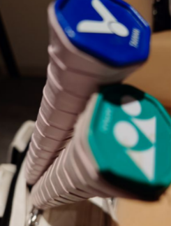

　　明明是系列文標題居然變了！

　　這當然是因為，本文從今天早上就開始打了。既然不是全部的文都在羽球場邊打，自然就不是「星期四晚上打羽球」，還是得區分一下標題。那麼，問題就變成了為什麼今天要提早打文呢？絕對不是 AI 已經幫我把上班該做的事情做完，導致現在閒得發慌……（公司同事應該再怎樣都看不到我的 Blog 吧？）

　　好吧，其實就是。

　　不如說這才是 AI 正確的使用方式，讓人類有時間做那些看似沒用卻更想做的事情，例如，寫 Blog。這樣一來，這篇的標題嚴格來說應該要變成「星期四早上上班」才對。唉，標題怎樣都好，真正會在早上開寫的原因是覺得今天要寫的事情有點多，單靠羽球場邊的碎碎念或許無法寫完，只好出此下策，不是因為聽到公司要島所以心態變成待退弟兄，絕對不是喔。

### 生日

　　講到生日，首先還是得祝格友兼日文老師兼八月同樂會主持人 [ikuka 大大](https://blog.ikukaroom.com/)生日快樂。雖然沒有如期（？）在七月前投稿同樂會文章，但希望這篇文章能在今天如期發出，如期祝賀，也才有我最喜歡的儀式感。

　　然而，之所以提到這個，是因為昨天 Shuyu 在留言板留了以下留言：

> 我認為處女座還是喜歡保持某種程度的神秘感的，基於這個理由，我選澳洲打工旅遊 XD
> 

　　當時內心是這樣想：「嗯嗯，很有道理，跟我想的差不多。等等，處女座？誰？我？」

　　自認在 Blog 中沒提過任何星座的我完全慌了手腳，難道真身（？）在哪被 Shuyu 發現了，這可不是開玩笑！因此，今天早上想都沒想，就寄了封信和 Shuyu 直球對決，表示如果發現我住哪裡就快出現，不要躲在柱子後面，呃不是，請問大大是如何得知我是處女座的。

　　結果 Shuyu 大大很快就回信惹，而事情終究比想像中的還要簡單：

> 算了，只好使出殺手鐧，講個絕對沒人知道的 LQ7 冷知識，那就是我和某Ａ姓網球選手同天生日。
> 
> 唉，這樣講好像跟摩斯密碼一樣，只好補充，我也和松本潤同一天生日喔。
> 
> 　　　　　　　　　　　　　　　　　　　　　　　　　——〈星期四晚上打羽球（六）〉　LQ7 撰
> 

　　原來是在這種地方自爆都不自知，妄想全世界都不知道松本潤是誰，還是太一廂情願了點[^1]。

　　雖然我的確不算是「相信星座」的那類人，但我還滿開心能被分類到「處女座」，即使親朋好友都說我全身上下沒一個地方像處女座也一樣[^2]。如果星座可以自由選擇，或許我還是會選處女座，我喜歡的就是處女座給人的煩宅印象，或許，這也省了許多麻煩事也說不定（？）

### 認不出來

　　（前情提要：[ikuka 蛋包飯](https://travlog.wei-lee.me/posts/travel/2026/07/pomunoki-tainan/)）

　　ikuka 大大的名字一直出現在這篇文章中實在非我所願，因為李唯的標題就打這樣，要怪就只能怪李唯惹。而這段的確也和 ikuka 大大沒有關係，只是想引用李唯文章開頭：

> 
> 
> 
> 倒是真正的 LQ7 出現時，我反而愣了一下，跟上次見面的形象完全不同，我一度擔心自己是不是上錯車了
> 

　　由於和李唯初次見面是在同人會場中，當時的我的確有稍微「打扮」，然而這次去車站接人，就只是穿得像平常上班的樣子（鄰居在電梯會嚇到說「什麼你穿這樣去上班」的樣子），害李唯在車站猶豫老半天要不要上車，真是抱歉。

　　這讓我想到同樣的事最近至少還發生過兩次，一次就在上周末和朋友約在高雄，雖然和這種認識近 20 年的朋友聚餐我多半也是「上班裝」，但由於聚餐完會去其他地方拍照，因此出門還是呈現了和李唯初次見面的戰鬥姿態。一進門看到已入座的朋友看了我一眼，就把眼睛撇到其他地方。

　　我只好裝沒事直接坐到他旁邊，他楞了三秒後：

　　「靠北啊，我剛還想說是誰，認不出來啦」

　　真是抱歉。上次另外一位約在台南吃飯同樣認識二十年的朋友，在機車停車場剛好遇到，我就機車跟在旁邊和他搭話，結果他一副也是沒要理我，最後發生同樣的事情：

　　「誰啦，你怎麼長這樣？」

　　真是抱歉（again）。真要說來，以前除了出席正式場合，多半沒再注重穿著和儀容，但自從寫了同人小說必須在會場見粉絲，覺得總不能讓粉絲發現寫出這種女同全糖文的作者居然長得如此潦草（？），有了偶包[^3]後也開始比較注重出門的儀態，最後就養成了參加活動時和一般居家裝扮不同的習慣。

　　這也讓我想到先前看到「同事的盛世美顏只在面試當天看過」的笑話，底下還有人回：「女生化妝是為了出去見人，然而同事不是人。」

　　所以這樣說來，李唯也不是人，Q.E.D.[^4] 🫴

　　說到底，這終究還是有個好處，因為我的確不太希望在某些場合被「不是那個場合該遇到的人」認出來，因此反過來說，那些在會場中認識我的朋友看到我的日常模樣大概也認不出來，真是太好了。

　　等等，難道這也前後呼應了「處女座還是喜歡保持某種程度的神秘感」……

　　原來 Q.E.D. 的竟是我自己？🤔

### 母胎單身戀愛大作戰２

　　這是 Netflix 最新的戀愛實境秀，去年是１，今年是２。在昨天上架了最後兩集，如果有在家和太太一起吃晚餐的話每次都會配一集，配著配著剛好趕上最新上架進度，就在昨天剛好看完了。

　　我算是非常喜歡實境秀的人。不只是戀愛系列，因為喜歡益智遊戲，《魔鬼的計謀》１和２我也有看完，因為喜歡運動，《百人體能巔峰》也有看完，因為（以前）喜歡煮菜，《Master Chef》系列美國和澳洲的至少看了好幾季，因為喜歡大自然，荒野求生（阿拉斯加）挑戰系列也看了幾部。

　　實境秀的醍醐味對我而言和電競或運動比賽有點類似，卻又有些不同。類似的點在兩者因為沒有劇本[^5]，因此局勢的不可預測性，是其中有趣的地方。而不同之處在於《母胎單身戀愛大作戰》本質上不算是個「比賽」，有時候角色的性格以及在節目中的成長與反應，或許才是真正的看點。

　　如果範圍縮小到「戀綜」，除了這部外我還推薦《盲昏試愛日本篇》，和《恢復單身的男女》，這兩部也非常好看，推薦有閒（真的要很閒不然加起來也是幾十小時）的人可以看看。

### 羽球

　　看到羽球兩字，證明現在的我已經下班，正式出現在羽球場了。

　　結果今天居然開了三場共 24 人！難道大家終於熱得受不了，決定通通跑來羽球場吹冷氣了？

　　這樣也好，能和不同的人打我還是覺得比較有趣。有些人或許比較習慣和認識的打，但多認識不同的球友打球，才有交流感。

　　等等，但以前打格鬥遊戲的時候，似乎比較喜歡和朋友打，不喜歡和大型電玩間的陌生人打，這又是為什麼呢？

　　算了，人生不見得每件事情都要有答案，除了等等打完球要吃什麼晚餐之外。

### 百翁

　　七月底是百合 Only 同人場（圈內人簡稱百翁）報名的最後期限。猶豫再三，最後還是報名了。雖然確定放棄先前那七萬字小說的計畫，但是還是決定搞些其他東西出來，和曾經支持過我的讀者見最後一次面（一期 Last 會？）。不出意外[^6]這場就是我同人擺攤生涯最後的波紋了，之後要在同人會場找我也不是找不到，但就只能在會場外面找拿著相機的我了，大概。

### 後記

　　雖然歡樂的羽球時光還沒有結束，但我想該講的都講完了，就讓我們專心打球，並且前後呼應地再次祝 ikuka 大大生日快樂。當然截至目前在家裡潤稿的時間點已超過 11 點，要讓 ikuka 大大在 12 點前看到這篇文章還是需要一點緣分，但我想也沒有關係，畢竟這篇文章只要在 12 點前發出，那麼他就永遠是 7 月 30 日的一篇祝賀文，真是太棒了。

　　我們下週再見 💪

[^1]: 就算不認識其實也能 google 就是，完全自投羅網。

[^2]: 太太說在超商猶豫要買哪種飲料的時候是最像的部分，但其實現在我也買得很快了，連唯一像的地方都要沒惹，好慘。

[^3]: 偶像包袱。

[^4]: 拉丁語「Quod Erat Demonstrandum」的縮寫，意思為「證明完畢」。

[^5]: 如果讓我發現有劇本感的實境秀我多半會棄坑，實境都不實境惹。

[^6]: 不出意外或許會出意外，誰知道？