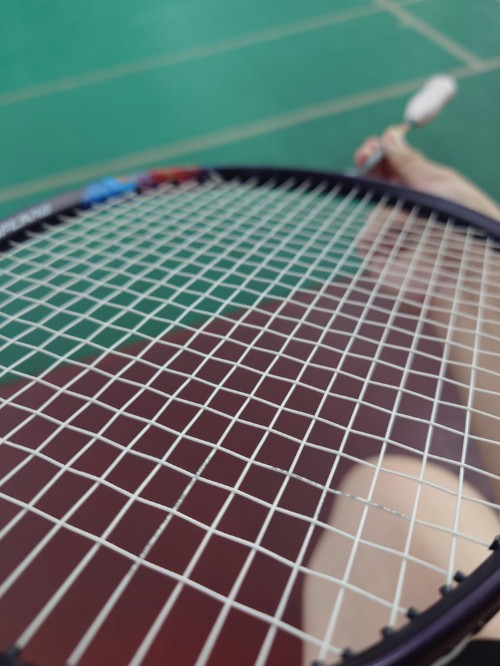

　　星期四晚上打羽球坐在場邊等上場時，滑著 RSS 閱讀器，總覺得哪裡怪怪的。

　　靠腰Ｒ今天是星期四！！！

> 這篇文章特地挑在禮拜五發，如果對密室逃脫「小品」有興趣的朋友，強烈建議周末將一小段時間留給 Neutral。
> 

　　（節錄自[Neutral Room Escape Games](/mood/neutral-room-escape-games/)）

　　特地挑在以為是禮拜五的禮拜四發，真是抱歉 <(_ _)>。看來玩到 Neutral 最新作的開心程度，讓我以為今天（發文的時間點已是昨天）就是禮拜五惹。

　　不過既然標題都打這樣，就順便紀錄一下在羽球場的胡思亂想吧。

　　我打羽球的時候總是戴著隱形眼鏡，由於只戴三個多小時加上眼睛不挑片，所以買的是當時能買到最便宜的透明日拋，大量購買加上折扣，一片只要六元左右，戴一次只要 12 元。

　　戴起來怎麼樣？除了包裝略顯廉價加上鏡片略厚之外，沒什麼大問題。

　　雖然這樣打還行，但我突然想到如果回到學生時期參加大Ｘ盃之類的比賽，我大概會換成一片將近 30 元的超貴日拋。這種日拋戴一次就要花快 60 元，但極其服貼又舒適，可以讓人完全忘記它的存在，整個就是一分錢一分貨。

　　這讓我想到《吹響吧，上低音號》的某段劇情，裡面吹雙簧管的鎧塚學姊，比賽前在後台說了句：「不要緊，我今天用的是最好的簧片。」

　　學姊這句話真是可愛又帥到炸裂，也讓人深有同感。我也想在關鍵的羽球賽中這樣說：

　　「不要緊，我今天用的是最好的隱形眼鏡。」

　　天啊，聽起來超蠢的啦，根本就是[《男子高校生日常》](/reading/daily-lives-of--high-school-boys/)裡面的搞笑劇情 😡