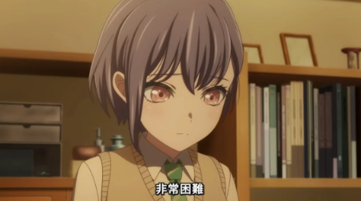

　　（本文有《BanG Dream! It's MyGO!!!!!》動畫角色小捏他，不介意者請再繼續觀看）

　　今天想和大家介紹《BanG Dream! It's MyGO!!!!!》的主角——高松燈。（下圖）

　　沒錯，介紹這位主角非常困難，因為大部分的人想到「燈」，第一個反應多半是念「あかり」（akari），但高松燈的「燈」其實是念「ともり」（tomori），兩者間有微妙的差異。念「あかり」的時候，意思像是「光」本身，而「ともり」則更有「照亮」的意思存在[^1]。

　　當初看動畫時沒有意識到這件事，而是看完後某天想到「為什麼高松燈的燈不念あかり」，才驚覺高松燈的個性文靜，可愛中帶點古怪，對自己無法理解他人感到焦慮，卻又用自己的方式帶著~~一群重女~~其他團員在迷茫中前進。

　　因此，這邊的「燈」比起あかり，我想ともり更適合她一點。

　　另一部動畫《ARIA》裡面的主角水無灯里，「灯里」的念法照日文取名自由度，完全也有可能念ともり，但依照劇中天真無瑕又開朗的個性，由於「她的存在本身就是一道光」，我想也是念あかり也比ともり適合[^2]。

　　另外「燈」這個漢字，在日文已幾乎不使用，通常只用「灯」，最常見到還有用「燈」的地方大概就是人名了。比起水無灯里名字內用的是「灯」，高松燈特地用了「燈」這古字，我想也有隱喻高松燈本身的個性也說不定。

　　這大概就是日文名字有趣之處了吧。

### 後記１

　　本文雖有前情提要，但想了想最後還是特地不打上前情提要以增加美感（啥）。

### 後記２

　　因為本 Blog 讀者們似乎人均 N1（？）其中還不乏從事日文教學的專業人士，為求慎重還是找了日本朋友校稿，結果果然一開始語意沒有弄精確，最後各位看到的版本是和朋友討論後作了一定程度的修改，非常謝謝他。[^3]

[^1]: 「ともり」源自於動詞「灯る」（ともる）」，但總覺得這部分該留給專業人士（？）發揮，在此不贅述 🫠

[^2]: 水無灯里官方念法是「みつなし あかり」（mitsunashi akari），而且如果念ともり就不符合天野老師的世界觀，也就是這邊提到的[《ARIA》豆知識](https://lq7.tw/mood/nine-anime-that-made-me-2/#aria-%E6%B0%B4%E6%98%9F%E9%A0%98%E8%88%AA%E5%93%A1) XD

[^3]: 朋友補充雖然也有「明る」（あかる）這個動詞，但比起「灯る」極度少用，通常是用形容詞「明るい」，所以才有這樣的語感在。