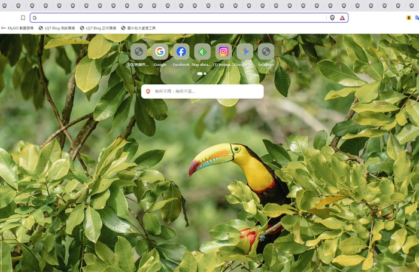
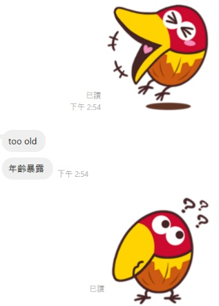
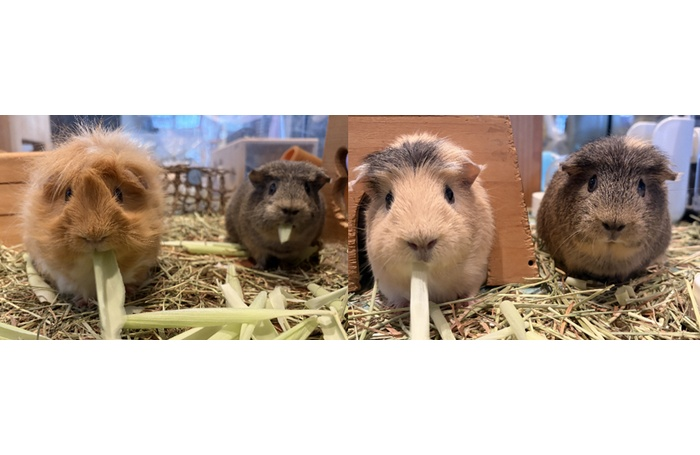

　　就在剛剛開 Brave 新分頁準備查資料時，太太看到我的螢幕畫面突然說了句：「大嘴鳥欸」

　　「有嗎」

　　「有，但你輸入網址之後就跳掉了」

　　「那我重開一個分頁把它找出來」

　　於是我就狂按 Brave 的「新增分頁」，它以一頁攝影師的作品和一頁 Brave 主頁設計形式輪流出現，結果總共開了三十幾個分頁，才終於 Ran 到那張大嘴鳥的圖！

（彩虹巨嘴鳥，學名「Ramphastos sulfuratus」）

　　如果真要選一個最愛的鳥類，大嘴鳥應該以些微之差戰勝了南崁企鵝[^1]。但其實大嘴鳥正式名稱叫做「巨嘴鳥」，而且科別是乍看之下很難念的「鵎鵼科」，但沒錯，查了一下發現其實就只是念「妥空科」，有邊念邊，完全沒有問題。

　　但我還是習慣叫這種鳥大嘴鳥就是了，可能是因為以前一直都叫巧克力球的那隻大嘴鳥有關，然而某位格友表示年齡暴露：

　　離題了，總之，之前喜歡大嘴鳥到跑去查如果要養的話一隻要多少錢，嗯，好像十來萬，比我的 FE 100-400mm F4.5 GM OSS 還貴，立刻放棄妄想。但說到底，就算很便宜大概也不會養就是了，畢竟還是比較喜歡野生動物，就算家裡養了四隻天竺鼠，也依舊是養在家裡的野生動物，養了四年多因為從來沒有馴化訓練，主人一靠近就跑，連碰都碰不到，超好笑。

　　先前和格友分享的照片，想說難得，就野放到這給讀者們看看。由左到右分別是鳳梨、汪八、小梨、小八。鳳梨是男生，因為炸毛長得像鳳梨（？）得名，汪八是女生，因為長得像澳洲袋熊（wombat）得名，然後小梨和小八是牠們的兒女，剛好也是一公一母，完全繼承了父母的毛色，孩子真的不能偷生（現階段男生皆已結紮所以不會出現新鼠了）。

　　這篇原本只是想記錄一下大嘴鳥廢文，最後不知道為什麼變成了天竺鼠，但就這樣吧，希望大家也喜歡大嘴鳥和天竺鼠。

[^1]: 關於先前寫過的文章[南崁企鵝](/photo/night-heron/)，其實就是夜鷺。