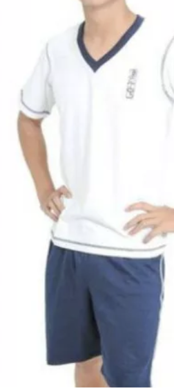

　　還在猶豫要不要參與[念高中還高職](https://shuojen.com/blog/2026/05/20/highschool)的話題時，朋友群組突然聊到高中生活的運動服，不知道為什麼都超醜。正在努力上班的我沒看對話紀錄就率先貼出高中時期大家公認的超醜運動服：　　

　　「阿北運動衫，而且是白色的，還有書法字在上面。」

　　「感覺蠻OK啊，我們冬季也是一樣綠色阿伯運動衫。」

　　太太立刻參戰。想說怎麼可能，往前拉看到她們的運動服：

　　「還好吧？」

　　「哪有還好，你們顏色配色還比較正常。」

　　就在兩人誰也不讓誰的時候，朋友Ｃ說話了：

　　「我們是胸前一隻大黃色老虎，配紅色或藍色領口，背後還有超大 Logo」

　　……。

　　「老虎居然還是有點卡通版的」

　　「真的是在開玩笑 XD，絕對全台前幾醜，哈哈哈哈」

　　「好好笑，救命」

　　最後大家一致通過，第一屆醜運動服ＰＫ賽，由朋友Ｃ獲勝。

### 後記

　　為保持超醜運動服學校的隱私在此不公布任何校名，雖然在以圖搜圖就會穿幫的 2026 年沒有任何意義。

　　如有想挑戰朋友Ｃ冠軍寶座的民眾歡迎留下學校名稱，超醜運動服評鑑委員會（？）會納入審核（但不見得會公布結果） 🫠