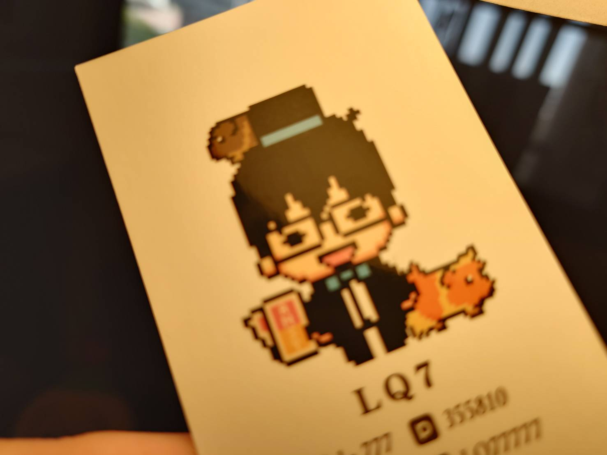

  

　　依稀記得，小學補習班的英文老師幫班上同學取名字，挑了很多她認為不錯的名字給大家舉手先搶先贏（現在想想還真是個奇葩的取法），看到「 Leo」的時候我毫不猶豫舉起了手，原因只是因為這是黑板上所有名字裡面最短的。

　　長大後發現不管怎麼想，「Leo」（獅子）這名字的形象和我實在不合，所以就沒有繼續使用。現在工作時用的是和中文名字念法相近，也是非常短的 Jay（對，我就是 Jay Chou，真是抱歉）。當然最近發現大學同學工作用的英文名字是「AI」（是 AL 阿爾，不是人工智慧AI）居然還能比我短，又是另一回事了。

　　這些名字都很好，但在網際網路上就有顯而易見的問題——太常見、太難搶。也因此當我發現高中朋友在網路上的ID叫做「H45」時，實在是太聰明了。只要加上數字，除了有辨識度外不易撞名，還同樣很短。於是我就~~東施效顰~~使用了「Lp7」這個組合，當我網路上的ID與暱稱，念法也很簡單，就是「欸樓批七」。當然這名字是有意義的，只是過於青春容我不再贅述，總之，高中和大學朋友直到現在，還是會叫我「LP」。

　　至於為什麼會變成 LQ7？因為大學時發生了「陳唐山 LP 事件」（不是什麼營養的新聞，這裡就不附連結有興趣的朋友自己再查），導致「LP」這個字眼變得非常敏感，也讓我遭受池魚之殃。山不轉路轉，P的下一個英文字母是Q，我毅然決然將暱稱改成 LQ7（念法：欸樓Ｑ七），從那之後現實認識的朋友，多半都只知道我叫做「LQ」，也是我現在最常被叫的暱稱。

　　2025年初為了發表同人小說，當時必須決定一個筆名，我最先想起高中時的筆名「楓翎」（又跟那位「H45」高中同學有關，因為他的筆名是「柳雨梢」，所以我想了一個楓樹系列和他呼應，對，我就是個~~中二抄襲~~致敬仔）。結果一查才發現，市面上不管商出還是同人作家的筆名，幾乎都是兩個字的文青系列。我心中一驚：

　　「如果用了『楓翎』，不就是茫茫人海中兩字筆名其中之一了嘛！」

　　最後，我還是用了「LQ7」這個筆名。唯一缺點大概是因為沒有任何母音，第一次看到的人會短暫疑惑該怎麼念之外，時至今日，我還是很喜歡這個暱稱。這暱稱的確和當時的我想得一樣：「簡短」、「有意義」（只有我知道）、「有辨識度」、「不撞名」。

　　在2025年末才想要買網域的我，依舊受惠於 LQ7 這ID 不撞名的好處。除了 lq7.com 搶不到之外，大部分如 lq7.blog、lq7.club，都是沒人使用的狀態。當然，最後我還是選擇了 lq7.tw ，原因我想各位朋友也猜到了——

　　.tw 就是最短的啊！誰能拒絕 lq7.tw 這麼短的網址？ 

　　有些短網址服務的域名都還比我長呢 XD